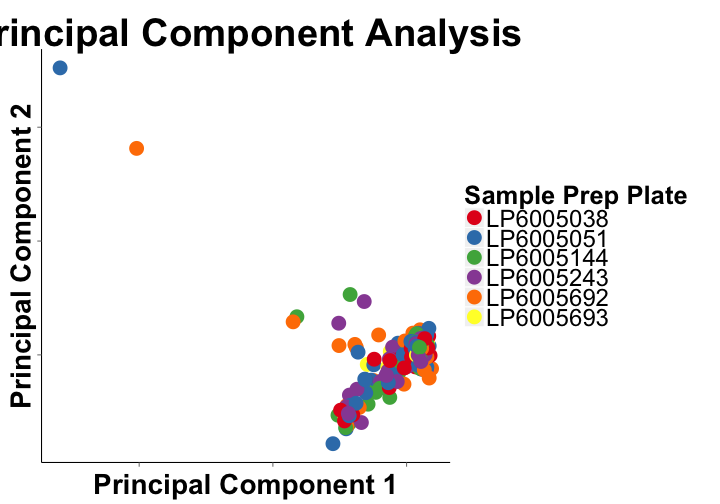
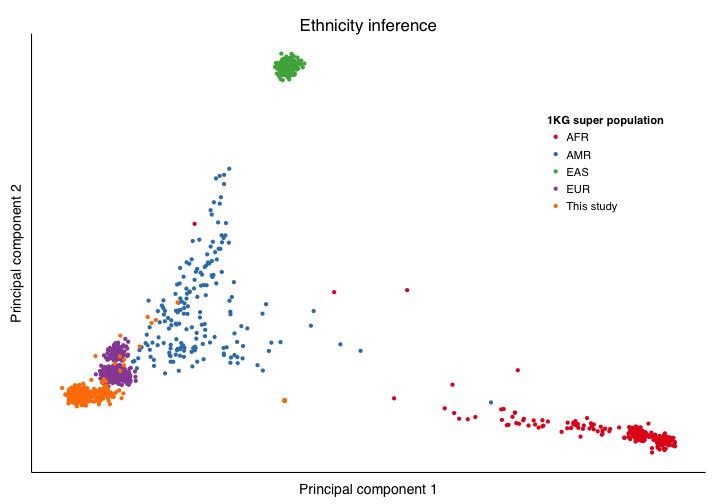

<!-- R Markdown Documentation, DO NOT EDIT THE PLAIN MARKDOWN VERSION OF THIS FILE -->

<!-- Copyright 2015 Stanford University All rights reserved. -->

<!-- Licensed under the Apache License, Version 2.0 (the "License"); -->
<!-- you may not use this file except in compliance with the License. -->
<!-- You may obtain a copy of the License at -->

<!--     http://www.apache.org/licenses/LICENSE-2.0 -->

<!-- Unless required by applicable law or agreed to in writing, software -->
<!-- distributed under the License is distributed on an "AS IS" BASIS, -->
<!-- WITHOUT WARRANTIES OR CONDITIONS OF ANY KIND, either express or implied. -->
<!-- See the License for the specific language governing permissions and -->
<!-- limitations under the License. -->

*This codelab was made in collaboration with [Google Genomics](https://github.com/googlegenomics)*

# Part 2: Sample-Level QC


In Parts 2 & 3 of the codelab we describe the details of each quality control step implemented on our population of genomes.  In Part 2 we perform some quality control analyses that could help to identify any problematic genomes that should be removed from the cohort before proceeding with further analysis.  The appropriate cut off thresholds will depend upon the input dataset and/or other factors.

To skip the details and jump to the implementation of the quality control methods skip to [Part 4: QC Implementation](./QC-Implementation.md).
* [Setup](#setup)
* [Missingness Rate](#missingness-rate)
* [Singleton Rate](#singleton-rate)
* [Inbreeding Coefficient](#inbreeding-coefficient)
* [Heterozygosity Rate](#heterozygosity-rate)
* [Sex Inference](#sex-inference)
* [Genotyping Concordance](#genotyping-concordance)
* [Batch Effect](#batch-effect)
* [Ethnicity Inference](#ethnicity-inference)
* [Genome Similarity](#genome-similarity)

## Setup


```r
tableReplacement <- list("_THE_TABLE_"="va_aaa_pilot_data.genome_calls_seq_qc",
                          "_THE_EXPANDED_TABLE_"="va_aaa_pilot_data.multi_sample_variants_seq_qc",
                          "_GENOTYPING_TABLE_"="va_aaa_pilot_data.genotyping_data")

ibs <- read.table("./data/all-genomes-ibs.tsv",
                  col.names=c("sample1", "sample2", "ibsScore", "similar", "observed"))

sampleData <- read.csv("./data/patient_info.csv")
sampleInfo <- select(sampleData, call_call_set_name=Catalog.ID, gender=Gender)
```

ggplot2 themes to use throughout this page.

```r
plot_theme = theme_minimal(base_size = 14, base_family = "Helvetica") + 
  theme(axis.line = element_line(colour = "black"),
        panel.grid = element_blank())

boxPlotTheme = theme_minimal(base_size=14, base_family = "Helvetica") +
  theme(panel.grid = element_blank())
```


## Missingness Rate

Missingess is defined as the proportion of sites found in the reference genome that are not called in a given genome. We calculate the missingness rate of each genome in our cohort in order to identify samples that are potentially low quality.  If a sample has a high missingness rate it may be indicative of issues with sample preparation or sequencing.  Genomes with a missingness rate greater than 0.1 are removed from the cohort.


```r
result <- DisplayAndDispatchQuery("./sql/missingness-sample-level.sql",
                                  project=project,
                                  replacements=tableReplacement)
```

```
# Determine the level of missingness for each sample when compared to the hg19 reference genome
SELECT 
  g.sample_id AS sample_id,
  ROUND(((hg19.count - g.all_calls_count)/hg19.count), 3) AS missingness
FROM (
  SELECT
    call.call_set_name AS sample_id,
    ref_count + alt_count AS all_calls_count,
  FROM (
    SELECT
      call.call_set_name,
      SUM(IF(genotype = '0,0',
        (end - start),
        0)) AS ref_count,
      SUM(IF(genotype NOT IN ('0,0', '-1,-1'),
        1,
        0)) AS alt_count,
    FROM (
    SELECT
      call.call_set_name,
      start,
      end,
      GROUP_CONCAT(STRING(call.genotype)) WITHIN call AS genotype
    FROM
      [va_aaa_pilot_data.genome_calls_seq_qc])
    OMIT call IF call.call_set_name = 'LP6005243-DNA_A08'
    GROUP BY
      call.call_set_name)) AS g
  CROSS JOIN (
    SELECT 
      COUNT(Chr) AS count
    FROM 
      [google.com:biggene:test.hg19]) AS hg19
ORDER BY
  missingness DESC
```
Number of rows returned by this query: 459.

Displaying the first few results:
<!-- html table generated in R 3.1.2 by xtable 1.7-4 package -->
<!-- Tue Sep 22 21:49:55 2015 -->
<table border=1>
<tr> <th> sample_id </th> <th> missingness </th>  </tr>
  <tr> <td> LP6005038-DNA_C02 </td> <td align="right"> 0.06 </td> </tr>
  <tr> <td> LP6005692-DNA_D09 </td> <td align="right"> 0.05 </td> </tr>
  <tr> <td> LP6005038-DNA_D02 </td> <td align="right"> 0.05 </td> </tr>
  <tr> <td> LP6005051-DNA_D07 </td> <td align="right"> 0.05 </td> </tr>
  <tr> <td> LP6005243-DNA_D01 </td> <td align="right"> 0.05 </td> </tr>
  <tr> <td> LP6005243-DNA_C01 </td> <td align="right"> 0.05 </td> </tr>
   </table>

And visualizing the results:

```r
ggplot(result) +
  geom_point(aes(x=sample_id, y=missingness)) +
  xlab("Sample") +
  ylab("Missingness Rate") +
  ggtitle("Genome-Specific Missingness") +
  plot_theme +
  theme(axis.ticks = element_blank(),
        axis.text.x = element_blank())
```


## Singleton Rate

Singleton rate is defined as the number of variants that are unique to a genome.  If a variant is found in only one genome in the cohort it is considered a singleton.  Genomes with singleton rates more than 3 standard deviations away from the mean are removed from the cohort.  


```r
result <- DisplayAndDispatchQuery("./sql/private-variants.sql",
                                  project=project,
                                  replacements=tableReplacement)
```

```
# Compute private variants counts for each sample.
SELECT
  call.call_set_name,
  COUNT(call.call_set_name) AS private_variant_count,
FROM (
  SELECT
    reference_name,
    start,
    GROUP_CONCAT(CASE WHEN cnt = 1 THEN 'S'
      WHEN cnt = 2 THEN 'D'
      ELSE STRING(cnt) END) AS SINGLETON_DOUBLETON,
    reference_bases,
    alternate_bases,
    GROUP_CONCAT(call.call_set_name) AS call.call_set_name,
    GROUP_CONCAT(genotype) AS genotype,
    SUM(num_samples_with_variant) AS num_samples_with_variant
  FROM (
    SELECT
      reference_name,
      start,
      reference_bases,
      alternate_bases,
      alt_num,
      call.call_set_name,
      GROUP_CONCAT(STRING(call.genotype)) WITHIN call AS genotype,
      SUM(call.genotype == alt_num) WITHIN call AS cnt,
      COUNT(call.call_set_name) WITHIN RECORD AS num_samples_with_variant
    FROM (
        FLATTEN((
          SELECT
            reference_name,
            start,
            reference_bases,
            alternate_bases,
            POSITION(alternate_bases) AS alt_num,
            call.call_set_name,
            call.genotype,
          FROM
            [va_aaa_pilot_data.genome_calls_seq_qc]
          # Optionally add a clause here to limit the query to a particular
          # region of the genome.
          #_WHERE_
          OMIT call IF EVERY(call.genotype = -1)
        ), alternate_bases)
        )
    OMIT RECORD IF alternate_bases IS NULL
    HAVING
      cnt > 0
      )
    GROUP EACH BY
      reference_name,
      start,
      reference_bases,
      alternate_bases
  HAVING
    num_samples_with_variant = 1
    )
GROUP BY
  call.call_set_name
#_ORDER_BY_
```
Number of rows returned by this query: 460.

Displaying the first few results:
<!-- html table generated in R 3.1.2 by xtable 1.7-4 package -->
<!-- Tue Sep 22 21:49:58 2015 -->
<table border=1>
<tr> <th> call_call_set_name </th> <th> private_variant_count </th>  </tr>
  <tr> <td> LP6005038-DNA_C05 </td> <td align="right"> 67704 </td> </tr>
  <tr> <td> LP6005692-DNA_G01 </td> <td align="right"> 26217 </td> </tr>
  <tr> <td> LP6005144-DNA_D08 </td> <td align="right"> 23597 </td> </tr>
  <tr> <td> LP6005692-DNA_F11 </td> <td align="right"> 23547 </td> </tr>
  <tr> <td> LP6005051-DNA_E04 </td> <td align="right"> 47140 </td> </tr>
  <tr> <td> LP6005144-DNA_G08 </td> <td align="right"> 26134 </td> </tr>
   </table>

And visualizing the results:

```r
ggplot(result) +
  geom_point(aes(x=call_call_set_name, y=private_variant_count)) +
  xlab("Sample") +
  ylab("Number of Singletons") +
  ggtitle("Count of Singletons Per Genome") +
  scale_y_continuous(labels=comma) +
  plot_theme +
  theme(axis.ticks = element_blank(),
        axis.text.x = element_blank())
```


## Inbreeding Coefficient

The inbreeding coefficient (F) is a measure of expected homozygosity rates vs observed homozygosity rates for individual genomes.  Here, we calculate the inbreeding coefficient using the method-of-moments estimator.  Genomes with an inbreeding coefficient more than 3 standard deviations away from the mean are removed from the cohort.  


```r
result <- DisplayAndDispatchQuery("./sql/homozygous-variants.sql",
                                  project=project,
                                  replacements=tableReplacement)
```

```
# Compute the expected and observed homozygosity rate for each individual.
SELECT
  call.call_set_name,
  O_HOM,
  ROUND(E_HOM, 2) as E_HOM,
  N_SITES,
  ROUND((O_HOM - E_HOM) / (N_SITES - E_HOM), 5) AS F
FROM (
  SELECT
    call.call_set_name,
    SUM(first_allele = second_allele) AS O_HOM,
    SUM(1.0 - (2.0 * freq * (1.0 - freq) * (called_allele_count / (called_allele_count - 1.0)))) AS E_HOM,
    COUNT(call.call_set_name) AS N_SITES,
  FROM (
    SELECT
      reference_name,
      start,
      reference_bases,
      GROUP_CONCAT(alternate_bases) WITHIN RECORD AS alternate_bases,
      call.call_set_name,
      NTH(1, call.genotype) WITHIN call AS first_allele,
      NTH(2, call.genotype) WITHIN call AS second_allele,
      COUNT(alternate_bases) WITHIN RECORD AS num_alts,
      SUM(call.genotype >= 0) WITHIN RECORD AS called_allele_count,
      IF((SUM(1 = call.genotype) > 0),
        SUM(call.genotype = 1)/SUM(call.genotype >= 0),
        -1)  WITHIN RECORD AS freq
    FROM
      [va_aaa_pilot_data.multi_sample_variants_seq_qc]
    # Optionally add a clause here to limit the query to a particular
    # region of the genome.
    #_WHERE_
    # Skip no calls and haploid sites
    OMIT call IF SOME(call.genotype < 0) OR (2 > COUNT(call.genotype)) 
    HAVING
      # Skip 1/2 genotypes _and non-SNP variants
      num_alts = 1
      AND reference_bases IN ('A','C','G','T')
      AND alternate_bases IN ('A','C','G','T')
      )
  WHERE
    freq > 0
  GROUP BY
    call.call_set_name
    )
#_ORDER_BY_
```
Number of rows returned by this query: 460.

Displaying the first few results:
<!-- html table generated in R 3.1.2 by xtable 1.7-4 package -->
<!-- Tue Sep 22 21:50:01 2015 -->
<table border=1>
<tr> <th> call_call_set_name </th> <th> O_HOM </th> <th> E_HOM </th> <th> N_SITES </th> <th> F </th>  </tr>
  <tr> <td> LP6005051-DNA_E03 </td> <td align="right"> 24036439 </td> <td align="right"> 23978412.34 </td> <td align="right"> 26185742 </td> <td align="right"> 0.03 </td> </tr>
  <tr> <td> LP6005243-DNA_E08 </td> <td align="right"> 24085065 </td> <td align="right"> 24081483.69 </td> <td align="right"> 26310910 </td> <td align="right"> 0.00 </td> </tr>
  <tr> <td> LP6005692-DNA_F04 </td> <td align="right"> 24006207 </td> <td align="right"> 24002414.10 </td> <td align="right"> 26224203 </td> <td align="right"> 0.00 </td> </tr>
  <tr> <td> LP6005038-DNA_A05 </td> <td align="right"> 23925478 </td> <td align="right"> 23955837.74 </td> <td align="right"> 26170707 </td> <td align="right"> -0.01 </td> </tr>
  <tr> <td> LP6005144-DNA_A10 </td> <td align="right"> 24036795 </td> <td align="right"> 23965529.58 </td> <td align="right"> 26182425 </td> <td align="right"> 0.03 </td> </tr>
  <tr> <td> LP6005144-DNA_C11 </td> <td align="right"> 23953076 </td> <td align="right"> 23958021.31 </td> <td align="right"> 26172270 </td> <td align="right"> -0.00 </td> </tr>
   </table>

And visualizing the results:

```r
limits <- c(min(result$O_HOM, result$E_HOM),
            max(result$O_HOM, result$E_HOM))

ggplot(result) +
  geom_point(aes(x=O_HOM, y=E_HOM, label=call_call_set_name), alpha=1/1.5) +
  geom_abline(color="darkslateblue") +
  scale_x_continuous(limits=limits, labels=comma) + 
  scale_y_continuous(limits=limits, labels=comma) +
  xlab("Observed Homozygous Variants") +
  ylab("Expected Homozygous Variants") +
  ggtitle("Homozygosity") +
  plot_theme
```


## Heterozygosity Rate 

Heterozygosity rate is simply the the number of heterozygous calls in a genome.  Genomes with a heterozygosity rate more than 3 standard deviations away from the mean are removed from the cohort.  


```r
result <- DisplayAndDispatchQuery("./sql/heterozygous-calls-count.sql",
                                  project=project,
                                  replacements=tableReplacement)
```

```
  # Count the number of heterozygous calls for each genome in the multi sample variants table.
  
  SELECT
    call.call_set_name,
    SUM(first_allele != second_allele) AS O_HET
  FROM (
    SELECT
      reference_name,
      start,
      reference_bases,
      GROUP_CONCAT(alternate_bases) WITHIN RECORD AS alternate_bases,
      call.call_set_name,
      NTH(1, call.genotype) WITHIN call AS first_allele,
      NTH(2, call.genotype) WITHIN call AS second_allele,
      COUNT(alternate_bases) WITHIN RECORD AS num_alts
    FROM
      [va_aaa_pilot_data.multi_sample_variants_seq_qc]
    OMIT call IF SOME(call.genotype < 0) OR (2 > COUNT(call.genotype)) 
    HAVING
      num_alts = 1
      AND reference_bases IN ('A','C','G','T')
      AND alternate_bases IN ('A','C','G','T')
    )
  GROUP BY
    call.call_set_name
  #_ORDER_BY
```
Number of rows returned by this query: 460.

Displaying the first few results:
<!-- html table generated in R 3.1.2 by xtable 1.7-4 package -->
<!-- Tue Sep 22 21:50:03 2015 -->
<table border=1>
<tr> <th> call_call_set_name </th> <th> O_HET </th>  </tr>
  <tr> <td> LP6005051-DNA_H06 </td> <td align="right"> 2142264 </td> </tr>
  <tr> <td> LP6005144-DNA_A11 </td> <td align="right"> 2160295 </td> </tr>
  <tr> <td> LP6005144-DNA_H05 </td> <td align="right"> 2130613 </td> </tr>
  <tr> <td> LP6005038-DNA_E02 </td> <td align="right"> 2144217 </td> </tr>
  <tr> <td> LP6005144-DNA_G11 </td> <td align="right"> 2113643 </td> </tr>
  <tr> <td> LP6005692-DNA_D11 </td> <td align="right"> 2111111 </td> </tr>
   </table>

And visualizing the results:

```r
ggplot(result) +
  geom_point(aes(y=O_HET, x=call_call_set_name, label=call_call_set_name), alpha=1/1.5) +
  xlab("Sample") +
  ylab("Observed Heterozygous Call Counts") +
  ggtitle("Hetrozygosity Rates") +
  scale_y_continuous(labels=comma) +
  plot_theme +
  theme(axis.ticks = element_blank(),
        axis.text.x = element_blank())
```


## Sex Inference

Gender is inferred for each genome by calculating the heterozygosity rate on the X chromosome.  Genomes who's inferred sex is different from that of the reported sex are removed from the cohort.  Although it is possible for people to be genotypically male and phenotypically female, it is more likely that samples or phenotypic records were mislabeled.


```r
result <- DisplayAndDispatchQuery("./sql/gender-check.sql",
                                  project=project,
                                  replacements=tableReplacement)
```

```
# Compute the the homozygous and heterozygous variant counts for each individual
# within chromosome X to help determine whether the gender phenotype value is
# correct for each individual.
SELECT
  call.call_set_name,
  ROUND((het_RA_count/(hom_AA_count + het_RA_count))*1000)/1000 AS perct_het_alt_in_snvs,
  ROUND((hom_AA_count/(hom_AA_count + het_RA_count))*1000)/1000 AS perct_hom_alt_in_snvs,
  (hom_AA_count + het_RA_count + hom_RR_count) AS all_callable_sites,
  hom_AA_count,
  het_RA_count,
  hom_RR_count,
  (hom_AA_count + het_RA_count) AS all_snvs,
FROM
  (
  SELECT
    call.call_set_name,
    SUM(0 = first_allele
      AND 0 = second_allele) AS hom_RR_count,
    SUM(first_allele = second_allele AND first_allele > 0) AS hom_AA_count,
    SUM((first_allele != second_allele OR second_allele IS NULL)
      AND (first_allele > 0 OR second_allele > 0)) AS het_RA_count
  FROM (
    SELECT
      reference_bases,
      GROUP_CONCAT(alternate_bases) WITHIN RECORD AS alternate_bases,
      COUNT(alternate_bases) WITHIN RECORD AS num_alts,
      call.call_set_name,
      NTH(1, call.genotype) WITHIN call AS first_allele,
      NTH(2, call.genotype) WITHIN call AS second_allele,
    FROM
      [va_aaa_pilot_data.multi_sample_variants_seq_qc]
    WHERE
      reference_name = 'chrX'
      AND start NOT BETWEEN 59999 AND 2699519
      AND start NOT BETWEEN 154931042 AND 155260559
    HAVING
      # Skip 1/2 genotypes _and non-SNP variants
      num_alts = 1
      AND reference_bases IN ('A','C','G','T')
      AND alternate_bases IN ('A','C','G','T')
      )
  GROUP BY
    call.call_set_name)
ORDER BY
  call.call_set_name
```
Number of rows returned by this query: 460.

Displaying the first few results:
<!-- html table generated in R 3.1.2 by xtable 1.7-4 package -->
<!-- Tue Sep 22 21:50:06 2015 -->
<table border=1>
<tr> <th> call_call_set_name </th> <th> perct_het_alt_in_snvs </th> <th> perct_hom_alt_in_snvs </th> <th> all_callable_sites </th> <th> hom_AA_count </th> <th> het_RA_count </th> <th> hom_RR_count </th> <th> all_snvs </th>  </tr>
  <tr> <td> LP6005038-DNA_A01 </td> <td align="right"> 0.03 </td> <td align="right"> 0.97 </td> <td align="right"> 872243 </td> <td align="right"> 71719 </td> <td align="right"> 2090 </td> <td align="right"> 798434 </td> <td align="right"> 73809 </td> </tr>
  <tr> <td> LP6005038-DNA_A02 </td> <td align="right"> 0.03 </td> <td align="right"> 0.97 </td> <td align="right"> 866001 </td> <td align="right"> 72907 </td> <td align="right"> 1949 </td> <td align="right"> 791145 </td> <td align="right"> 74856 </td> </tr>
  <tr> <td> LP6005038-DNA_A03 </td> <td align="right"> 0.59 </td> <td align="right"> 0.41 </td> <td align="right"> 870230 </td> <td align="right"> 44797 </td> <td align="right"> 64482 </td> <td align="right"> 760951 </td> <td align="right"> 109279 </td> </tr>
  <tr> <td> LP6005038-DNA_A04 </td> <td align="right"> 0.03 </td> <td align="right"> 0.97 </td> <td align="right"> 868767 </td> <td align="right"> 71427 </td> <td align="right"> 2215 </td> <td align="right"> 795125 </td> <td align="right"> 73642 </td> </tr>
  <tr> <td> LP6005038-DNA_A05 </td> <td align="right"> 0.58 </td> <td align="right"> 0.42 </td> <td align="right"> 868743 </td> <td align="right"> 44537 </td> <td align="right"> 61520 </td> <td align="right"> 762686 </td> <td align="right"> 106057 </td> </tr>
  <tr> <td> LP6005038-DNA_A06 </td> <td align="right"> 0.03 </td> <td align="right"> 0.97 </td> <td align="right"> 867771 </td> <td align="right"> 76007 </td> <td align="right"> 2232 </td> <td align="right"> 789532 </td> <td align="right"> 78239 </td> </tr>
   </table>

Let's join this with the sample information:

```r
joinedResult <- inner_join(result, sampleInfo)
```

And visualize the results:


```r
ggplot(joinedResult) +
  geom_point(aes(x=call_call_set_name, y=perct_het_alt_in_snvs, color=gender), size=3) +
  xlab("Sample") +
  ylab("Heterozygosity Rate") +
  ggtitle("Heterozygosity Rate on the X Chromosome") +
  scale_colour_brewer(palette="Set1", name="Gender") +
  plot_theme +
  theme(axis.ticks = element_blank(),
    axis.text.x = element_blank())
```


## Genotyping Concordance

We next want to look at the concordance between SNPs called from the sequencing data and those called through the use genotyping.  This allows us to identify samples that may have been mixed up in the laboratory.  Samples with low concordance (>99%) should be removed from the cohort.


```r
concordanceResult <- DisplayAndDispatchQuery("./sql/genotyping-concordance.sql",
                                  project=project,
                                  replacements=tableReplacement)
```

```
# Calculate the concordance between sequencing data and genotyping data.

SELECT
  sample_id,
  calls_in_common,
  identical_calls,
  (identical_calls/calls_in_common) AS concordance
FROM (
  SELECT 
    sample_id,
    COUNT(seq_genotype) AS calls_in_common,
    SUM(IF(seq_genotype = gen_genotype, 1, 0)) AS identical_calls,
  FROM (
    SELECT
      seq.sample_id AS sample_id,
      seq.reference_name AS reference_name,
      seq.start AS start,
      seq.end AS end,
      seq.genotype AS seq_genotype,
      gen.genotype AS gen_genotype,
    FROM (
      SELECT
        sample_id,
        reference_name,
        start,
        end,
        genotype,
        bin,
      FROM js(
        (SELECT
          call.call_set_name,
          reference_name,
          start,
          end,
          call.genotype,
          reference_bases,
          GROUP_CONCAT(alternate_bases) WITHIN RECORD AS alts,
          COUNT(alternate_bases) WITHIN RECORD AS num_alts,
        FROM
          [va_aaa_pilot_data.genome_calls_seq_qc]
         #_WHERE_
        OMIT 
          call IF EVERY (call.genotype < 0)
        HAVING 
          num_alts <= 1
          AND reference_bases IN ('A','C','G','T')
          AND (alts IS null
            OR LENGTH(alts) <= 1)
        ),
        // Start javascript function
        // Input Columns
        call.call_set_name, reference_name, start, end, call.genotype,
        // Output Schema
        "[{name: 'sample_id', type: 'string'},
        {name: 'reference_name', type: 'string'},
        {name: 'start', type: 'integer'},
        {name: 'end', type: 'integer'},
        {name: 'genotype', type: 'string'},
        {name: 'bin', type: 'integer'}]",
        // Function
        "function(r, emit) {
          for (c of r.call) {
            var binSize = 5000;
            var startBin = Math.floor(r.start/binSize);
            var endBin = Math.floor(r.end/binSize);
            var genotype = JSON.stringify(c.genotype.sort());
            for (var bin = startBin; bin <= endBin; bin++){
              emit({
                sample_id: c.call_set_name,
                reference_name: r.reference_name,
                start: r.start,
                end: r.end,
                genotype: genotype,
                bin: bin,
              })
            }
          }
        }")) AS seq
JOIN EACH (
  SELECT
    sample_id,
    reference_name,
    start,
    end,
    genotype,
    bin,
  FROM js(
    (SELECT
      call.call_set_name,
      reference_name,
      start,
      end,
      call.genotype,
    FROM
      [va_aaa_pilot_data.genotyping_data]
      OMIT call IF EVERY (call.genotype < 0)       
    ),
    // Start javascript function
    // Input Columns
    call.call_set_name, reference_name, start, end, call.genotype,
    // Output Schema
    "[{name: 'sample_id', type: 'string'},
    {name: 'reference_name', type: 'string'},
    {name: 'start', type: 'integer'},
    {name: 'end', type: 'integer'},
    {name: 'genotype', type: 'string'},
    {name: 'bin', type: 'integer'}]",
    // Function
    "function(r, emit) {
      for (c of r.call) {
        var binSize = 5000;
        var bin = Math.floor(r.start/binSize);
        var genotype = JSON.stringify(c.genotype.sort());
        var re = /\d+/;
        var chr = 'chr' + r.reference_name.match(re);
        emit({
          sample_id: c.call_set_name,
          reference_name: chr,
          start: r.start,
          end: r.end,
          genotype: genotype,
          bin: bin,
        })
      }
    }")) AS gen
ON
  seq.sample_id = gen.sample_id
  AND seq.reference_name = gen.reference_name
  AND seq.bin = gen.bin
WHERE
  seq.start <= gen.start
  AND seq.end >= gen.end )
GROUP BY 
  sample_id)

Running query:   RUNNING  2.1s
Running query:   RUNNING  2.7s
Running query:   RUNNING  3.3s
Running query:   RUNNING  4.1s
Running query:   RUNNING  4.8s
Running query:   RUNNING  5.5s
Running query:   RUNNING  6.1s
Running query:   RUNNING  6.8s
Running query:   RUNNING  7.5s
Running query:   RUNNING  8.1s
Running query:   RUNNING  8.7s
Running query:   RUNNING  9.4s
Running query:   RUNNING 10.1s
Running query:   RUNNING 10.7s
Running query:   RUNNING 11.4s
Running query:   RUNNING 12.0s
Running query:   RUNNING 12.7s
Running query:   RUNNING 13.3s
Running query:   RUNNING 14.0s
Running query:   RUNNING 14.6s
Running query:   RUNNING 15.3s
Running query:   RUNNING 16.0s
Running query:   RUNNING 16.7s
Running query:   RUNNING 17.4s
Running query:   RUNNING 18.1s
Running query:   RUNNING 18.7s
Running query:   RUNNING 19.4s
Running query:   RUNNING 20.0s
Running query:   RUNNING 20.7s
Running query:   RUNNING 21.4s
Running query:   RUNNING 22.0s
Running query:   RUNNING 22.7s
Running query:   RUNNING 23.3s
Running query:   RUNNING 24.0s
Running query:   RUNNING 24.6s
Running query:   RUNNING 25.2s
Running query:   RUNNING 25.9s
Running query:   RUNNING 26.6s
Running query:   RUNNING 27.2s
Running query:   RUNNING 27.9s
Running query:   RUNNING 28.6s
Running query:   RUNNING 29.3s
Running query:   RUNNING 29.9s
Running query:   RUNNING 30.5s
Running query:   RUNNING 31.4s
Running query:   RUNNING 32.1s
Running query:   RUNNING 32.8s
Running query:   RUNNING 33.5s
Running query:   RUNNING 34.2s
Running query:   RUNNING 34.8s
Running query:   RUNNING 35.5s
Running query:   RUNNING 36.2s
Running query:   RUNNING 36.8s
Running query:   RUNNING 37.9s
Running query:   RUNNING 38.6s
Running query:   RUNNING 39.3s
Running query:   RUNNING 40.0s
Running query:   RUNNING 40.7s
Running query:   RUNNING 41.4s
Running query:   RUNNING 42.1s
Running query:   RUNNING 42.7s
Running query:   RUNNING 43.3s
Running query:   RUNNING 44.0s
Running query:   RUNNING 45.0s
Running query:   RUNNING 45.6s
Running query:   RUNNING 46.3s
Running query:   RUNNING 47.3s
Running query:   RUNNING 48.0s
Running query:   RUNNING 48.6s
Running query:   RUNNING 49.3s
Running query:   RUNNING 50.1s
Running query:   RUNNING 50.7s
Running query:   RUNNING 51.4s
Running query:   RUNNING 52.0s
Running query:   RUNNING 52.8s
Running query:   RUNNING 53.4s
Running query:   RUNNING 54.1s
Running query:   RUNNING 54.8s
Running query:   RUNNING 55.5s
Running query:   RUNNING 56.1s
Running query:   RUNNING 56.9s
Running query:   RUNNING 57.6s
Running query:   RUNNING 58.3s
Running query:   RUNNING 59.0s
Running query:   RUNNING 59.7s
Running query:   RUNNING 60.4s
Running query:   RUNNING 61.1s
Running query:   RUNNING 61.8s
Running query:   RUNNING 62.4s
Running query:   RUNNING 63.1s
Running query:   RUNNING 63.8s
Running query:   RUNNING 64.4s
Running query:   RUNNING 65.1s
Running query:   RUNNING 65.8s
Running query:   RUNNING 66.4s
Running query:   RUNNING 67.1s
Running query:   RUNNING 67.8s
Running query:   RUNNING 68.5s
Running query:   RUNNING 69.3s
Running query:   RUNNING 70.1s
Running query:   RUNNING 70.7s
Running query:   RUNNING 71.3s
Running query:   RUNNING 72.0s
Running query:   RUNNING 72.7s
Running query:   RUNNING 73.3s
Running query:   RUNNING 74.0s
Running query:   RUNNING 74.6s
Running query:   RUNNING 75.3s
Running query:   RUNNING 76.0s
Running query:   RUNNING 76.7s
Running query:   RUNNING 77.3s
Running query:   RUNNING 78.0s
Running query:   RUNNING 78.7s
Running query:   RUNNING 79.4s
Running query:   RUNNING 80.0s
Running query:   RUNNING 80.8s
Running query:   RUNNING 81.5s
Running query:   RUNNING 82.2s
Running query:   RUNNING 82.9s
Running query:   RUNNING 83.6s
Running query:   RUNNING 84.3s
Running query:   RUNNING 85.0s
Running query:   RUNNING 85.7s
Running query:   RUNNING 86.4s
Running query:   RUNNING 87.0s
Running query:   RUNNING 87.6s
Running query:   RUNNING 88.3s
Running query:   RUNNING 89.0s
Running query:   RUNNING 89.7s
Running query:   RUNNING 90.3s
Running query:   RUNNING 91.0s
Running query:   RUNNING 91.7s
Running query:   RUNNING 92.3s
Running query:   RUNNING 93.0s
Running query:   RUNNING 93.7s
Running query:   RUNNING 94.5s
Running query:   RUNNING 95.2s
Running query:   RUNNING 95.8s
Running query:   RUNNING 96.5s
Running query:   RUNNING 97.1s
Running query:   RUNNING 97.8s
Running query:   RUNNING 98.4s
Running query:   RUNNING 99.2s
Running query:   RUNNING 99.9s
Running query:   RUNNING 100.6s
Running query:   RUNNING 101.3s
Running query:   RUNNING 102.0s
Running query:   RUNNING 102.6s
Running query:   RUNNING 103.3s
Running query:   RUNNING 103.9s
Running query:   RUNNING 104.6s
Running query:   RUNNING 105.3s
Running query:   RUNNING 106.1s
Running query:   RUNNING 106.7s
Running query:   RUNNING 107.3s
Running query:   RUNNING 108.0s
Running query:   RUNNING 108.6s
Running query:   RUNNING 109.3s
Running query:   RUNNING 110.0s
Running query:   RUNNING 110.6s
Running query:   RUNNING 111.3s
Running query:   RUNNING 112.0s
Running query:   RUNNING 112.6s
Running query:   RUNNING 113.3s
Running query:   RUNNING 113.9s
Running query:   RUNNING 114.6s
Running query:   RUNNING 115.2s
Running query:   RUNNING 116.0s
Running query:   RUNNING 116.6s
Running query:   RUNNING 117.3s
Running query:   RUNNING 118.0s
Running query:   RUNNING 118.6s
Running query:   RUNNING 119.3s
Running query:   RUNNING 120.0s
Running query:   RUNNING 120.7s
Running query:   RUNNING 121.4s
Running query:   RUNNING 122.0s
Running query:   RUNNING 122.9s
Running query:   RUNNING 123.6s
Running query:   RUNNING 124.3s
Running query:   RUNNING 125.0s
Running query:   RUNNING 125.7s
Running query:   RUNNING 126.4s
Running query:   RUNNING 127.2s
Running query:   RUNNING 127.9s
Running query:   RUNNING 128.6s
Running query:   RUNNING 129.4s
Running query:   RUNNING 130.1s
Running query:   RUNNING 130.8s
Running query:   RUNNING 131.4s
Running query:   RUNNING 132.1s
Running query:   RUNNING 132.7s
Running query:   RUNNING 133.4s
Running query:   RUNNING 134.1s
Running query:   RUNNING 134.8s
Running query:   RUNNING 135.5s
Running query:   RUNNING 136.2s
Running query:   RUNNING 136.8s
Running query:   RUNNING 137.6s
Running query:   RUNNING 138.3s
Running query:   RUNNING 139.0s
Running query:   RUNNING 139.7s
Running query:   RUNNING 140.4s
Running query:   RUNNING 141.0s
Running query:   RUNNING 141.7s
Running query:   RUNNING 142.4s
Running query:   RUNNING 143.1s
Running query:   RUNNING 143.8s
Running query:   RUNNING 144.5s
Running query:   RUNNING 145.2s
Running query:   RUNNING 145.9s
Running query:   RUNNING 146.6s
Running query:   RUNNING 147.2s
Running query:   RUNNING 147.9s
Running query:   RUNNING 148.5s
Running query:   RUNNING 149.3s
Running query:   RUNNING 150.0s
Running query:   RUNNING 150.6s
Running query:   RUNNING 151.3s
Running query:   RUNNING 152.0s
Running query:   RUNNING 152.7s
Running query:   RUNNING 153.4s
Running query:   RUNNING 154.0s
Running query:   RUNNING 154.7s
Running query:   RUNNING 155.4s
Running query:   RUNNING 156.1s
Running query:   RUNNING 157.0s
Running query:   RUNNING 157.7s
Running query:   RUNNING 158.4s
Running query:   RUNNING 159.1s
Running query:   RUNNING 159.8s
Running query:   RUNNING 160.5s
Running query:   RUNNING 161.2s
Running query:   RUNNING 161.9s
Running query:   RUNNING 162.5s
Running query:   RUNNING 163.2s
Running query:   RUNNING 163.9s
Running query:   RUNNING 164.6s
Running query:   RUNNING 165.3s
Running query:   RUNNING 166.0s
Running query:   RUNNING 166.7s
Running query:   RUNNING 167.4s
Running query:   RUNNING 168.1s
Running query:   RUNNING 168.7s
Running query:   RUNNING 169.4s
Running query:   RUNNING 170.1s
Running query:   RUNNING 170.8s
Running query:   RUNNING 171.5s
Running query:   RUNNING 172.1s
Running query:   RUNNING 172.7s
Running query:   RUNNING 173.4s
Running query:   RUNNING 174.1s
Running query:   RUNNING 174.8s
Running query:   RUNNING 175.4s
Running query:   RUNNING 176.1s
Running query:   RUNNING 176.8s
Running query:   RUNNING 177.4s
Running query:   RUNNING 178.1s
Running query:   RUNNING 178.8s
Running query:   RUNNING 179.5s
Running query:   RUNNING 180.1s
Running query:   RUNNING 180.8s
Running query:   RUNNING 181.5s
Running query:   RUNNING 182.1s
Running query:   RUNNING 182.8s
Running query:   RUNNING 183.4s
Running query:   RUNNING 184.3s
Running query:   RUNNING 185.0s
Running query:   RUNNING 185.7s
Running query:   RUNNING 186.6s
Running query:   RUNNING 187.4s
Running query:   RUNNING 188.1s
Running query:   RUNNING 188.8s
Running query:   RUNNING 189.5s
Running query:   RUNNING 190.2s
Running query:   RUNNING 190.8s
Running query:   RUNNING 192.0s
Running query:   RUNNING 192.6s
Running query:   RUNNING 193.5s
Running query:   RUNNING 194.3s
Running query:   RUNNING 195.0s
Running query:   RUNNING 195.7s
Running query:   RUNNING 196.3s
Running query:   RUNNING 197.1s
Running query:   RUNNING 197.8s
Running query:   RUNNING 198.5s
Running query:   RUNNING 199.2s
Running query:   RUNNING 199.9s
Running query:   RUNNING 200.6s
Running query:   RUNNING 201.3s
Running query:   RUNNING 202.0s
Running query:   RUNNING 202.6s
Running query:   RUNNING 203.3s
Running query:   RUNNING 204.0s
Running query:   RUNNING 204.7s
Running query:   RUNNING 205.3s
Running query:   RUNNING 206.0s
Running query:   RUNNING 206.9s
Running query:   RUNNING 207.7s
Running query:   RUNNING 208.4s
Running query:   RUNNING 209.1s
Running query:   RUNNING 209.8s
Running query:   RUNNING 210.6s
Running query:   RUNNING 211.3s
Running query:   RUNNING 212.0s
Running query:   RUNNING 212.6s
Running query:   RUNNING 213.3s
Running query:   RUNNING 214.0s
Running query:   RUNNING 214.7s
Running query:   RUNNING 215.3s
Running query:   RUNNING 216.0s
Running query:   RUNNING 216.6s
Running query:   RUNNING 217.3s
Running query:   RUNNING 218.0s
Running query:   RUNNING 218.6s
Running query:   RUNNING 219.3s
Running query:   RUNNING 220.0s
Running query:   RUNNING 220.6s
Running query:   RUNNING 221.3s
Running query:   RUNNING 222.0s
Running query:   RUNNING 222.7s
Running query:   RUNNING 223.4s
Running query:   RUNNING 224.1s
Running query:   RUNNING 224.8s
Running query:   RUNNING 225.5s
Running query:   RUNNING 226.1s
Running query:   RUNNING 226.8s
Running query:   RUNNING 227.5s
Running query:   RUNNING 228.1s
Running query:   RUNNING 228.8s
Running query:   RUNNING 229.5s
Running query:   RUNNING 230.1s
Running query:   RUNNING 230.8s
Running query:   RUNNING 231.4s
Running query:   RUNNING 232.1s
Running query:   RUNNING 232.8s
Running query:   RUNNING 233.5s
Running query:   RUNNING 234.1s
Running query:   RUNNING 234.7s
Running query:   RUNNING 235.4s
Running query:   RUNNING 236.0s
Running query:   RUNNING 236.7s
Running query:   RUNNING 237.4s
Running query:   RUNNING 238.1s
Running query:   RUNNING 238.8s
Running query:   RUNNING 239.5s
Running query:   RUNNING 240.2s
Running query:   RUNNING 240.8s
Running query:   RUNNING 242.1s
Running query:   RUNNING 243.6s
Running query:   RUNNING 244.5s
Running query:   RUNNING 245.4s
Running query:   RUNNING 246.3s
Running query:   RUNNING 247.1s
Running query:   RUNNING 247.8s
Running query:   RUNNING 248.7s
Running query:   RUNNING 249.4s
Running query:   RUNNING 250.2s
Running query:   RUNNING 251.0s
Running query:   RUNNING 251.7s
Running query:   RUNNING 253.0s
Running query:   RUNNING 253.8s
Running query:   RUNNING 254.7s
Running query:   RUNNING 255.4s
Running query:   RUNNING 256.2s
Running query:   RUNNING 257.0s
Running query:   RUNNING 257.8s
Running query:   RUNNING 258.6s
Running query:   RUNNING 259.3s
Running query:   RUNNING 259.9s
Running query:   RUNNING 260.7s
Running query:   RUNNING 261.3s
Running query:   RUNNING 262.1s
Running query:   RUNNING 262.7s
Running query:   RUNNING 263.4s
Running query:   RUNNING 264.1s
Running query:   RUNNING 264.8s
Running query:   RUNNING 265.5s
Running query:   RUNNING 266.2s
Running query:   RUNNING 266.9s
Running query:   RUNNING 267.6s
Running query:   RUNNING 268.2s
Running query:   RUNNING 268.9s
Running query:   RUNNING 270.0s
Running query:   RUNNING 270.7s
Running query:   RUNNING 271.4s
Running query:   RUNNING 272.1s
Running query:   RUNNING 272.9s
Running query:   RUNNING 273.6s
Running query:   RUNNING 274.2s
Running query:   RUNNING 275.0s
Running query:   RUNNING 275.8s
Running query:   RUNNING 276.7s
Running query:   RUNNING 277.4s
Running query:   RUNNING 278.0s
Running query:   RUNNING 278.7s
Running query:   RUNNING 279.4s
Running query:   RUNNING 280.0s
Running query:   RUNNING 280.7s
Running query:   RUNNING 281.4s
Running query:   RUNNING 282.2s
Running query:   RUNNING 282.8s
Running query:   RUNNING 283.5s
Running query:   RUNNING 284.1s
Running query:   RUNNING 284.8s
Running query:   RUNNING 285.5s
Running query:   RUNNING 286.2s
Running query:   RUNNING 286.8s
Running query:   RUNNING 287.5s
Running query:   RUNNING 288.2s
Running query:   RUNNING 288.8s
Running query:   RUNNING 289.7s
Running query:   RUNNING 290.6s
Running query:   RUNNING 291.4s
Running query:   RUNNING 292.2s
Running query:   RUNNING 292.9s
Running query:   RUNNING 293.7s
Running query:   RUNNING 294.4s
Running query:   RUNNING 295.1s
Running query:   RUNNING 295.9s
Running query:   RUNNING 296.6s
Running query:   RUNNING 297.3s
Running query:   RUNNING 298.0s
Running query:   RUNNING 298.6s
Running query:   RUNNING 299.4s
Running query:   RUNNING 300.0s
Running query:   RUNNING 300.6s
Running query:   RUNNING 301.3s
Running query:   RUNNING 302.0s
Running query:   RUNNING 302.6s
Running query:   RUNNING 303.3s
Running query:   RUNNING 304.0s
Running query:   RUNNING 304.7s
Running query:   RUNNING 305.4s
Running query:   RUNNING 306.0s
Running query:   RUNNING 306.7s
Running query:   RUNNING 307.4s
Running query:   RUNNING 308.1s
Running query:   RUNNING 308.8s
Running query:   RUNNING 309.5s
Running query:   RUNNING 310.3s
Running query:   RUNNING 311.0s
Running query:   RUNNING 311.6s
Running query:   RUNNING 312.4s
Running query:   RUNNING 313.2s
Running query:   RUNNING 313.9s
Running query:   RUNNING 314.7s
```
Number of rows returned by this query: 460.

Displaying the first few results:
<!-- html table generated in R 3.1.2 by xtable 1.7-4 package -->
<!-- Tue Sep 22 21:55:25 2015 -->
<table border=1>
<tr> <th> sample_id </th> <th> calls_in_common </th> <th> identical_calls </th> <th> concordance </th>  </tr>
  <tr> <td> LP6005038-DNA_D09 </td> <td align="right"> 2155898 </td> <td align="right"> 2134125 </td> <td align="right"> 0.99 </td> </tr>
  <tr> <td> LP6005693-DNA_A01 </td> <td align="right"> 2196713 </td> <td align="right"> 2184674 </td> <td align="right"> 0.99 </td> </tr>
  <tr> <td> LP6005243-DNA_E08 </td> <td align="right"> 2151013 </td> <td align="right"> 2129531 </td> <td align="right"> 0.99 </td> </tr>
  <tr> <td> LP6005038-DNA_G05 </td> <td align="right"> 2154290 </td> <td align="right"> 2132563 </td> <td align="right"> 0.99 </td> </tr>
  <tr> <td> LP6005692-DNA_D11 </td> <td align="right"> 2193881 </td> <td align="right"> 2181898 </td> <td align="right"> 0.99 </td> </tr>
  <tr> <td> LP6005692-DNA_E09 </td> <td align="right"> 2195790 </td> <td align="right"> 2183423 </td> <td align="right"> 0.99 </td> </tr>
   </table>

Get the sample preparation plate for each sample

```r
plate = substr(concordanceResult$sample_id, 1, 9)
concordanceResult = cbind(concordanceResult, plate)
```

Visualizing the results:

```r
ggplot(concordanceResult) +
  geom_point(aes(x=sample_id, y=concordance, color=plate), size=3) +
  xlab("Sample") +
  ylab("Concordance") +
  ggtitle("Concordance with Genotyping Data") +
  scale_colour_brewer(name="Sample Prep Plate", palette="Set1") +
  plot_theme +
  theme(axis.ticks = element_blank(),
        axis.text.x = element_blank())
```


## Batch Effect

We next want to determine if there are any batch effects that were introduced during sequencing.  Since the genomes in our study were sequenced over time it is important to check if we can identify sequencing batches by variant data alone.  We can check for batch effects by running principal component analysis on all of the variants from our dataset.  If any of the batches are outliers in this part of the analysis we may want to remove them from the cohort.

Note: This analysis is run on a Google Compute Engine rather than in BigQuery.  For full instructions on how to run PCA see the [Google Genomics Cookbook](https://googlegenomics.readthedocs.org/en/latest/use_cases/compute_principal_coordinate_analysis/1-way-pca.html?highlight=pca).

Create cluster with Apache Spark installed
```
./bdutil -e extensions/spark/spark_env.sh deploy
```

Copy client_secrets to head node
```
gcloud compute copy-files client_secrets.json hadoop-m:~/
```

SSH into the head node
```
gcloud compute ssh hadoop-m
```

Install SBT
```
echo "deb http://dl.bintray.com/sbt/debian /" | sudo tee -a /etc/apt/sources.list.d/sbt.list
sudo apt-get update
sudo apt-get install sbt
```

Install git and clone spark-examples repository.
```
sudo apt-get install git
git clone https://github.com/googlegenomics/spark-examples.git
```

Compile the jar
```
cd spark-examples
sbt assembly
cp target/scala-2.10/googlegenomics-spark-examples-assembly-*.jar ~/
cd ~/
```

Running the job.  

Variant set definitions:
2442214609072563359: Full variant set for AAA dataset.

```
spark-submit \
  --class com.google.cloud.genomics.spark.examples.VariantsPcaDriver \
  --conf spark.shuffle.spill=true \
  --master spark://hadoop-m:7077 \
  /home/gmcinnes/spark-examples/target/scala-2.10/googlegenomics-spark-examples-assembly-1.0.jar \
  --client-secrets /home/gmcinnes/client_secrets.json \
  --variant-set-id 2442214609072563359 \
  --all-references \
  --num-reduce-partitions 15 \
  --output-path gs://gbsc-gcp-project-mvp-va_aaa_hadoop/spark/output/aaa-batch-effect-pca.tsv
```


Next, we need to download the files that were output from the job to our local machine.

```
gsutil cat gs://gbsc-gcp-project-mvp-va_aaa_hadoop/spark/output/aaa-batch-effect-pca.tsv* > aaa-batch-effect-pca.tsv
```

Now let's visualize the results.


```r
pcaFile = './data/aaa-batch-effect-pca.tsv'
pcaResult = read.table(pcaFile)
names(pcaResult) = c('sample_id','pc1', 'pc2', 'extra')
plate = substr(pcaResult$sample_id, 1, 9)
pcaResult = cbind(pcaResult, plate)
```


```r
ggplot(pcaResult, aes(pc1, pc2, color=plate)) + 
  geom_point(size=4, alpha=0.5) +
  ggtitle("Batch Effect PCA") +
  xlab("Principal component 1") + 
  ylab("Principal component 2") +
  scale_colour_brewer(name="Library Prep Plate", palette="Set1") +
  plot_theme +
  theme(axis.text.x=element_blank(),
        axis.text.y=element_blank(),
        axis.ticks=element_blank(),
        legend.position = c(0.85,0.75))
```




## Ethnicity Inference

Another application of principle component analysis is inferring ethnicity.  We can do so by performing PCA with our data merged with data from the 1,000 Genomes Project.  When we do this we expect to see that genomes from the 1,000 Genome Project and genomes from our dataset will cluster by ethnicity.  Since almost all of the genomes from our dataset are of European descent the European subpopulations from 1,000 Genomes and our genomes should cluster together.  Any genomes that cluster with an unexpected ethnic group should be removed from the cohort.

Full instructions for how to compute principal component analysis on the intersection of two datasets using Google Cloud can be found [here](http://googlegenomics.readthedocs.org/en/latest/use_cases/compute_principal_coordinate_analysis/2-way-pca.html).

#### Step by step instructions for running 2-way PCA

These instructions are identical to the Batch Effect step except that we run 2-way PCA instead of 1-way PCA.

Create cluster with Apache Spark installed
```
./bdutil -e extensions/spark/spark_env.sh deploy
```

Copy client_secrets to head node
```
gcloud compute copy-files client_secrets.json hadoop-m:~/
```

SSH into the head node
```
gcloud compute ssh hadoop-m
```

Install SBT
```
echo "deb http://dl.bintray.com/sbt/debian /" | sudo tee -a /etc/apt/sources.list.d/sbt.list
sudo apt-get update
sudo apt-get install sbt
```

Install git and clone spark-examples repository.
```
sudo apt-get install git
git clone https://github.com/googlegenomics/spark-examples.git
```

Compile the jar
```
cd spark-examples
sbt assembly
cp target/scala-2.10/googlegenomics-spark-examples-assembly-*.jar ~/
cd ~/
```

#### Run the job

Variant set definitions:
18444522614861607145: SNPs from the AAA dataset to use for ethnicity inference.  
12511568612726359419: 1000 genomes variant set.

```
spark-submit   \
  --class com.google.cloud.genomics.spark.examples.VariantsPcaDriver \
  --conf spark.shuffle.spill=true \
  --master spark://hadoop-m:7077 \
  /home/gmcinnes/spark-examples/target/scala-2.10/googlegenomics-spark-examples-assembly-1.0.jar \
  --client-secrets /home/gmcinnes/client_secrets.json \
  --variant-set-id 18444522614861607145 12511568612726359419 \
  --all-references \
  --num-reduce-partitions 15 \
  --output-path gs://gbsc-gcp-project-mvp-va_aaa_hadoop/spark/output/aaa-vs-1kg-pca.txt
```

Next, we need to download the files that were output from the job to our local machine.

```
gsutil cat gs://gbsc-gcp-project-mvp-va_aaa_hadoop/spark/output/aaa-vs-1kg-pca.txt* > aaa-vs-1kg-pca.tsv
```

Now let's visualize the results.


```r
pca = read.table('./data/aaa-vs-1kg-pca.tsv')
names(pca) <- c("sample_id","pc1","pc2")
```


```r
populations = read.csv('./data/1kg_info.csv')
pca = join(pca, populations, by='sample_id')
```


```r
ggplot(pca) +
  geom_point(aes(pc1,pc2, color=Population)) +
  ggtitle("Ethnicity inference") +
  scale_colour_brewer(name="1KG super population", palette="Set1") +
  xlab("Principal component 1") +
  ylab("Principal component 2") +
  plot_theme + 
  theme(axis.ticks=element_blank(),
        axis.text=element_blank(),
        legend.position = c(0.85, 0.7))
```



## Genome Similarity

The final step in the Sample QC portion of our workflow is a check for unexpected relatedness among our genomes.  To do this we perfrom an analysis called Identity By State (IBS).  This analysis checks the similarity between all positions in every genome against every other genome.  Any unexpected similarity among our genomes may be the result of unknown family relationships or the result of cross-sample contamination.  Any samples with unexpected relatedness should be removed from the cohort.

Full instructions for setting up and running this job can be found in the [Google Genomics Cookbook](http://googlegenomics.readthedocs.org/en/latest/use_cases/compute_identity_by_state/).

Note that this `n^2` analysis is a cluster compute job instead of a BigQuery query.


#### Run the job
```
java -cp target/google-genomics-dataflow*.jar \
  com.google.cloud.genomics.dataflow.pipelines.IdentityByState \
  --runner=BlockingDataflowPipelineRunner \
  --project=gbsc-gcp-project-mvp \
  --stagingLocation=gs://gbsc-gcp-project-mvp-va_aaa_jobs/dataflow/all-genomes-staging \
  --output=gs://gbsc-gcp-project-mvp-va_aaa_hadoop/dataflow/output/all-genomes-ibs.tsv \
  --numWorkers=40 \
  --genomicsSecretsFile=client_secrets.json \
  --datasetId=2442214609072563359 \
  --hasNonVariantSegments=true \
  —allReferences=true
```


```r
require(reshape2)
require(dplyr)
ibsDataFlowFilename = '/Users/gmcinnes/data/all-genomes-ibs-2.tsv'
ReadIBSFile <- function(ibsFilename, header=FALSE, rowNames=NULL) {
  ibsData <- read.table(file=ibsFilename, header=header,
                        row.names=rowNames, stringsAsFactors=FALSE)
  return (ibsData)
}
ibsDataflowData <- ReadIBSFile(ibsDataFlowFilename)

ColumnNames <- function(ibsData) { 
  if(3 == ncol(ibsData)) {
    colnames(ibsData) <- c("sample1", "sample2", "ibsScore")
  } else {
    colnames(ibsData) <- c("sample1", "sample2", "ibsScore", "similar", "observed")
  }
}
colnames(ibsDataflowData) <- ColumnNames(ibsDataflowData)

MakeIBSDataSymmetric <- function(ibsData) {
  ibsPairsMirrored <- data.frame(sample1=ibsData$sample2,
                                 sample2=ibsData$sample1,
                                 ibsScore=ibsData$ibsScore)
  ibsData <- rbind(ibsData[,1:3], ibsPairsMirrored)
}
ibsDataflowData <- MakeIBSDataSymmetric(ibsDataflowData)

ExcludeDiagonal <- function(ibsData) {
  ibsData <- filter(ibsData, ibsData$sample1 != ibsData$sample2)
  return (ibsData)
}
ibsDataflowDataSample <- ExcludeDiagonal(ibsDataflowData)

SampleIBSMatrix <- function(ibsData, sampleSize=50) {
  individuals <- unique(ibsData$sample1)
  sample <- sample(individuals, sampleSize)
  ibsData <- subset(ibsData, ibsData$sample1 %in% sample)
  ibsData <- subset(ibsData, ibsData$sample2 %in% sample)
  return (ibsData)
}
ibsDataflowDataSubset <- SampleIBSMatrix(ibsDataflowDataSample)
```

Let's plot a subset of the data to understand the plot

```r
DrawHeatMap <- function(ibsData) {
  p <- ggplot(data=ibsData, aes(x=sample1, y=sample2)) +
    theme(axis.ticks=element_blank(), axis.text=element_blank()) +
    geom_tile(aes(fill=ibsScore), colour="white") +
    scale_fill_gradient(low="white", high="steelblue", na.value="black",
                        guide=guide_colourbar(title= "IBS Score")) +
    labs(list(title="Identity By State (IBS) Heat Map",
              x="Sample", y="Sample"))
  p
}
DrawHeatMap(ibsDataflowDataSubset)
```


Let's take a look at the most similar genomes.
<!-- html table generated in R 3.1.2 by xtable 1.7-4 package -->
<!-- Tue Sep 22 21:55:29 2015 -->
<table border=1>
<tr> <th> sample1 </th> <th> sample2 </th> <th> ibsScore </th>  </tr>
  <tr> <td> LP6005243-DNA_G12 </td> <td> LP6005243-DNA_H12 </td> <td align="right"> 0.10 </td> </tr>
  <tr> <td> LP6005243-DNA_B12 </td> <td> LP6005243-DNA_D12 </td> <td align="right"> 0.10 </td> </tr>
  <tr> <td> LP6005243-DNA_A12 </td> <td> LP6005243-DNA_C12 </td> <td align="right"> 0.10 </td> </tr>
  <tr> <td> LP6005692-DNA_H12 </td> <td> LP6005693-DNA_C03 </td> <td align="right"> 0.08 </td> </tr>
  <tr> <td> LP6005243-DNA_C12 </td> <td> LP6005243-DNA_D12 </td> <td align="right"> 0.10 </td> </tr>
  <tr> <td> LP6005243-DNA_A12 </td> <td> LP6005243-DNA_F12 </td> <td align="right"> 0.10 </td> </tr>
   </table>


--------------------------------------------------------
_Next_: [Part 3: Variant-Level QC](./Variant-Level-QC.md)
