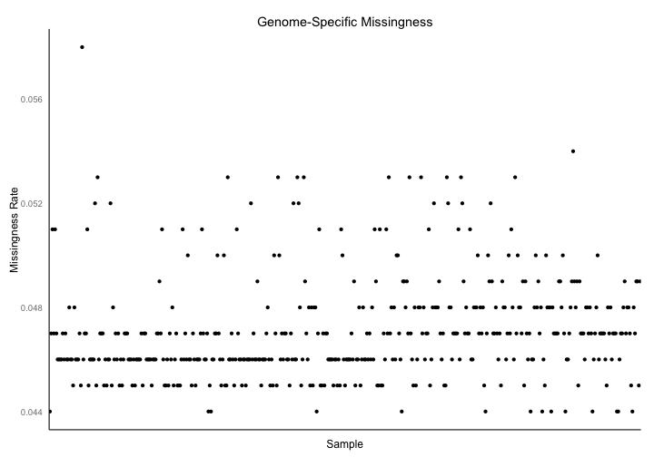
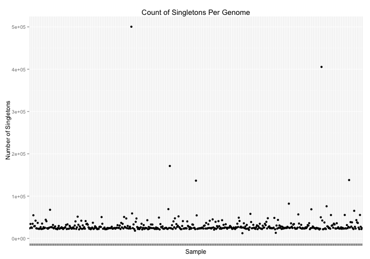
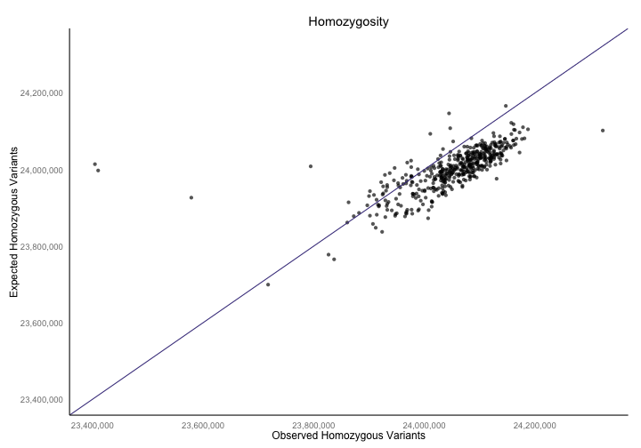
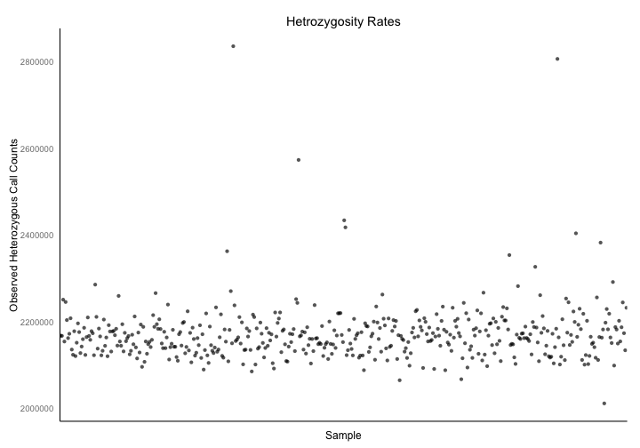
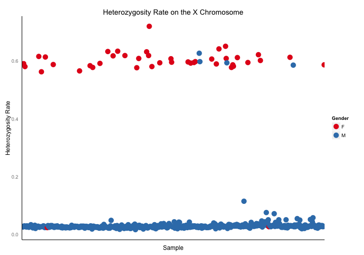
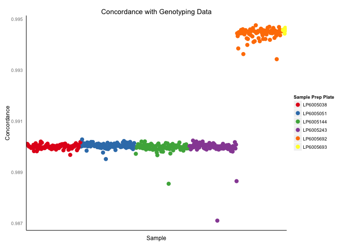
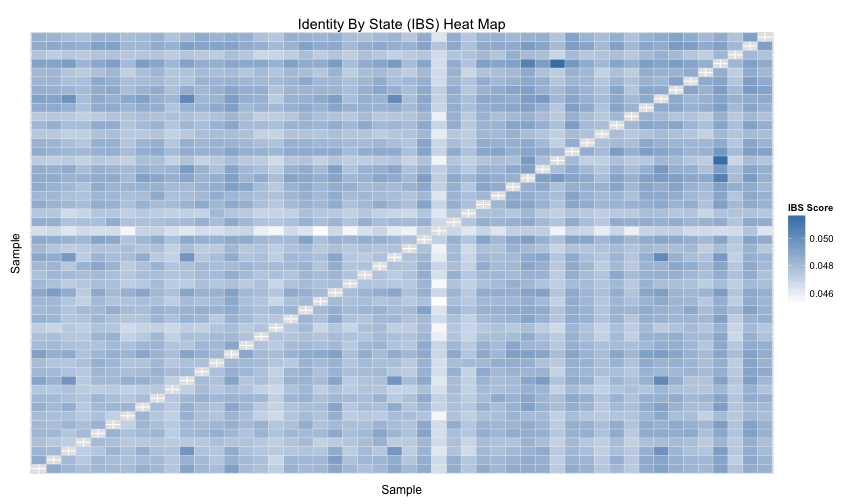
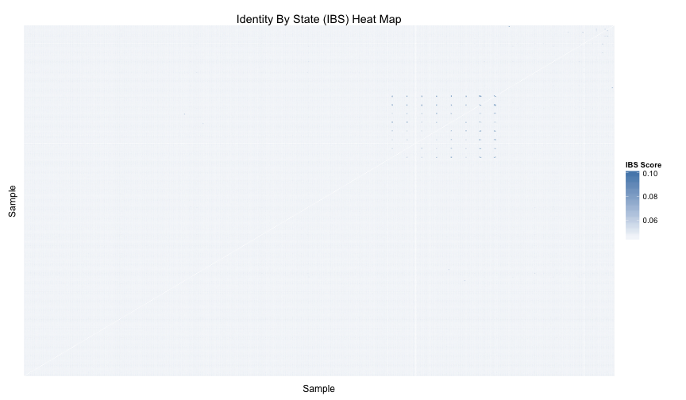

<!-- R Markdown Documentation, DO NOT EDIT THE PLAIN MARKDOWN VERSION OF THIS FILE -->

<!-- Copyright 2015 Stanford University All rights reserved. -->

<!-- Licensed under the Apache License, Version 2.0 (the "License"); -->
<!-- you may not use this file except in compliance with the License. -->
<!-- You may obtain a copy of the License at -->

<!--     http://www.apache.org/licenses/LICENSE-2.0 -->

<!-- Unless required by applicable law or agreed to in writing, software -->
<!-- distributed under the License is distributed on an "AS IS" BASIS, -->
<!-- WITHOUT WARRANTIES OR CONDITIONS OF ANY KIND, either express or implied. -->
<!-- See the License for the specific language governing permissions and -->
<!-- limitations under the License. -->

*This codelab was made in collaboration with [Google Genomics](https://github.com/googlegenomics)*

# Part 2: Sample-Level QC


In Part 3 of the codelab, we perform some quality control analyses that could help to identify any problematic genomes that should be removed from the cohort before proceeding with further analysis.  The appropriate cut off thresholds will depend upon the input dataset and/or other factors.

By default this codelab runs upon the Illumina Platinum Genomes Variants. Update the table and change the source of sample information here if you wish to run the queries against a different dataset.

```r
tableReplacement <- list("_THE_TABLE_"="va_aaa_pilot_data.genome_calls_seq_qc",
                          "_THE_EXPANDED_TABLE_"="va_aaa_pilot_data.multi_sample_variants_seq_qc",
                          "_GENOTYPING_TABLE_"="va_aaa_pilot_data.genotyping_data")

ibs <- read.table("./data/all-genomes-ibs.tsv",
                  col.names=c("sample1", "sample2", "ibsScore", "similar", "observed"))

sampleData <- read.csv("./data/patient_info.csv")
sampleInfo <- select(sampleData, call_call_set_name=Catalog.ID, gender=Gender)
```

* [Missingness Rate](#missingness-rate)
* [Singleton Rate](#singleton-rate)
* [Inbreeding Coefficient](#inbreeding-coefficient)
* [Heterozygosity Rate](#heterozygosity-rate)
* [Sex Inference](#sex-inference)
* [Genotyping Concordance](#genotyping-concordance)
* [Ethnicity Inference](#ethnicity-inference)
* [Genome Similarity](#genome-similarity)

## Missingness Rate

Missingess is defined as the proportion of sites found in the reference genome that are not called in a given genome. We calculate the missingness rate of each genome in our cohort in order to identify samples that are potentially low quality.  If a sample has a high missingness rate it may be indicative of issues with sample preparation or sequencing.  Genomes with a missingness rate greater than 0.1 are removed from the cohort.


```r
result <- DisplayAndDispatchQuery("./sql/missingness-sample-level.sql",
                                  project=project,
                                  replacements=tableReplacement)
```

```
# Determine the level of missingness for each sample when compared to the hg19 reference genome
SELECT 
  g.sample_id AS sample_id,
  ROUND(((hg19.count - g.all_calls_count)/hg19.count), 3) AS missingness
FROM (
  SELECT
    call.call_set_name AS sample_id,
    ref_count + alt_count AS all_calls_count,
  FROM (
    SELECT
      call.call_set_name,
      SUM(IF(genotype = '0,0',
        (end - start),
        0)) AS ref_count,
      SUM(IF(genotype NOT IN ('0,0', '-1,-1'),
        1,
        0)) AS alt_count,
    FROM (
    SELECT
      call.call_set_name AS sample_id,
      start,
      end,
      GROUP_CONCAT(STRING(call.genotype)) WITHIN call AS genotype
    FROM
      [va_aaa_pilot_data.genome_calls_seq_qc])
    OMIT call IF call.call_set_name = 'LP6005243-DNA_A08'
    GROUP BY
      call.call_set_name)) AS g
  CROSS JOIN (
    SELECT 
      COUNT(Chr) AS count
    FROM 
      [google.com:biggene:test.hg19]) AS hg19
ORDER BY
  missingness DESC
```
Number of rows returned by this query: 459.

Displaying the first few results:
<!-- html table generated in R 3.1.2 by xtable 1.7-4 package -->
<!-- Tue Jun 23 13:17:43 2015 -->
<table border=1>
<tr> <th> sample_id </th> <th> missingness </th>  </tr>
  <tr> <td> LP6005038-DNA_C02 </td> <td align="right"> 0.06 </td> </tr>
  <tr> <td> LP6005692-DNA_D09 </td> <td align="right"> 0.05 </td> </tr>
  <tr> <td> LP6005243-DNA_H01 </td> <td align="right"> 0.05 </td> </tr>
  <tr> <td> LP6005038-DNA_D02 </td> <td align="right"> 0.05 </td> </tr>
  <tr> <td> LP6005144-DNA_G01 </td> <td align="right"> 0.05 </td> </tr>
  <tr> <td> LP6005051-DNA_D07 </td> <td align="right"> 0.05 </td> </tr>
   </table>

And visualizing the results:

```r
ggplot(result) +
  geom_point(aes(x=sample_id, y=missingness)) +
  xlab("Sample") +
  ylab("Missingness Rate") +
  ggtitle("Genome-Specific Missingness") +
  theme(axis.line = element_line(colour = "black"),
        panel.grid.major = element_blank(),
        panel.grid.minor = element_blank(),
        panel.border = element_blank(),
        panel.background = element_blank(),
        legend.position = "none",
        axis.ticks = element_blank(),
        axis.text.x = element_blank())
```



## Singleton Rate

Singleton rate is defined as the number of variants that are unique to a genome.  If a variant is found in only one genome in the cohort it is considered a singleton.  Genomes with singleton rates more than 3 standard deviations away from the mean are removed from the cohort.  


```r
result <- DisplayAndDispatchQuery("./sql/private-variants.sql",
                                  project=project,
                                  replacements=tableReplacement)
```

```
# Compute private variants counts for each sample.
SELECT
  call.call_set_name,
  COUNT(call.call_set_name) AS private_variant_count,
FROM (
  SELECT
    reference_name,
    start,
    GROUP_CONCAT(CASE WHEN cnt = 1 THEN 'S'
      WHEN cnt = 2 THEN 'D'
      ELSE STRING(cnt) END) AS SINGLETON_DOUBLETON,
    reference_bases,
    alternate_bases,
    GROUP_CONCAT(call.call_set_name) AS call.call_set_name,
    GROUP_CONCAT(genotype) AS genotype,
    SUM(num_samples_with_variant) AS num_samples_with_variant
  FROM (
    SELECT
      reference_name,
      start,
      reference_bases,
      alternate_bases,
      alt_num,
      call.call_set_name,
      GROUP_CONCAT(STRING(call.genotype)) WITHIN call AS genotype,
      SUM(call.genotype == alt_num) WITHIN call AS cnt,
      COUNT(call.call_set_name) WITHIN RECORD AS num_samples_with_variant
    FROM (
        FLATTEN((
          SELECT
            reference_name,
            start,
            reference_bases,
            alternate_bases,
            POSITION(alternate_bases) AS alt_num,
            call.call_set_name,
            call.genotype,
          FROM
            [va_aaa_pilot_data.genome_calls_seq_qc]
          # Optionally add a clause here to limit the query to a particular
          # region of the genome.
          #_WHERE_
          OMIT call IF EVERY(call.genotype = -1)
        ), alternate_bases)
        )
    OMIT RECORD IF alternate_bases IS NULL
    HAVING
      cnt > 0
      )
    GROUP EACH BY
      reference_name,
      start,
      reference_bases,
      alternate_bases
  HAVING
    num_samples_with_variant = 1
    )
GROUP BY
  call.call_set_name
#_ORDER_BY_
```
Number of rows returned by this query: 460.

Displaying the first few results:
<!-- html table generated in R 3.1.2 by xtable 1.7-4 package -->
<!-- Tue Jun 23 13:17:46 2015 -->
<table border=1>
<tr> <th> call_call_set_name </th> <th> private_variant_count </th>  </tr>
  <tr> <td> LP6005144-DNA_C07 </td> <td align="right"> 26458 </td> </tr>
  <tr> <td> LP6005051-DNA_H08 </td> <td align="right"> 24793 </td> </tr>
  <tr> <td> LP6005038-DNA_H07 </td> <td align="right"> 28700 </td> </tr>
  <tr> <td> LP6005144-DNA_E11 </td> <td align="right"> 41789 </td> </tr>
  <tr> <td> LP6005051-DNA_A04 </td> <td align="right"> 50463 </td> </tr>
  <tr> <td> LP6005038-DNA_E08 </td> <td align="right"> 29634 </td> </tr>
   </table>

And visualizing the results:

```r
ggplot(result) +
  geom_point(aes(x=call_call_set_name, y=private_variant_count)) +
  xlab("Sample") +
  ylab("Number of Singletons") +
  ggtitle("Count of Singletons Per Genome") +
  scale_y_continuous(labels=comma) +
    theme(axis.line = element_line(colour = "black"),
        panel.grid.major = element_blank(),
        panel.grid.minor = element_blank(),
        panel.border = element_blank(),
        panel.background = element_blank(),
        legend.position = "none",
        axis.ticks = element_blank(),
        axis.text.x=element_blank())
```



## Inbreeding Coefficient

The inbreeding coefficient (F) is a measure of expected homozygosity rates vs observed homozygosity rates for individual genomes.  Here, we calculate the inbreeding coefficient using the method-of-moments estimator.  Genomes with an inbreeding coefficient more than 3 standard deviations away from the mean are removed from the cohort.  


```r
result <- DisplayAndDispatchQuery("./sql/homozygous-variants.sql",
                                  project=project,
                                  replacements=tableReplacement)
```

```
# Compute the expected and observed homozygosity rate for each individual.
SELECT
  call.call_set_name,
  O_HOM,
  ROUND(E_HOM, 2) as E_HOM,
  N_SITES,
  ROUND((O_HOM - E_HOM) / (N_SITES - E_HOM), 5) AS F
FROM (
  SELECT
    call.call_set_name,
    SUM(first_allele = second_allele) AS O_HOM,
    SUM(1.0 - (2.0 * freq * (1.0 - freq) * (called_allele_count / (called_allele_count - 1.0)))) AS E_HOM,
    COUNT(call.call_set_name) AS N_SITES,
  FROM (
    SELECT
      reference_name,
      start,
      reference_bases,
      GROUP_CONCAT(alternate_bases) WITHIN RECORD AS alternate_bases,
      call.call_set_name,
      NTH(1, call.genotype) WITHIN call AS first_allele,
      NTH(2, call.genotype) WITHIN call AS second_allele,
      COUNT(alternate_bases) WITHIN RECORD AS num_alts,
      SUM(call.genotype >= 0) WITHIN RECORD AS called_allele_count,
      IF((SUM(1 = call.genotype) > 0),
        SUM(call.genotype = 1)/SUM(call.genotype >= 0),
        -1)  WITHIN RECORD AS freq
    FROM
      [va_aaa_pilot_data.multi_sample_variants_seq_qc]
    # Optionally add a clause here to limit the query to a particular
    # region of the genome.
    #_WHERE_
    # Skip no calls and haploid sites
    OMIT call IF SOME(call.genotype < 0) OR (2 > COUNT(call.genotype)) 
    HAVING
      # Skip 1/2 genotypes _and non-SNP variants
      num_alts = 1
      AND reference_bases IN ('A','C','G','T')
      AND alternate_bases IN ('A','C','G','T')
      )
  WHERE
    freq > 0
  GROUP BY
    call.call_set_name
    )
#_ORDER_BY_
```
Number of rows returned by this query: 460.

Displaying the first few results:
<!-- html table generated in R 3.1.2 by xtable 1.7-4 package -->
<!-- Tue Jun 23 13:17:49 2015 -->
<table border=1>
<tr> <th> call_call_set_name </th> <th> O_HOM </th> <th> E_HOM </th> <th> N_SITES </th> <th> F </th>  </tr>
  <tr> <td> LP6005051-DNA_H12 </td> <td align="right"> 24033716 </td> <td align="right"> 24053409.48 </td> <td align="right"> 26285511 </td> <td align="right"> -0.01 </td> </tr>
  <tr> <td> LP6005692-DNA_D10 </td> <td align="right"> 23993486 </td> <td align="right"> 23918477.81 </td> <td align="right"> 26138922 </td> <td align="right"> 0.03 </td> </tr>
  <tr> <td> LP6005693-DNA_G01 </td> <td align="right"> 24047141 </td> <td align="right"> 24046122.85 </td> <td align="right"> 26279052 </td> <td align="right"> 0.00 </td> </tr>
  <tr> <td> LP6005038-DNA_H03 </td> <td align="right"> 24080371 </td> <td align="right"> 24016798.13 </td> <td align="right"> 26243766 </td> <td align="right"> 0.03 </td> </tr>
  <tr> <td> LP6005144-DNA_G10 </td> <td align="right"> 24102590 </td> <td align="right"> 24062111.27 </td> <td align="right"> 26304048 </td> <td align="right"> 0.02 </td> </tr>
  <tr> <td> LP6005144-DNA_H04 </td> <td align="right"> 24073008 </td> <td align="right"> 24006086.56 </td> <td align="right"> 26230425 </td> <td align="right"> 0.03 </td> </tr>
   </table>

And visualizing the results:

```r
limits <- c(min(result$O_HOM, result$E_HOM),
            max(result$O_HOM, result$E_HOM))

ggplot(result) +
  geom_point(aes(x=O_HOM, y=E_HOM, label=call_call_set_name), alpha=1/1.5) +
  geom_abline(color="darkslateblue") +
  scale_x_continuous(limits=limits, labels=comma) + 
  scale_y_continuous(limits=limits, labels=comma) +
  xlab("Observed Homozygous Variants") +
  ylab("Expected Homozygous Variants") +
  ggtitle("Homozygosity") +
  theme(axis.line = element_line(colour = "black"),
        panel.grid.major = element_blank(),
        panel.grid.minor = element_blank(),
        panel.border = element_blank(),
        panel.background = element_blank(),
        legend.position = "none",
        axis.ticks = element_blank())  
```




## Heterozygosity Rate 

Heterozygosity rate is defined as the number of heterozygous calls in a genome.  Genomes with a heterozygosity rate more than 3 standard deviations away from the mean are removed from the cohort.  


```r
result <- DisplayAndDispatchQuery("./sql/heterozygous-calls-count.sql",
                                  project=project,
                                  replacements=tableReplacement)
```

```
  SELECT
    call.call_set_name,
    SUM(first_allele != second_allele) AS O_HET
  FROM (
    SELECT
      reference_name,
      start,
      reference_bases,
      GROUP_CONCAT(alternate_bases) WITHIN RECORD AS alternate_bases,
      call.call_set_name,
      NTH(1, call.genotype) WITHIN call AS first_allele,
      NTH(2, call.genotype) WITHIN call AS second_allele,
      COUNT(alternate_bases) WITHIN RECORD AS num_alts
    FROM
      [va_aaa_pilot_data.multi_sample_variants_seq_qc]
    OMIT call IF SOME(call.genotype < 0) OR (2 > COUNT(call.genotype)) 
    HAVING
      num_alts = 1
      AND reference_bases IN ('A','C','G','T')
      AND alternate_bases IN ('A','C','G','T')
    )
  GROUP BY
    call.call_set_name
  #_ORDER_BY
```
Number of rows returned by this query: 460.

Displaying the first few results:
<!-- html table generated in R 3.1.2 by xtable 1.7-4 package -->
<!-- Tue Jun 23 13:17:51 2015 -->
<table border=1>
<tr> <th> call_call_set_name </th> <th> O_HET </th>  </tr>
  <tr> <td> LP6005693-DNA_A02 </td> <td align="right"> 2149339 </td> </tr>
  <tr> <td> LP6005692-DNA_E05 </td> <td align="right"> 2145968 </td> </tr>
  <tr> <td> LP6005051-DNA_D11 </td> <td align="right"> 2155156 </td> </tr>
  <tr> <td> LP6005243-DNA_E07 </td> <td align="right"> 2184648 </td> </tr>
  <tr> <td> LP6005051-DNA_G11 </td> <td align="right"> 2221100 </td> </tr>
  <tr> <td> LP6005144-DNA_C01 </td> <td align="right"> 2152075 </td> </tr>
   </table>

And visualizing the results:

```r
ggplot(result) +
  geom_point(aes(y=O_HET, x=call_call_set_name, label=call_call_set_name), alpha=1/1.5) +
  xlab("Sample") +
  ylab("Observed Heterozygous Call Counts") +
  ggtitle("Hetrozygosity Rates") +
  theme(axis.line = element_line(colour = "black"),
        panel.grid.major = element_blank(),
        panel.grid.minor = element_blank(),
        panel.border = element_blank(),
        panel.background = element_blank(),
        legend.position = "none",
        axis.ticks = element_blank(),
        axis.text.x = element_blank())    
```




## Sex Inference

Gender is inferred for each genome by calculating the heterozygosity rate on the X chromosome.  Genomes who's inferred sex is different from that of the reported sex are removed from the cohort.  Although it is possible for people to be genotypically male and phenotypically female, it is more likely that samples and phenotypic records were mislabeled.


```r
result <- DisplayAndDispatchQuery("./sql/gender-check.sql",
                                  project=project,
                                  replacements=tableReplacement)
```

```
# Compute the the homozygous and heterozygous variant counts for each individual
# within chromosome X to help determine whether the gender phenotype value is
# correct for each individual.
SELECT
  call.call_set_name,
  ROUND((het_RA_count/(hom_AA_count + het_RA_count))*1000)/1000 AS perct_het_alt_in_snvs,
  ROUND((hom_AA_count/(hom_AA_count + het_RA_count))*1000)/1000 AS perct_hom_alt_in_snvs,
  (hom_AA_count + het_RA_count + hom_RR_count) AS all_callable_sites,
  hom_AA_count,
  het_RA_count,
  hom_RR_count,
  (hom_AA_count + het_RA_count) AS all_snvs,
FROM
  (
  SELECT
    call.call_set_name,
    SUM(0 = first_allele
      AND 0 = second_allele) AS hom_RR_count,
    SUM(first_allele = second_allele AND first_allele > 0) AS hom_AA_count,
    SUM((first_allele != second_allele OR second_allele IS NULL)
      AND (first_allele > 0 OR second_allele > 0)) AS het_RA_count
  FROM (
    SELECT
      reference_bases,
      GROUP_CONCAT(alternate_bases) WITHIN RECORD AS alternate_bases,
      COUNT(alternate_bases) WITHIN RECORD AS num_alts,
      call.call_set_name,
      NTH(1, call.genotype) WITHIN call AS first_allele,
      NTH(2, call.genotype) WITHIN call AS second_allele,
    FROM
      [va_aaa_pilot_data.multi_sample_variants_seq_qc]
    WHERE
      reference_name = 'chrX'
      AND start NOT BETWEEN 59999 AND 2699519
      AND start NOT BETWEEN 154931042 AND 155260559
    HAVING
      # Skip 1/2 genotypes _and non-SNP variants
      num_alts = 1
      AND reference_bases IN ('A','C','G','T')
      AND alternate_bases IN ('A','C','G','T')
      )
  GROUP BY
    call.call_set_name)
ORDER BY
  call.call_set_name
```
Number of rows returned by this query: 460.

Displaying the first few results:
<!-- html table generated in R 3.1.2 by xtable 1.7-4 package -->
<!-- Tue Jun 23 13:17:53 2015 -->
<table border=1>
<tr> <th> call_call_set_name </th> <th> perct_het_alt_in_snvs </th> <th> perct_hom_alt_in_snvs </th> <th> all_callable_sites </th> <th> hom_AA_count </th> <th> het_RA_count </th> <th> hom_RR_count </th> <th> all_snvs </th>  </tr>
  <tr> <td> LP6005038-DNA_A01 </td> <td align="right"> 0.03 </td> <td align="right"> 0.97 </td> <td align="right"> 872243 </td> <td align="right"> 71719 </td> <td align="right"> 2090 </td> <td align="right"> 798434 </td> <td align="right"> 73809 </td> </tr>
  <tr> <td> LP6005038-DNA_A02 </td> <td align="right"> 0.03 </td> <td align="right"> 0.97 </td> <td align="right"> 866001 </td> <td align="right"> 72907 </td> <td align="right"> 1949 </td> <td align="right"> 791145 </td> <td align="right"> 74856 </td> </tr>
  <tr> <td> LP6005038-DNA_A03 </td> <td align="right"> 0.59 </td> <td align="right"> 0.41 </td> <td align="right"> 870230 </td> <td align="right"> 44797 </td> <td align="right"> 64482 </td> <td align="right"> 760951 </td> <td align="right"> 109279 </td> </tr>
  <tr> <td> LP6005038-DNA_A04 </td> <td align="right"> 0.03 </td> <td align="right"> 0.97 </td> <td align="right"> 868767 </td> <td align="right"> 71427 </td> <td align="right"> 2215 </td> <td align="right"> 795125 </td> <td align="right"> 73642 </td> </tr>
  <tr> <td> LP6005038-DNA_A05 </td> <td align="right"> 0.58 </td> <td align="right"> 0.42 </td> <td align="right"> 868743 </td> <td align="right"> 44537 </td> <td align="right"> 61520 </td> <td align="right"> 762686 </td> <td align="right"> 106057 </td> </tr>
  <tr> <td> LP6005038-DNA_A06 </td> <td align="right"> 0.03 </td> <td align="right"> 0.97 </td> <td align="right"> 867771 </td> <td align="right"> 76007 </td> <td align="right"> 2232 </td> <td align="right"> 789532 </td> <td align="right"> 78239 </td> </tr>
   </table>

Let's join this with the sample information:

```r
joinedResult <- inner_join(result, sampleInfo)
```

And visualize the results:


```r
ggplot(joinedResult) +
  geom_point(aes(x=call_call_set_name, y=perct_het_alt_in_snvs, color=gender), size=5) +
  xlab("Sample") +
  ylab("Heterozygosity Rate") +
  ggtitle("Heterozygosity Rate on the X Chromosome") +
  scale_colour_brewer(palette="Set1", name="Gender") +
  theme(axis.line = element_line(colour = "black"),
    panel.grid.major = element_blank(),
    panel.grid.minor = element_blank(),
    panel.border = element_blank(),
    panel.background = element_blank(),
    axis.ticks = element_blank(),
    axis.text.x = element_blank()) 
```



## Genotyping Concordance

We next want to look at the concordance between SNPs called from the sequencing data and those called through the use genotyping.  This allows us to identify samples that may have been mixed up in the laboratory.


```r
concordanceResult <- DisplayAndDispatchQuery("./sql/genotyping-concordance.sql",
                                  project=project,
                                  replacements=tableReplacement)
```

```
SELECT
  sample_id,
  calls_in_common,
  identical_calls,
  (identical_calls/calls_in_common) AS concordance
FROM (
  SELECT 
    sample_id,
    COUNT(seq_genotype) AS calls_in_common,
    SUM(IF(seq_genotype = gen_genotype, 1, 0)) AS identical_calls,
  FROM (
    SELECT
      seq.sample_id AS sample_id,
      seq.reference_name AS reference_name,
      seq.start AS start,
      seq.end AS end,
      seq.genotype AS seq_genotype,
      gen.genotype AS gen_genotype,
    FROM (
      SELECT
        sample_id,
        reference_name,
        start,
        end,
        genotype,
        bin,
      FROM js(
        (SELECT
          call.call_set_name,
          reference_name,
          start,
          end,
          call.genotype,
          reference_bases,
          GROUP_CONCAT(alternate_bases) WITHIN RECORD AS alts,
          COUNT(alternate_bases) WITHIN RECORD AS num_alts,
        FROM
          [va_aaa_pilot_data.genome_calls_seq_qc]
         #_WHERE_
        OMIT 
          call IF EVERY (call.genotype < 0)
        HAVING 
          num_alts <= 1
          AND reference_bases IN ('A','C','G','T')
          AND (alts IS null
            OR LENGTH(alts) <= 1)
        ),
        // Start javascript function
        // Input Columns
        call.call_set_name, reference_name, start, end, call.genotype,
        // Output Schema
        "[{name: 'sample_id', type: 'string'},
        {name: 'reference_name', type: 'string'},
        {name: 'start', type: 'integer'},
        {name: 'end', type: 'integer'},
        {name: 'genotype', type: 'string'},
        {name: 'bin', type: 'integer'}]",
        // Function
        "function(r, emit) {
          for (c of r.call) {
            var binSize = 5000;
            var startBin = Math.floor(r.start/binSize);
            var endBin = Math.floor(r.end/binSize);
            var genotype = JSON.stringify(c.genotype.sort());
            for (var bin = startBin; bin <= endBin; bin++){
              emit({
                sample_id: c.call_set_name,
                reference_name: r.reference_name,
                start: r.start,
                end: r.end,
                genotype: genotype,
                bin: bin,
              })
            }
          }
        }")) AS seq
JOIN EACH (
  SELECT
    sample_id,
    reference_name,
    start,
    end,
    genotype,
    bin,
  FROM js(
    (SELECT
      call.call_set_name,
      reference_name,
      start,
      end,
      call.genotype,
    FROM
      [va_aaa_pilot_data.genotyping_data]
      OMIT call IF EVERY (call.genotype < 0)       
    ),
    // Start javascript function
    // Input Columns
    call.call_set_name, reference_name, start, end, call.genotype,
    // Output Schema
    "[{name: 'sample_id', type: 'string'},
    {name: 'reference_name', type: 'string'},
    {name: 'start', type: 'integer'},
    {name: 'end', type: 'integer'},
    {name: 'genotype', type: 'string'},
    {name: 'bin', type: 'integer'}]",
    // Function
    "function(r, emit) {
      for (c of r.call) {
        var binSize = 5000;
        var bin = Math.floor(r.start/binSize);
        var genotype = JSON.stringify(c.genotype.sort());
        var re = /\d+/;
        var chr = 'chr' + r.reference_name.match(re);
        emit({
          sample_id: c.call_set_name,
          reference_name: chr,
          start: r.start,
          end: r.end,
          genotype: genotype,
          bin: bin,
        })
      }
    }")) AS gen
ON
  seq.sample_id = gen.sample_id
  AND seq.reference_name = gen.reference_name
  AND seq.bin = gen.bin
WHERE
  seq.start <= gen.start
  AND seq.end >= gen.end )
GROUP BY 
  sample_id)
Running query:   RUNNING  2.5s
Running query:   RUNNING  3.1s
Running query:   RUNNING  3.7s
...
Running query:   RUNNING 282.8s
```
Number of rows returned by this query: 460.

Displaying the first few results:
<!-- html table generated in R 3.1.2 by xtable 1.7-4 package -->
<!-- Tue Jun 23 13:22:39 2015 -->
<table border=1>
<tr> <th> sample_id </th> <th> calls_in_common </th> <th> identical_calls </th> <th> concordance </th>  </tr>
  <tr> <td> LP6005144-DNA_B05 </td> <td align="right"> 2153692 </td> <td align="right"> 2132375 </td> <td align="right"> 0.99 </td> </tr>
  <tr> <td> LP6005144-DNA_G09 </td> <td align="right"> 2153661 </td> <td align="right"> 2132007 </td> <td align="right"> 0.99 </td> </tr>
  <tr> <td> LP6005243-DNA_D06 </td> <td align="right"> 2153920 </td> <td align="right"> 2132606 </td> <td align="right"> 0.99 </td> </tr>
  <tr> <td> LP6005051-DNA_D07 </td> <td align="right"> 2151662 </td> <td align="right"> 2130020 </td> <td align="right"> 0.99 </td> </tr>
  <tr> <td> LP6005038-DNA_H02 </td> <td align="right"> 2151002 </td> <td align="right"> 2129648 </td> <td align="right"> 0.99 </td> </tr>
  <tr> <td> LP6005144-DNA_B03 </td> <td align="right"> 2155129 </td> <td align="right"> 2133437 </td> <td align="right"> 0.99 </td> </tr>
   </table>

Get the sample preparation plate for each sample

```r
plate = substr(concordanceResult$sample_id, 1, 9)
concordanceResult = cbind(concordanceResult, plate)
```

Visualizing the results:

```r
ggplot(concordanceResult) +
  geom_point(aes(x=sample_id, y=concordance, color=plate), size=4) +
  xlab("Sample") +
  ylab("Concordance") +
  ggtitle("Concordance with Genotyping Data") +
  scale_colour_brewer(name="Sample Prep Plate", palette="Set1") +
  theme(axis.text.x=element_blank(),
        axis.line = element_line(colour = "black"),
        panel.grid.major = element_blank(),
        panel.grid.minor = element_blank(),
        panel.border = element_blank(),
        panel.background = element_blank(),
        axis.ticks = element_blank(),
        axis.text.x = element_blank()) 
```



## Ethnicity Inference

TODO

## Genome Similarity

Perform a simplistic similarity check on each pair of genomes to identify any mislabled or cross-contaminated samples.

Note that this `n^2` analysis is a cluster compute job instead of a BigQuery query.


```r
require(reshape2)
require(dplyr)
ibsDataFlowFilename = '/Users/gmcinnes/data/all-genomes-ibs-2.tsv'
ReadIBSFile <- function(ibsFilename, header=FALSE, rowNames=NULL) {
  ibsData <- read.table(file=ibsFilename, header=header,
                        row.names=rowNames, stringsAsFactors=FALSE)
  return (ibsData)
}
ibsDataflowData <- ReadIBSFile(ibsDataFlowFilename)

ColumnNames <- function(ibsData) { 
  if(3 == ncol(ibsData)) {
    colnames(ibsData) <- c("sample1", "sample2", "ibsScore")
  } else {
    colnames(ibsData) <- c("sample1", "sample2", "ibsScore", "similar", "observed")
  }
}
colnames(ibsDataflowData) <- ColumnNames(ibsDataflowData)

MakeIBSDataSymmetric <- function(ibsData) {
  ibsPairsMirrored <- data.frame(sample1=ibsData$sample2,
                                 sample2=ibsData$sample1,
                                 ibsScore=ibsData$ibsScore)
  ibsData <- rbind(ibsData[,1:3], ibsPairsMirrored)
}
ibsDataflowData <- MakeIBSDataSymmetric(ibsDataflowData)

ExcludeDiagonal <- function(ibsData) {
  ibsData <- filter(ibsData, ibsData$sample1 != ibsData$sample2)
  return (ibsData)
}
ibsDataflowDataSample <- ExcludeDiagonal(ibsDataflowData)

SampleIBSMatrix <- function(ibsData, sampleSize=50) {
  individuals <- unique(ibsData$sample1)
  sample <- sample(individuals, sampleSize)
  ibsData <- subset(ibsData, ibsData$sample1 %in% sample)
  ibsData <- subset(ibsData, ibsData$sample2 %in% sample)
  return (ibsData)
}
ibsDataflowDataSubset <- SampleIBSMatrix(ibsDataflowDataSample)
```

Let's plot a subset of the data to understand the plot

```r
DrawHeatMap <- function(ibsData) {
  p <- ggplot(data=ibsData, aes(x=sample1, y=sample2)) +
    theme(axis.ticks=element_blank(), axis.text=element_blank()) +
    geom_tile(aes(fill=ibsScore), colour="white") +
    scale_fill_gradient(low="white", high="steelblue", na.value="black",
                        guide=guide_colourbar(title= "IBS Score")) +
    labs(list(title="Identity By State (IBS) Heat Map",
              x="Sample", y="Sample"))
  p
}
DrawHeatMap(ibsDataflowDataSubset)
```



Now let's look at all the genomes


```r
DrawHeatMap(ibsDataflowDataSample)
```



Let's take a look at the most similar genomes.
<!-- html table generated in R 3.1.2 by xtable 1.7-4 package -->
<!-- Tue Jun 23 13:22:46 2015 -->
<table border=1>
<tr> <th> sample1 </th> <th> sample2 </th> <th> ibsScore </th>  </tr>
  <tr> <td> LP6005243-DNA_G12 </td> <td> LP6005243-DNA_H12 </td> <td align="right"> 0.10 </td> </tr>
  <tr> <td> LP6005243-DNA_B12 </td> <td> LP6005243-DNA_D12 </td> <td align="right"> 0.10 </td> </tr>
  <tr> <td> LP6005243-DNA_A12 </td> <td> LP6005243-DNA_C12 </td> <td align="right"> 0.10 </td> </tr>
  <tr> <td> LP6005692-DNA_H12 </td> <td> LP6005693-DNA_C03 </td> <td align="right"> 0.08 </td> </tr>
  <tr> <td> LP6005243-DNA_C12 </td> <td> LP6005243-DNA_D12 </td> <td align="right"> 0.10 </td> </tr>
  <tr> <td> LP6005243-DNA_A12 </td> <td> LP6005243-DNA_F12 </td> <td align="right"> 0.10 </td> </tr>
  <tr> <td> LP6005692-DNA_F12 </td> <td> LP6005693-DNA_B03 </td> <td align="right"> 0.07 </td> </tr>
  <tr> <td> LP6005243-DNA_D12 </td> <td> LP6005243-DNA_H12 </td> <td align="right"> 0.10 </td> </tr>
  <tr> <td> LP6005243-DNA_F12 </td> <td> LP6005243-DNA_G11 </td> <td align="right"> 0.10 </td> </tr>
  <tr> <td> LP6005243-DNA_B12 </td> <td> LP6005243-DNA_F12 </td> <td align="right"> 0.10 </td> </tr>
  <tr> <td> LP6005051-DNA_D09 </td> <td> LP6005692-DNA_D05 </td> <td align="right"> 0.06 </td> </tr>
  <tr> <td> LP6005243-DNA_D12 </td> <td> LP6005243-DNA_E12 </td> <td align="right"> 0.10 </td> </tr>
  <tr> <td> LP6005243-DNA_B12 </td> <td> LP6005243-DNA_H12 </td> <td align="right"> 0.10 </td> </tr>
  <tr> <td> LP6005692-DNA_H12 </td> <td> LP6005693-DNA_D03 </td> <td align="right"> 0.08 </td> </tr>
  <tr> <td> LP6005243-DNA_A12 </td> <td> LP6005243-DNA_B12 </td> <td align="right"> 0.10 </td> </tr>
  <tr> <td> LP6005243-DNA_C12 </td> <td> LP6005243-DNA_G12 </td> <td align="right"> 0.10 </td> </tr>
  <tr> <td> LP6005243-DNA_B12 </td> <td> LP6005243-DNA_H11 </td> <td align="right"> 0.10 </td> </tr>
  <tr> <td> LP6005243-DNA_H11 </td> <td> LP6005243-DNA_H12 </td> <td align="right"> 0.10 </td> </tr>
  <tr> <td> LP6005243-DNA_B12 </td> <td> LP6005243-DNA_C12 </td> <td align="right"> 0.10 </td> </tr>
  <tr> <td> LP6005243-DNA_F12 </td> <td> LP6005243-DNA_H12 </td> <td align="right"> 0.10 </td> </tr>
  <tr> <td> LP6005243-DNA_E12 </td> <td> LP6005243-DNA_G12 </td> <td align="right"> 0.10 </td> </tr>
  <tr> <td> LP6005243-DNA_A12 </td> <td> LP6005243-DNA_G12 </td> <td align="right"> 0.10 </td> </tr>
  <tr> <td> LP6005243-DNA_D12 </td> <td> LP6005243-DNA_G12 </td> <td align="right"> 0.10 </td> </tr>
  <tr> <td> LP6005243-DNA_B12 </td> <td> LP6005243-DNA_G11 </td> <td align="right"> 0.10 </td> </tr>
  <tr> <td> LP6005243-DNA_E12 </td> <td> LP6005243-DNA_H12 </td> <td align="right"> 0.10 </td> </tr>
  <tr> <td> LP6005243-DNA_C12 </td> <td> LP6005243-DNA_E12 </td> <td align="right"> 0.10 </td> </tr>
  <tr> <td> LP6005243-DNA_E12 </td> <td> LP6005243-DNA_H11 </td> <td align="right"> 0.10 </td> </tr>
  <tr> <td> LP6005243-DNA_C12 </td> <td> LP6005243-DNA_H11 </td> <td align="right"> 0.10 </td> </tr>
  <tr> <td> LP6005243-DNA_B12 </td> <td> LP6005243-DNA_E12 </td> <td align="right"> 0.10 </td> </tr>
  <tr> <td> LP6005243-DNA_A12 </td> <td> LP6005243-DNA_D12 </td> <td align="right"> 0.10 </td> </tr>
  <tr> <td> LP6005243-DNA_G11 </td> <td> LP6005243-DNA_H11 </td> <td align="right"> 0.10 </td> </tr>
  <tr> <td> LP6005243-DNA_A12 </td> <td> LP6005243-DNA_H12 </td> <td align="right"> 0.10 </td> </tr>
  <tr> <td> LP6005243-DNA_D12 </td> <td> LP6005243-DNA_H11 </td> <td align="right"> 0.10 </td> </tr>
  <tr> <td> LP6005243-DNA_D12 </td> <td> LP6005243-DNA_G11 </td> <td align="right"> 0.10 </td> </tr>
  <tr> <td> LP6005243-DNA_F12 </td> <td> LP6005243-DNA_G12 </td> <td align="right"> 0.10 </td> </tr>
  <tr> <td> LP6005243-DNA_B12 </td> <td> LP6005243-DNA_G12 </td> <td align="right"> 0.10 </td> </tr>
  <tr> <td> LP6005051-DNA_E02 </td> <td> LP6005243-DNA_E10 </td> <td align="right"> 0.07 </td> </tr>
  <tr> <td> LP6005243-DNA_G12 </td> <td> LP6005243-DNA_H11 </td> <td align="right"> 0.10 </td> </tr>
  <tr> <td> LP6005243-DNA_C12 </td> <td> LP6005243-DNA_H12 </td> <td align="right"> 0.10 </td> </tr>
  <tr> <td> LP6005243-DNA_A12 </td> <td> LP6005243-DNA_G11 </td> <td align="right"> 0.10 </td> </tr>
  <tr> <td> LP6005051-DNA_C11 </td> <td> LP6005243-DNA_F11 </td> <td align="right"> 0.07 </td> </tr>
  <tr> <td> LP6005243-DNA_C12 </td> <td> LP6005243-DNA_F12 </td> <td align="right"> 0.10 </td> </tr>
  <tr> <td> LP6005693-DNA_C03 </td> <td> LP6005693-DNA_D03 </td> <td align="right"> 0.07 </td> </tr>
  <tr> <td> LP6005243-DNA_A12 </td> <td> LP6005243-DNA_H11 </td> <td align="right"> 0.10 </td> </tr>
  <tr> <td> LP6005243-DNA_G11 </td> <td> LP6005243-DNA_G12 </td> <td align="right"> 0.10 </td> </tr>
  <tr> <td> LP6005243-DNA_F12 </td> <td> LP6005243-DNA_H11 </td> <td align="right"> 0.10 </td> </tr>
  <tr> <td> LP6005692-DNA_B02 </td> <td> LP6005693-DNA_H01 </td> <td align="right"> 0.10 </td> </tr>
  <tr> <td> LP6005243-DNA_E12 </td> <td> LP6005243-DNA_F12 </td> <td align="right"> 0.10 </td> </tr>
  <tr> <td> LP6005243-DNA_E12 </td> <td> LP6005243-DNA_G11 </td> <td align="right"> 0.10 </td> </tr>
  <tr> <td> LP6005243-DNA_G11 </td> <td> LP6005243-DNA_H12 </td> <td align="right"> 0.10 </td> </tr>
  <tr> <td> LP6005243-DNA_A12 </td> <td> LP6005243-DNA_E12 </td> <td align="right"> 0.10 </td> </tr>
  <tr> <td> LP6005692-DNA_G12 </td> <td> LP6005693-DNA_B03 </td> <td align="right"> 0.07 </td> </tr>
  <tr> <td> LP6005243-DNA_D12 </td> <td> LP6005243-DNA_F12 </td> <td align="right"> 0.10 </td> </tr>
  <tr> <td> LP6005243-DNA_C12 </td> <td> LP6005243-DNA_G11 </td> <td align="right"> 0.10 </td> </tr>
  <tr> <td> LP6005243-DNA_H12 </td> <td> LP6005243-DNA_G12 </td> <td align="right"> 0.10 </td> </tr>
  <tr> <td> LP6005243-DNA_D12 </td> <td> LP6005243-DNA_B12 </td> <td align="right"> 0.10 </td> </tr>
  <tr> <td> LP6005243-DNA_C12 </td> <td> LP6005243-DNA_A12 </td> <td align="right"> 0.10 </td> </tr>
  <tr> <td> LP6005693-DNA_C03 </td> <td> LP6005692-DNA_H12 </td> <td align="right"> 0.08 </td> </tr>
  <tr> <td> LP6005243-DNA_D12 </td> <td> LP6005243-DNA_C12 </td> <td align="right"> 0.10 </td> </tr>
  <tr> <td> LP6005243-DNA_F12 </td> <td> LP6005243-DNA_A12 </td> <td align="right"> 0.10 </td> </tr>
  <tr> <td> LP6005693-DNA_B03 </td> <td> LP6005692-DNA_F12 </td> <td align="right"> 0.07 </td> </tr>
  <tr> <td> LP6005243-DNA_H12 </td> <td> LP6005243-DNA_D12 </td> <td align="right"> 0.10 </td> </tr>
  <tr> <td> LP6005243-DNA_G11 </td> <td> LP6005243-DNA_F12 </td> <td align="right"> 0.10 </td> </tr>
  <tr> <td> LP6005243-DNA_F12 </td> <td> LP6005243-DNA_B12 </td> <td align="right"> 0.10 </td> </tr>
  <tr> <td> LP6005692-DNA_D05 </td> <td> LP6005051-DNA_D09 </td> <td align="right"> 0.06 </td> </tr>
  <tr> <td> LP6005243-DNA_E12 </td> <td> LP6005243-DNA_D12 </td> <td align="right"> 0.10 </td> </tr>
  <tr> <td> LP6005243-DNA_H12 </td> <td> LP6005243-DNA_B12 </td> <td align="right"> 0.10 </td> </tr>
  <tr> <td> LP6005693-DNA_D03 </td> <td> LP6005692-DNA_H12 </td> <td align="right"> 0.08 </td> </tr>
  <tr> <td> LP6005243-DNA_B12 </td> <td> LP6005243-DNA_A12 </td> <td align="right"> 0.10 </td> </tr>
  <tr> <td> LP6005243-DNA_G12 </td> <td> LP6005243-DNA_C12 </td> <td align="right"> 0.10 </td> </tr>
  <tr> <td> LP6005243-DNA_H11 </td> <td> LP6005243-DNA_B12 </td> <td align="right"> 0.10 </td> </tr>
  <tr> <td> LP6005243-DNA_H12 </td> <td> LP6005243-DNA_H11 </td> <td align="right"> 0.10 </td> </tr>
  <tr> <td> LP6005243-DNA_C12 </td> <td> LP6005243-DNA_B12 </td> <td align="right"> 0.10 </td> </tr>
  <tr> <td> LP6005243-DNA_H12 </td> <td> LP6005243-DNA_F12 </td> <td align="right"> 0.10 </td> </tr>
  <tr> <td> LP6005243-DNA_G12 </td> <td> LP6005243-DNA_E12 </td> <td align="right"> 0.10 </td> </tr>
  <tr> <td> LP6005243-DNA_G12 </td> <td> LP6005243-DNA_A12 </td> <td align="right"> 0.10 </td> </tr>
  <tr> <td> LP6005243-DNA_G12 </td> <td> LP6005243-DNA_D12 </td> <td align="right"> 0.10 </td> </tr>
  <tr> <td> LP6005243-DNA_G11 </td> <td> LP6005243-DNA_B12 </td> <td align="right"> 0.10 </td> </tr>
  <tr> <td> LP6005243-DNA_H12 </td> <td> LP6005243-DNA_E12 </td> <td align="right"> 0.10 </td> </tr>
  <tr> <td> LP6005243-DNA_E12 </td> <td> LP6005243-DNA_C12 </td> <td align="right"> 0.10 </td> </tr>
  <tr> <td> LP6005243-DNA_H11 </td> <td> LP6005243-DNA_E12 </td> <td align="right"> 0.10 </td> </tr>
  <tr> <td> LP6005243-DNA_H11 </td> <td> LP6005243-DNA_C12 </td> <td align="right"> 0.10 </td> </tr>
  <tr> <td> LP6005243-DNA_E12 </td> <td> LP6005243-DNA_B12 </td> <td align="right"> 0.10 </td> </tr>
  <tr> <td> LP6005243-DNA_D12 </td> <td> LP6005243-DNA_A12 </td> <td align="right"> 0.10 </td> </tr>
  <tr> <td> LP6005243-DNA_H11 </td> <td> LP6005243-DNA_G11 </td> <td align="right"> 0.10 </td> </tr>
  <tr> <td> LP6005243-DNA_H12 </td> <td> LP6005243-DNA_A12 </td> <td align="right"> 0.10 </td> </tr>
  <tr> <td> LP6005243-DNA_H11 </td> <td> LP6005243-DNA_D12 </td> <td align="right"> 0.10 </td> </tr>
  <tr> <td> LP6005243-DNA_G11 </td> <td> LP6005243-DNA_D12 </td> <td align="right"> 0.10 </td> </tr>
  <tr> <td> LP6005243-DNA_G12 </td> <td> LP6005243-DNA_F12 </td> <td align="right"> 0.10 </td> </tr>
  <tr> <td> LP6005243-DNA_G12 </td> <td> LP6005243-DNA_B12 </td> <td align="right"> 0.10 </td> </tr>
  <tr> <td> LP6005243-DNA_E10 </td> <td> LP6005051-DNA_E02 </td> <td align="right"> 0.07 </td> </tr>
  <tr> <td> LP6005243-DNA_H11 </td> <td> LP6005243-DNA_G12 </td> <td align="right"> 0.10 </td> </tr>
  <tr> <td> LP6005243-DNA_H12 </td> <td> LP6005243-DNA_C12 </td> <td align="right"> 0.10 </td> </tr>
  <tr> <td> LP6005243-DNA_G11 </td> <td> LP6005243-DNA_A12 </td> <td align="right"> 0.10 </td> </tr>
  <tr> <td> LP6005243-DNA_F11 </td> <td> LP6005051-DNA_C11 </td> <td align="right"> 0.07 </td> </tr>
  <tr> <td> LP6005243-DNA_F12 </td> <td> LP6005243-DNA_C12 </td> <td align="right"> 0.10 </td> </tr>
  <tr> <td> LP6005693-DNA_D03 </td> <td> LP6005693-DNA_C03 </td> <td align="right"> 0.07 </td> </tr>
  <tr> <td> LP6005243-DNA_H11 </td> <td> LP6005243-DNA_A12 </td> <td align="right"> 0.10 </td> </tr>
  <tr> <td> LP6005243-DNA_G12 </td> <td> LP6005243-DNA_G11 </td> <td align="right"> 0.10 </td> </tr>
  <tr> <td> LP6005243-DNA_H11 </td> <td> LP6005243-DNA_F12 </td> <td align="right"> 0.10 </td> </tr>
  <tr> <td> LP6005693-DNA_H01 </td> <td> LP6005692-DNA_B02 </td> <td align="right"> 0.10 </td> </tr>
  <tr> <td> LP6005243-DNA_F12 </td> <td> LP6005243-DNA_E12 </td> <td align="right"> 0.10 </td> </tr>
  <tr> <td> LP6005243-DNA_G11 </td> <td> LP6005243-DNA_E12 </td> <td align="right"> 0.10 </td> </tr>
  <tr> <td> LP6005243-DNA_H12 </td> <td> LP6005243-DNA_G11 </td> <td align="right"> 0.10 </td> </tr>
  <tr> <td> LP6005243-DNA_E12 </td> <td> LP6005243-DNA_A12 </td> <td align="right"> 0.10 </td> </tr>
  <tr> <td> LP6005693-DNA_B03 </td> <td> LP6005692-DNA_G12 </td> <td align="right"> 0.07 </td> </tr>
  <tr> <td> LP6005243-DNA_F12 </td> <td> LP6005243-DNA_D12 </td> <td align="right"> 0.10 </td> </tr>
  <tr> <td> LP6005243-DNA_G11 </td> <td> LP6005243-DNA_C12 </td> <td align="right"> 0.10 </td> </tr>
   </table>


--------------------------------------------------------
_Next_: [Part 3: Variant-Level QC](./Variant-Level-QC.md)
