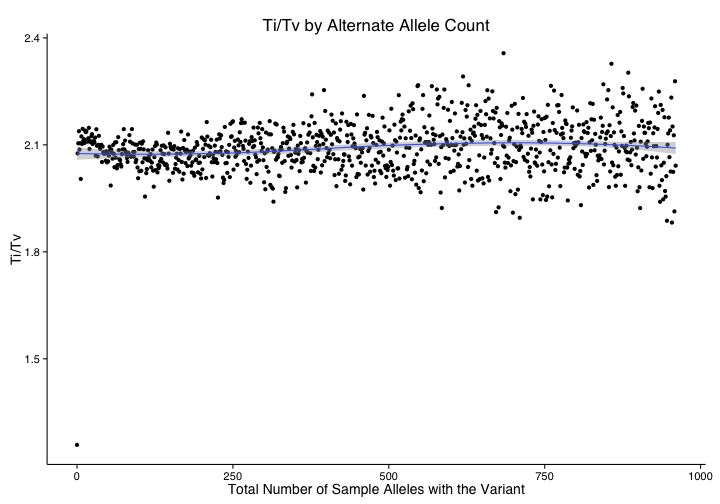
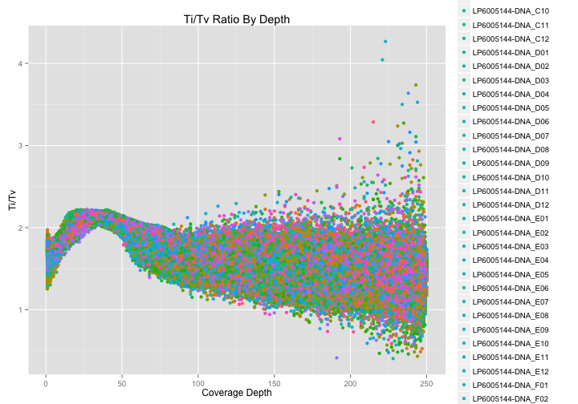

<!-- R Markdown Documentation, DO NOT EDIT THE PLAIN MARKDOWN VERSION OF THIS FILE -->

<!-- Copyright 2015 Google Inc. All rights reserved. -->

<!-- Licensed under the Apache License, Version 2.0 (the "License"); -->
<!-- you may not use this file except in compliance with the License. -->
<!-- You may obtain a copy of the License at -->

<!--     http://www.apache.org/licenses/LICENSE-2.0 -->

<!-- Unless required by applicable law or agreed to in writing, software -->
<!-- distributed under the License is distributed on an "AS IS" BASIS, -->
<!-- WITHOUT WARRANTIES OR CONDITIONS OF ANY KIND, either express or implied. -->
<!-- See the License for the specific language governing permissions and -->
<!-- limitations under the License. -->

*This codelab was made in collaboration with [Google Genomics](https://github.com/googlegenomics).
New [Standard SQL](https://cloud.google.com/bigquery/docs/reference/standard-sql/)
versions of many of these queries can be found
[here](https://github.com/googlegenomics/codelabs/tree/master/R/PlatinumGenomes-QC/sql).*

# Part 3: Variant-Level QC


In Part 3 of the codelab, we perform some quality control analyses that could help to identify any problematic variants which should be excluded from further analysis.  The appropriate cut off thresholds will depend upon the input dataset and/or other factors.

* [Setup](#setup)
* [Ti/Tv by Genomic Window](#titv-by-genomic-window)
* [Ti/Tv by Alternate Allele Counts](#titv-by-alternate-allele-counts)
* [Ti/Tv by Depth](#titv-by-depth)
* [Missingness Rate](#missingness-rate)
* [Hardy-Weinberg Equilibrium](#hardy-weinberg-equilibrium)
* [Heterozygous Haplotype](#heterozygous-haplotype)
* [Blacklisted Variants](#blacklisted-variants)


## Setup


```r
queryReplacements <- list("_THE_TABLE_"="va_aaa_pilot_data.all_genomes_gvcfs",
                          "_THE_EXPANDED_TABLE_"="va_aaa_pilot_data.all_genomes_expanded_vcfs_java2",
                          "_BLACKLISTED_TABLE_"="resources.blacklisted_positions",
                          "_PATIENT_INFO_"="va_aaa_pilot_data.patient_info")
sampleData <- read.csv("./data/patient_info.csv")
sampleInfo <- select(sampleData, call_call_set_name=Catalog.ID, gender=Gender)
```

ggplot2 themes to use throughout this page.

```r
plot_theme = theme_minimal(base_size = 14, base_family = "Helvetica") + 
  theme(axis.line = element_line(colour = "black"),
        panel.grid = element_blank())

boxPlotTheme = theme_minimal(base_size=14, base_family = "Helvetica") +
  theme(panel.grid = element_blank())
```


## Ti/Tv by Genomic Window

We want to check whether either variants are occuring more frequently than random chance at regions across the genome.  One way we can check this is to check whether the ratio of transitions to transversions is within an expected range.  In this analysis we group variants together within 100kb windows accross the entire genome and calculate the ti/tv ratio for each region.  Variants within windows that have a ti/tv ratio outside the expected range will be flagged.


```r
result <- DisplayAndDispatchQuery("./sql/ti-tv-ratio.sql",
                                  project=project,
                                  replacements=c("#_WHERE_"="WHERE reference_name = 'chr1'",
                                                 "_WINDOW_SIZE_"="100000",
                                                 queryReplacements))
```

```
# Compute the Ti/Tv ratio for variants within genomic region windows.
SELECT
  reference_name,
  window * 100000 AS window_start,
  transitions,
  transversions,
  transitions/transversions AS titv,
  num_variants_in_window,
FROM (
  SELECT
    reference_name,
    window,
    SUM(mutation IN ('A->G', 'G->A', 'C->T', 'T->C')) AS transitions,
    SUM(mutation IN ('A->C', 'C->A', 'G->T', 'T->G',
                     'A->T', 'T->A', 'C->G', 'G->C')) AS transversions,
    COUNT(mutation) AS num_variants_in_window
  FROM (
    SELECT
      reference_name,
      reference_bases,
      alternate_bases,
      INTEGER(FLOOR(start / 100000)) AS window,
      CONCAT(reference_bases, CONCAT(STRING('->'), alternate_bases)) AS mutation,
      COUNT(alternate_bases) WITHIN RECORD AS num_alts,
    FROM
      [va_aaa_pilot_data.all_genomes_gvcfs]
    # Optionally add clause here to limit the query to a particular
    # region of the genome.
    WHERE reference_name = 'chr1'
    HAVING
      # Skip 1/2 genotypes _and non-SNP variants
      num_alts = 1
      AND reference_bases IN ('A','C','G','T')
      AND alternate_bases IN ('A','C','G','T'))
  GROUP BY
    reference_name,
    window)
ORDER BY
  window_start
```
Number of rows returned by this query: **2279**.

Displaying the first few rows of the dataframe of results:
<!-- html table generated in R 3.1.2 by xtable 1.7-4 package -->
<!-- Tue Sep 22 23:09:26 2015 -->
<table border=1>
<tr> <th> reference_name </th> <th> window_start </th> <th> transitions </th> <th> transversions </th> <th> titv </th> <th> num_variants_in_window </th>  </tr>
  <tr> <td> chr1 </td> <td align="right">   0 </td> <td align="right"> 501 </td> <td align="right"> 335 </td> <td align="right"> 1.50 </td> <td align="right"> 836 </td> </tr>
  <tr> <td> chr1 </td> <td align="right"> 100000 </td> <td align="right"> 253 </td> <td align="right"> 121 </td> <td align="right"> 2.09 </td> <td align="right"> 374 </td> </tr>
  <tr> <td> chr1 </td> <td align="right"> 200000 </td> <td align="right"> 137 </td> <td align="right">  91 </td> <td align="right"> 1.51 </td> <td align="right"> 228 </td> </tr>
  <tr> <td> chr1 </td> <td align="right"> 300000 </td> <td align="right">  19 </td> <td align="right">  18 </td> <td align="right"> 1.06 </td> <td align="right">  37 </td> </tr>
  <tr> <td> chr1 </td> <td align="right"> 400000 </td> <td align="right">  30 </td> <td align="right">  31 </td> <td align="right"> 0.97 </td> <td align="right">  61 </td> </tr>
  <tr> <td> chr1 </td> <td align="right"> 500000 </td> <td align="right"> 481 </td> <td align="right"> 159 </td> <td align="right"> 3.03 </td> <td align="right"> 640 </td> </tr>
   </table>

Visualizing the results:

```r
ggplot(result, aes(x=window_start, y=titv)) +
  geom_point() +
  stat_smooth() +
  scale_x_continuous(labels=comma) +
  xlab("Genomic Position") +
  ylab("Ti/Tv") +
  ggtitle("Ti/Tv by 100,000 base pair windows on Chromosome 1") +
  plot_theme
```


## Ti/Tv by Alternate Allele Counts

Check whether the ratio of transitions vs. transversions in SNPs appears to be resonable across the range of rare variants to common variants.  This query may help to identify problems with rare or common variants.  


```r
result <- DisplayAndDispatchQuery("./sql/ti-tv-by-alternate-allele-count.sql",
                                  project=project,
                                  replacements=c(queryReplacements))
```

```
# Compute the Ti/Tv ratio for variants binned by alternate allele count.
SELECT
  transitions,
  transversions,
  transitions/transversions AS titv,
  alternate_allele_count
FROM (
  SELECT
    SUM(mutation IN ('A->G', 'G->A', 'C->T', 'T->C')) AS transitions,
    SUM(mutation IN ('A->C', 'C->A', 'G->T', 'T->G',
                     'A->T', 'T->A', 'C->G', 'G->C')) AS transversions,
    alternate_allele_count
  FROM (
    SELECT
      alternate_bases,
      reference_bases,
      CONCAT(reference_bases, CONCAT(STRING('->'), alternate_bases)) AS mutation,
      COUNT(alternate_bases) WITHIN RECORD AS num_alts,
      SUM(call.genotype = 1) WITHIN RECORD AS alternate_allele_count,
    FROM
      [va_aaa_pilot_data.all_genomes_gvcfs]
    # Optionally add clause here to limit the query to a particular
    # region of the genome.
    #_WHERE_
    HAVING
      # Skip 1/2 genotypes _and non-SNP variants
      num_alts = 1
      AND reference_bases IN ('A','C','G','T')
      AND alternate_bases IN ('A','C','G','T'))
  GROUP BY
    alternate_allele_count)
ORDER BY
  alternate_allele_count DESC
```
Number of rows returned by this query: **961**.

Displaying the first few rows of the dataframe of results:
<!-- html table generated in R 3.1.2 by xtable 1.7-4 package -->
<!-- Tue Sep 22 23:09:30 2015 -->
<table border=1>
<tr> <th> transitions </th> <th> transversions </th> <th> titv </th> <th> alternate_allele_count </th>  </tr>
  <tr> <td align="right"> 39938 </td> <td align="right"> 19562 </td> <td align="right"> 2.04 </td> <td align="right"> 960 </td> </tr>
  <tr> <td align="right"> 19010 </td> <td align="right"> 8344 </td> <td align="right"> 2.28 </td> <td align="right"> 959 </td> </tr>
  <tr> <td align="right"> 38832 </td> <td align="right"> 20295 </td> <td align="right"> 1.91 </td> <td align="right"> 958 </td> </tr>
  <tr> <td align="right"> 17355 </td> <td align="right"> 8160 </td> <td align="right"> 2.13 </td> <td align="right"> 957 </td> </tr>
  <tr> <td align="right"> 11650 </td> <td align="right"> 5755 </td> <td align="right"> 2.02 </td> <td align="right"> 956 </td> </tr>
  <tr> <td align="right"> 7414 </td> <td align="right"> 3446 </td> <td align="right"> 2.15 </td> <td align="right"> 955 </td> </tr>
   </table>

Visualizing the results:

```r
ggplot(result, aes(x=alternate_allele_count, y=titv)) +
  geom_point() +
  stat_smooth() +
  scale_x_continuous() +
  xlab("Total Number of Sample Alleles with the Variant") +
  ylab("Ti/Tv") +
  ggtitle("Ti/Tv by Alternate Allele Count") +
  plot_theme
```



## Ti/Tv by Depth

We next want to determine whether mutations at a specific depth seem to be occuring at various coverage depths are occuring more often than would be expected by random chance.  We do this by grouping variants from each genome together by coverage depth, e.g. if variant A and variant B both occur in the same sample with 30x coverage they will be grouped for this analysis.  Variants at coverage depths that have ti/tv ratios outside the expected range will be flagged.


```r
query <- "./sql/ti-tv-by-depth.sql"
result <- DisplayAndDispatchQuery(query,
                                  project=project,
                                  replacements=c(tableReplacement))
```

```
# Calculate ti/tv ratio for all SNPs for each sample grouped by depth of coverage.

SELECT
  call.call_set_name,
  (transitions/transversions) AS titv_ratio,
  average_depth,
FROM (
  SELECT
    call.call_set_name,
    SUM(mutation IN ('A->G', 'G->A', 'C->T', 'T->C')) AS transitions,
    SUM(mutation IN ('A->C', 'C->A', 'G->T', 'T->G',
                     'A->T', 'T->A', 'C->G', 'G->C')) AS transversions,
    ROUND(AVG(call.DP)) AS average_depth,
  FROM (

    SELECT
      call.call_set_name,
      reference_bases,
      alternate_bases,
      CONCAT(reference_bases, CONCAT(STRING('->'), alternate_bases)) AS mutation,
      COUNT(alternate_bases) WITHIN RECORD AS num_alts,
      call.DP
    FROM (
      SELECT
        call.call_set_name,
        reference_bases,
        GROUP_CONCAT(alternate_bases) WITHIN RECORD AS alternate_bases,
        call.genotype,
        call.DP,
      FROM
        [va_aaa_pilot_data.multi_sample_variants_seq_qc]
      # Optionally add clause here to limit the query to a particular
      # region of the genome.
      #_WHERE_  
      )
    WHERE
      call.DP is not null
    HAVING
      # Skip 1/2 genotypes _and non-SNP variants
      num_alts = 1
      AND reference_bases IN ('A','C','G','T')
      AND alternate_bases IN ('A','C','G','T'))
    GROUP BY 
      call.call_set_name,
      call.DP,)
WHERE
  transversions > 0
GROUP BY
  call.call_set_name,
  titv_ratio,
  average_depth,

Retrieving data:  3.4s
Retrieving data:  4.9s
Retrieving data:  7.7s
Retrieving data:  9.2s
Retrieving data: 10.9s
Retrieving data: 12.4s
Retrieving data: 14.1s
Retrieving data: 15.6s
Retrieving data: 17.4s
Retrieving data: 19.5s
```

<!-- html table generated in R 3.1.2 by xtable 1.7-4 package -->
<!-- Tue Sep 22 23:09:53 2015 -->
<table border=1>
<tr> <th> call_call_set_name </th> <th> titv_ratio </th> <th> average_depth </th>  </tr>
  <tr> <td> LP6005692-DNA_G03 </td> <td align="right"> 2.12 </td> <td align="right"> 29.00 </td> </tr>
  <tr> <td> LP6005692-DNA_C05 </td> <td align="right"> 2.13 </td> <td align="right"> 36.00 </td> </tr>
  <tr> <td> LP6005144-DNA_F02 </td> <td align="right"> 2.16 </td> <td align="right"> 24.00 </td> </tr>
  <tr> <td> LP6005144-DNA_H12 </td> <td align="right"> 2.16 </td> <td align="right"> 34.00 </td> </tr>
  <tr> <td> LP6005038-DNA_D03 </td> <td align="right"> 2.14 </td> <td align="right"> 34.00 </td> </tr>
  <tr> <td> LP6005051-DNA_F09 </td> <td align="right"> 1.96 </td> <td align="right"> 45.00 </td> </tr>
   </table>


```r
ggplot(result, aes(x=average_depth, y=titv_ratio, color=call_call_set_name)) + 
  geom_point() +
  ggtitle("Ti/Tv Ratio By Depth") +
  xlab("Coverage Depth") + 
  ylab("Ti/Tv") + 
  plot_theme +
  theme(legend.position="none")
```



## Missingness Rate

We next want to check how frequenctly or infrequenctly a variant is called across all samples.  If a variant has a very low call rate this may mean it is difficult to sequence and even high confidence calls at that position may be suspect.  


```r
sortAndLimit <- "ORDER BY missingness_rate DESC, reference_name, start, reference_bases, alternate_bases LIMIT 1000"
cutoff <- list("_CUTOFF_"="0.9")
result <- DisplayAndDispatchQuery("./sql/variant-level-missingness-fail.sql",
                                  project=project,
                                  replacements=c("#_ORDER_BY_"=sortAndLimit,
                                                 queryReplacements,
                                                 cutoff))
```

```
# Select positions where the missingness rate across all samples is above a defined cutoff.

SELECT 
variant_id,
"variant_missingness" AS failure_reason,
missingness_rate,
FROM (
  SELECT
  variant_id,
  reference_name,
  start,
  end,
  reference_bases,
  alternate_bases,
  called_allele_count,
  1 - (called_allele_count)/sample_count AS missingness_rate,
  sample_count
  FROM (
    SELECT
    variant_id,
    reference_name,
    start,
    end,
    reference_bases,
    GROUP_CONCAT(alternate_bases) WITHIN RECORD AS alternate_bases,
    SUM(call.genotype >= 0) WITHIN RECORD AS called_allele_count,
    FROM
    [va_aaa_pilot_data.all_genomes_expanded_vcfs_java2]
    # Optionally add clause here to limit the query to a particular
    # region of the genome.
    #_WHERE_
  ) AS g
  CROSS JOIN (
    SELECT
    COUNT(call.call_set_name) AS sample_count
    FROM (
      SELECT 
      call.call_set_name
      FROM
      [va_aaa_pilot_data.all_genomes_expanded_vcfs_java2]
      GROUP BY 
      call.call_set_name)) AS count )
WHERE
missingness_rate > 0.9
# Optionally add a clause here to sort and limit the results.
ORDER BY missingness_rate DESC, reference_name, start, reference_bases, alternate_bases LIMIT 1000
```
Number of rows returned by this query: **1000**.

Displaying the first few rows of the dataframe of results:
<!-- html table generated in R 3.1.2 by xtable 1.7-4 package -->
<!-- Tue Sep 22 23:10:00 2015 -->
<table border=1>
<tr> <th> variant_id </th> <th> failure_reason </th> <th> missingness_rate </th>  </tr>
  <tr> <td> CJ_JqPj1p5_yIRIEY2hyMRj9UiCG4PHHiLuQ8O8B </td> <td> variant_missingness </td> <td align="right"> 1.00 </td> </tr>
  <tr> <td> CJ_JqPj1p5_yIRIEY2hyMRir8QEg8NHvoIrojceRAQ </td> <td> variant_missingness </td> <td align="right"> 1.00 </td> </tr>
  <tr> <td> CJ_JqPj1p5_yIRIEY2hyMRjK8QEgyqWChcvz7JIK </td> <td> variant_missingness </td> <td align="right"> 1.00 </td> </tr>
  <tr> <td> CJ_JqPj1p5_yIRIEY2hyMRi-9AEgt66dj4yx7a9D </td> <td> variant_missingness </td> <td align="right"> 1.00 </td> </tr>
  <tr> <td> CJ_JqPj1p5_yIRIEY2hyMRi-9AEgudWm_IbA20k </td> <td> variant_missingness </td> <td align="right"> 1.00 </td> </tr>
  <tr> <td> CJ_JqPj1p5_yIRIEY2hyMRjalAMgmpr66o-86pW0AQ </td> <td> variant_missingness </td> <td align="right"> 1.00 </td> </tr>
   </table>

## Hardy-Weinberg Equilibrium

For each variant, compute the expected versus observed relationship between allele frequencies and genotype frequencies per the Hardy-Weinberg Equilibrium.


```r
sortAndLimit <- "ORDER BY ChiSq DESC, reference_name, start, alternate_bases LIMIT 1000"
result <- DisplayAndDispatchQuery("./sql/hardy-weinberg.sql",
                                  project=project,
                                  replacements=c("#_ORDER_BY_"=sortAndLimit,
                                                 queryReplacements))
```

```
# The following query computes the Hardy-Weinberg equilibrium for variants.
SELECT
  reference_name,
  start,
  reference_bases,
  alternate_bases,
  OBS_HOM1,
  OBS_HET,
  OBS_HOM2,
  E_HOM1,
  E_HET,
  E_HOM2,

  # Chi Squared Calculation
  # SUM(((Observed - Expected)^2) / Expected )
  ROUND((POW(OBS_HOM1 - E_HOM1, 2) / E_HOM1)
  + (POW(OBS_HET - E_HET, 2) / E_HET)
  + (POW(OBS_HOM2 - E_HOM2, 2) / E_HOM2), 6)
  AS ChiSq,

  # Determine if Chi Sq value is significant
  IF((POW(OBS_HOM1 - E_HOM1, 2) / E_HOM1)
  + (POW(OBS_HET - E_HET, 2) / E_HET)
  + (POW(OBS_HOM2 - E_HOM2, 2) / E_HOM2)
  > 5.991, "TRUE", "FALSE") AS PVALUE_SIG

FROM (
    SELECT
      reference_name,
      start,
      reference_bases,
      alternate_bases,
      OBS_HOM1,
      OBS_HET,
      OBS_HOM2,

      # Expected AA
      # p^2
      # ((COUNT(AA) + (COUNT(Aa)/2) /
      #  SAMPLE_COUNT) ^ 2) * SAMPLE_COUNT
      ROUND(POW((OBS_HOM1 + (OBS_HET/2)) /
        SAMPLE_COUNT, 2) * SAMPLE_COUNT, 2)
        AS E_HOM1,

      # Expected Aa
      # 2pq
      # 2 * (COUNT(AA) + (COUNT(Aa)/2) / SAMPLE_COUNT) *
      # (COUNT(aa) + (COUNT(Aa)/2) / SAMPLE_COUNT)
      # * SAMPLE_COUNT
      ROUND(2 * ((OBS_HOM1 + (OBS_HET/2)) / SAMPLE_COUNT) *
        ((OBS_HOM2 + (OBS_HET/2)) / SAMPLE_COUNT)
        * SAMPLE_COUNT, 2)
        AS E_HET,

      # Expected aa
      # q^2
      # (COUNT(aa) + (COUNT(Aa)/2) /
      #  SAMPLE_COUNT) ^ 2 * SAMPLE_COUNT
      ROUND(POW((OBS_HOM2 + (OBS_HET/2)) /
        SAMPLE_COUNT, 2) * SAMPLE_COUNT, 2)
        AS E_HOM2,

  FROM (
    SELECT
      reference_name,
      start,
      reference_bases,
      alternate_bases,
      HOM_REF AS OBS_HOM1,
      HET AS OBS_HET,
      HOM_ALT AS OBS_HOM2,
      HOM_REF + HET + HOM_ALT AS SAMPLE_COUNT,
    FROM (
      SELECT
        reference_name,
        start,
        END,
        reference_bases,
        GROUP_CONCAT(alternate_bases) WITHIN RECORD AS alternate_bases,
        COUNT(alternate_bases) WITHIN RECORD AS num_alts,
        SUM(EVERY(0 = call.genotype)) WITHIN call AS HOM_REF,
        SUM(EVERY(1 = call.genotype)) WITHIN call AS HOM_ALT,
        SUM(SOME(0 = call.genotype)
          AND SOME(1 = call.genotype)) WITHIN call AS HET,
      FROM
        [va_aaa_pilot_data.all_genomes_expanded_vcfs_java2]
      # Optionally add a clause here to limit the query to a particular
      # region of the genome.
      #_WHERE_
      HAVING
        # Skip 1/2 genotypes
        num_alts = 1
        )))
# Optionally add a clause here to sort and limit the results.
ORDER BY ChiSq DESC, reference_name, start, alternate_bases LIMIT 1000
```
Number of rows returned by this query: **1000**.

Displaying the first few rows of the dataframe of results:
<!-- html table generated in R 3.1.2 by xtable 1.7-4 package -->
<!-- Tue Sep 22 23:10:03 2015 -->
<table border=1>
<tr> <th> reference_name </th> <th> start </th> <th> reference_bases </th> <th> alternate_bases </th> <th> OBS_HOM1 </th> <th> OBS_HET </th> <th> OBS_HOM2 </th> <th> E_HOM1 </th> <th> E_HET </th> <th> E_HOM2 </th> <th> ChiSq </th> <th> PVALUE_SIG </th>  </tr>
  <tr> <td> chr10 </td> <td align="right"> 1461139 </td> <td> C </td> <td> T </td> <td align="right"> 454 </td> <td align="right">   0 </td> <td align="right">   4 </td> <td align="right"> 450.03 </td> <td align="right"> 7.93 </td> <td align="right"> 0.03 </td> <td align="right"> 533.33 </td> <td> TRUE </td> </tr>
  <tr> <td> chr11 </td> <td align="right"> 101415618 </td> <td> T </td> <td> A </td> <td align="right"> 454 </td> <td align="right">   0 </td> <td align="right">   4 </td> <td align="right"> 450.03 </td> <td align="right"> 7.93 </td> <td align="right"> 0.03 </td> <td align="right"> 533.33 </td> <td> TRUE </td> </tr>
  <tr> <td> chr11 </td> <td align="right"> 120928708 </td> <td> T </td> <td> G </td> <td align="right"> 454 </td> <td align="right">   0 </td> <td align="right">   4 </td> <td align="right"> 450.03 </td> <td align="right"> 7.93 </td> <td align="right"> 0.03 </td> <td align="right"> 533.33 </td> <td> TRUE </td> </tr>
  <tr> <td> chr13 </td> <td align="right"> 59168960 </td> <td> A </td> <td> G </td> <td align="right"> 454 </td> <td align="right">   0 </td> <td align="right">   4 </td> <td align="right"> 450.03 </td> <td align="right"> 7.93 </td> <td align="right"> 0.03 </td> <td align="right"> 533.33 </td> <td> TRUE </td> </tr>
  <tr> <td> chr15 </td> <td align="right"> 98813562 </td> <td> A </td> <td> G </td> <td align="right"> 454 </td> <td align="right">   0 </td> <td align="right">   4 </td> <td align="right"> 450.03 </td> <td align="right"> 7.93 </td> <td align="right"> 0.03 </td> <td align="right"> 533.33 </td> <td> TRUE </td> </tr>
  <tr> <td> chr2 </td> <td align="right"> 217343776 </td> <td> G </td> <td> C </td> <td align="right"> 454 </td> <td align="right">   0 </td> <td align="right">   4 </td> <td align="right"> 450.03 </td> <td align="right"> 7.93 </td> <td align="right"> 0.03 </td> <td align="right"> 533.33 </td> <td> TRUE </td> </tr>
   </table>

## Heterozygous Haplotype
For each variant within the X and Y chromosome, identify heterozygous variants in male genomes.  Males should not have any heterozygous calls on the X-chromosome outside of the pseudo-autosomal regions.  If any are found they will be flagged. 

First we use our sample information to determine which genomes are male.  

```r
maleSampleIds <- paste("'", filter(sampleInfo, gender == "Male")$call_call_set_name, "'", sep="", collapse=",")
```


```r
sortAndLimit <- "ORDER BY reference_name, start, alternate_bases, call.call_set_name LIMIT 1000"
result <- DisplayAndDispatchQuery("./sql/sex-chromosome-heterozygous-haplotypes.sql",
                                  project=project,
                                  replacements=c("_MALE_SAMPLE_IDS_"=maleSampleIds,
                                                 "#_ORDER_BY_"=sortAndLimit,
                                                 queryReplacements))
```

```
# Identify heterozygous variants on the sex chromosomes for reportedly male samples. 

SELECT
  variant_id,
  sample_id,
  "heterozygous_haplotype" AS failure_reason,
FROM (
SELECT
  variant_id,
  reference_name,
  start,
  end,
  reference_bases,
  call.call_set_name AS sample_id,
  GROUP_CONCAT(STRING(call.genotype)) WITHIN call AS genotype,
FROM(FLATTEN((
  [va_aaa_pilot_data.all_genomes_expanded_vcfs_java2]), call.call_set_name))
WHERE
  reference_name IN ('chrX', 'chrY')
OMIT
  call IF (2 > COUNT(call.genotype))
  OR EVERY(call.genotype <= 0)
  OR EVERY(call.genotype = 1)
  # Pseudoautosomal Region 1
  OR (reference_name = 'chrX'
    AND start > 60001
    AND end < 2699520)
  OR (reference_name = 'chrY'
    AND start > 10001
    AND end < 2649520)
  # Pseudoautosomal Region 2
  OR (reference_name = 'chrX'
    AND start > 155260560
    AND end < 155270560)
  OR (reference_name = 'chrY' 
    AND start > 59363566
    AND end < 59373566)) AS seq
JOIN (
  SELECT
    IlluminaID,
    SEX
  FROM
    [va_aaa_pilot_data.patient_info] ) AS info
ON
  seq.sample_id = info.IlluminaID
WHERE
  SEX = 'M'
# Optionally add a clause here to sort and limit the results.
ORDER BY reference_name, start, alternate_bases, call.call_set_name LIMIT 1000
```

```
Error: Field 'alternate_bases' not found on either side of the JOIN

query invalidQuery. Field 'alternate_bases' not found on either side of the JOIN
```
Number of rows returned by this query: **1000**.

Displaying the first few rows of the dataframe of results:
<!-- html table generated in R 3.1.2 by xtable 1.7-4 package -->
<!-- Tue Sep 22 23:10:06 2015 -->
<table border=1>
<tr> <th> reference_name </th> <th> start </th> <th> reference_bases </th> <th> alternate_bases </th> <th> OBS_HOM1 </th> <th> OBS_HET </th> <th> OBS_HOM2 </th> <th> E_HOM1 </th> <th> E_HET </th> <th> E_HOM2 </th> <th> ChiSq </th> <th> PVALUE_SIG </th>  </tr>
  <tr> <td> chr10 </td> <td align="right"> 1461139 </td> <td> C </td> <td> T </td> <td align="right"> 454 </td> <td align="right">   0 </td> <td align="right">   4 </td> <td align="right"> 450.03 </td> <td align="right"> 7.93 </td> <td align="right"> 0.03 </td> <td align="right"> 533.33 </td> <td> TRUE </td> </tr>
  <tr> <td> chr11 </td> <td align="right"> 101415618 </td> <td> T </td> <td> A </td> <td align="right"> 454 </td> <td align="right">   0 </td> <td align="right">   4 </td> <td align="right"> 450.03 </td> <td align="right"> 7.93 </td> <td align="right"> 0.03 </td> <td align="right"> 533.33 </td> <td> TRUE </td> </tr>
  <tr> <td> chr11 </td> <td align="right"> 120928708 </td> <td> T </td> <td> G </td> <td align="right"> 454 </td> <td align="right">   0 </td> <td align="right">   4 </td> <td align="right"> 450.03 </td> <td align="right"> 7.93 </td> <td align="right"> 0.03 </td> <td align="right"> 533.33 </td> <td> TRUE </td> </tr>
  <tr> <td> chr13 </td> <td align="right"> 59168960 </td> <td> A </td> <td> G </td> <td align="right"> 454 </td> <td align="right">   0 </td> <td align="right">   4 </td> <td align="right"> 450.03 </td> <td align="right"> 7.93 </td> <td align="right"> 0.03 </td> <td align="right"> 533.33 </td> <td> TRUE </td> </tr>
  <tr> <td> chr15 </td> <td align="right"> 98813562 </td> <td> A </td> <td> G </td> <td align="right"> 454 </td> <td align="right">   0 </td> <td align="right">   4 </td> <td align="right"> 450.03 </td> <td align="right"> 7.93 </td> <td align="right"> 0.03 </td> <td align="right"> 533.33 </td> <td> TRUE </td> </tr>
  <tr> <td> chr2 </td> <td align="right"> 217343776 </td> <td> G </td> <td> C </td> <td align="right"> 454 </td> <td align="right">   0 </td> <td align="right">   4 </td> <td align="right"> 450.03 </td> <td align="right"> 7.93 </td> <td align="right"> 0.03 </td> <td align="right"> 533.33 </td> <td> TRUE </td> </tr>
   </table>

## Blacklisted Variants
Identify all variants within our cohort that have been blacklisted.  For more information on what variants are blacklisted and why see [here](https://sites.google.com/site/anshulkundaje/projects/blacklists).  All variants lccuring within blacklisted regions will be flagged.


```r
result <- DisplayAndDispatchQuery("./sql/blacklisted-variants.sql",
                                  project=project,
                                  replacements=c(queryReplacements))
```

```
# Select variants that are found within blacklisted genes.
# https://sites.google.com/site/anshulkundaje/projects/blacklists

SELECT
  seq.variant_id AS variant_id,
  "blacklisted" AS failure_reason,
  bl.Artifact_Type AS Artifact_Type 
FROM (
  SELECT
    variant_id,
    reference_name,
    start,
    end,
  FROM
    [va_aaa_pilot_data.all_genomes_expanded_vcfs_java2]) as seq
JOIN (
  SELECT 
    reference_name,
    start - 1 AS start,
    end,
    Artifact_Type
  FROM 
    [resources.blacklisted_positions]) AS bl
ON
  seq.reference_name = bl.reference_name
WHERE 
  seq.start >= bl.start AND
  seq.end <= bl.end
#_ORDER_BY_


Retrieving data:  3.8s
Retrieving data:  6.3s
Retrieving data:  9.9s
Retrieving data: 12.5s
Retrieving data: 15.0s
Retrieving data: 17.6s
Retrieving data: 19.9s
Retrieving data: 22.8s
Retrieving data: 26.4s
Retrieving data: 29.0s
Retrieving data: 32.2s
Retrieving data: 36.9s
Retrieving data: 39.5s
Retrieving data: 42.9s
Retrieving data: 46.5s
Retrieving data: 49.7s
Retrieving data: 52.0s
Retrieving data: 54.7s
Retrieving data: 57.4s
Retrieving data: 60.2s
Retrieving data: 62.4s
Retrieving data: 65.2s
Retrieving data: 67.7s
Retrieving data: 70.3s
Retrieving data: 72.5s
Retrieving data: 75.4s
Retrieving data: 77.2s
Retrieving data: 79.0s
Retrieving data: 81.8s
Retrieving data: 84.1s
Retrieving data: 86.1s
Retrieving data: 88.3s
Retrieving data: 89.9s
Retrieving data: 92.3s
Retrieving data: 94.6s
Retrieving data: 96.5s
Retrieving data: 98.4s
Retrieving data: 100.4s
Retrieving data: 102.1s
Retrieving data: 104.1s
Retrieving data: 106.2s
Retrieving data: 109.8s
Retrieving data: 111.6s
Retrieving data: 113.5s
Retrieving data: 115.3s
Retrieving data: 117.3s
Retrieving data: 119.1s
Retrieving data: 120.9s
Retrieving data: 123.1s
```
Number of rows returned by this query: **509065**.

Displaying the first few rows of the dataframe of results:
<!-- html table generated in R 3.1.2 by xtable 1.7-4 package -->
<!-- Tue Sep 22 23:12:15 2015 -->
<table border=1>
<tr> <th> variant_id </th> <th> failure_reason </th> <th> Artifact_Type </th>  </tr>
  <tr> <td> CJ_JqPj1p5_yIRIEY2hyNRiv_4QWIKeCtZ3phP3_hwE </td> <td> blacklisted </td> <td> centromeric_repeat </td> </tr>
  <tr> <td> CJ_JqPj1p5_yIRIEY2hyNRjT_4QWINuMj6To5JHvAw </td> <td> blacklisted </td> <td> centromeric_repeat </td> </tr>
  <tr> <td> CJ_JqPj1p5_yIRIEY2hyNRjbgIUWIKinoLyFt4GxzwE </td> <td> blacklisted </td> <td> centromeric_repeat </td> </tr>
  <tr> <td> CJ_JqPj1p5_yIRIEY2hyNRjhgoUWII2H6sHWt4XFuAE </td> <td> blacklisted </td> <td> centromeric_repeat </td> </tr>
  <tr> <td> CJ_JqPj1p5_yIRIEY2hyNRj7goUWIOG13aLxo5u_Gw </td> <td> blacklisted </td> <td> centromeric_repeat </td> </tr>
  <tr> <td> CJ_JqPj1p5_yIRIEY2hyNRjeg4UWIPqdwOHH34HXbA </td> <td> blacklisted </td> <td> centromeric_repeat </td> </tr>
   </table>

--------------------------------------------------------
_Next_: [ Part 4: QC Implementation](./QC-Implementation.md)
