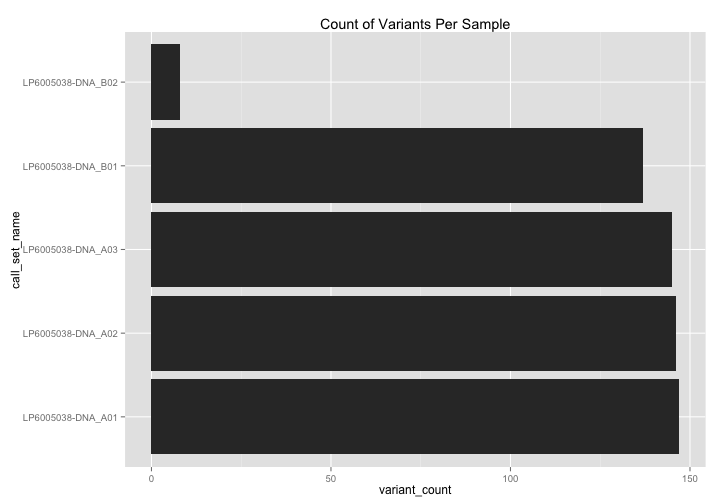

# RMarkdown Template

## Setup

For more information about how to set up set up BigQuery usage in R see [this page](https://github.com/googlegenomics/getting-started-bigquery/blob/master/RMarkdown/literate-programming-demo.md#data-visualization) from google genomics.

#### Set project details


```r
######################[ CHANGE ME ]##################################
# This codelab assumes that the current working directory is where the Rmd file resides.
setwd("/Users/gmcinnes/GitHub/mvp_aaa_codelabs/qc")

# Set the Google Cloud Platform project id under which these queries will run.
project <- "gbsc-gcp-project-mvp"
#####################################################################
```

#### Set up query function

```r
# Set up for BigQuery access.
source("./rHelpers/setup.R")
```

#### Define tables to be used in queries 

```r
tableReplacement <- list("_THE_TABLE_"="gbsc-gcp-project-mvp:va_aaa_pilot_data.5_genome_test_gvcfs_2",
                         "_THE_EXPANDED_TABLE_"="gbsc-gcp-project-mvp:va_aaa_pilot_data.5_genome_test_vcfs_2",
                         "_REF_TABLE_"="gbsc-gcp-project-mvp:qc_tables.5_genomes_ref_calls_brca1",
                         "_VARIANT_TABLE_"="gbsc-gcp-project-mvp:qc_tables.5_genomes_variants_brca1")

sampleData <- read.csv("./data/patient_info.csv")
sampleInfo <- select(sampleData, call_call_set_name=Catalog.ID, gender=Gender)

constraints <- list("#_WHERE_"="WHERE 
                    reference_name = 'chr17'
                    AND start BETWEEN 41196311
                    AND 41277499")

googleRepository = "https://raw.githubusercontent.com/googlegenomics/codelabs/master/R/PlatinumGenomes-QC/sql/"
```

## Executing queries

Queries can be imported from a local file, from the internet, or by pasting the query into the rmarkdown file.  

In this example we'll look at all the variants found within brca1 for our sample cohort.

```r
query <- "https://raw.githubusercontent.com/googlegenomics/getting-started-bigquery/master/sql/sample-variant-counts-for-brca1.sql"
result <- DisplayAndDispatchQuery(query,
                                  project=project,
                                  replacements=tableReplacement)
```

```
# Sample variant counts within BRCA1.
SELECT
  call_set_name,
  COUNT(call_set_name) AS variant_count,
FROM (
  SELECT
    reference_name,
    start,
    END,
    reference_bases,
    GROUP_CONCAT(alternate_bases) WITHIN RECORD AS alternate_bases,
    call.call_set_name AS call_set_name,
    NTH(1,
      call.genotype) WITHIN call AS first_allele,
    NTH(2,
      call.genotype) WITHIN call AS second_allele,
  FROM
      [gbsc-gcp-project-mvp:va_aaa_pilot_data.5_genome_test_gvcfs_2]
  WHERE
    reference_name = 'chr17'
    AND start BETWEEN 41196311
    AND 41277499
  HAVING
    first_allele > 0
    OR second_allele > 0
    )
GROUP BY
  call_set_name
ORDER BY
  call_set_name
```
Number of rows returned by this query: 5.

Displaying the first few results:
<!-- html table generated in R 3.1.2 by xtable 1.7-4 package -->
<!-- Mon Mar 23 16:18:08 2015 -->
<table border=1>
<tr> <th> call_set_name </th> <th> variant_count </th>  </tr>
  <tr> <td> LP6005038-DNA_A01 </td> <td align="right"> 147 </td> </tr>
  <tr> <td> LP6005038-DNA_A02 </td> <td align="right"> 146 </td> </tr>
  <tr> <td> LP6005038-DNA_A03 </td> <td align="right"> 145 </td> </tr>
  <tr> <td> LP6005038-DNA_B01 </td> <td align="right"> 137 </td> </tr>
  <tr> <td> LP6005038-DNA_B02 </td> <td align="right">   8 </td> </tr>
   </table>

Plot it:

```r
ggplot(result, aes(x=call_set_name, y=variant_count)) +
  geom_bar(stat="identity") + coord_flip() +
  ggtitle("Count of Variants Per Sample")
```



## Generate Markdown File
Execute the the following commands to create the markdown file.
```
require(knitr)

setwd("/YOUR/WORKING/DIRECTORY")
knit("./RMarkdown_Template.Rmd")
```
  
