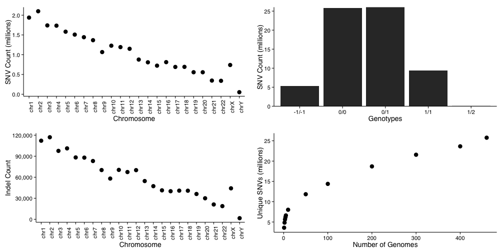
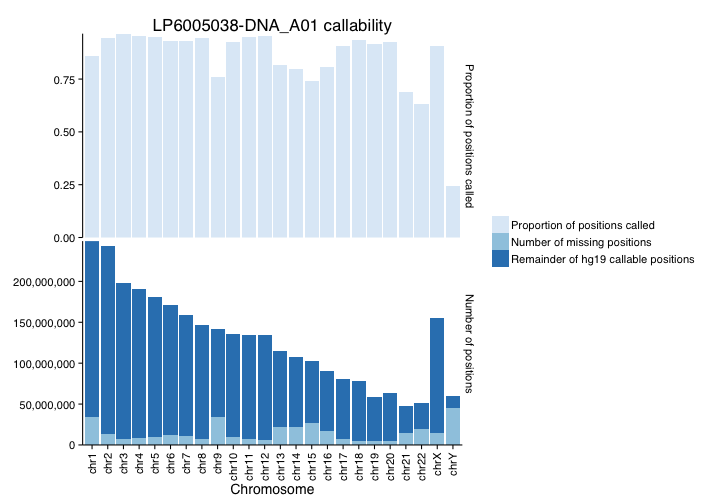
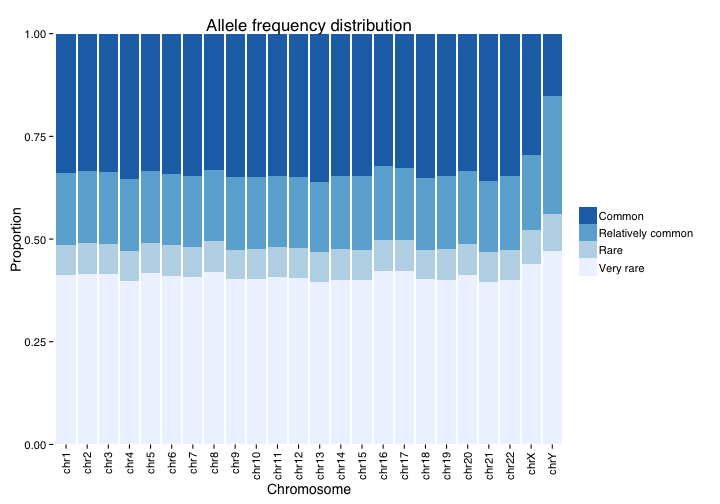
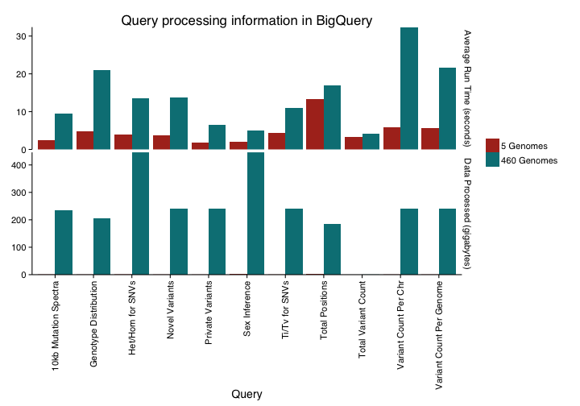
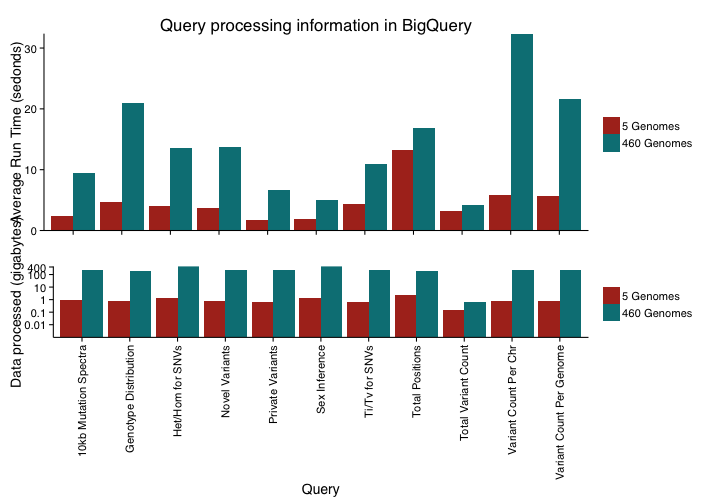
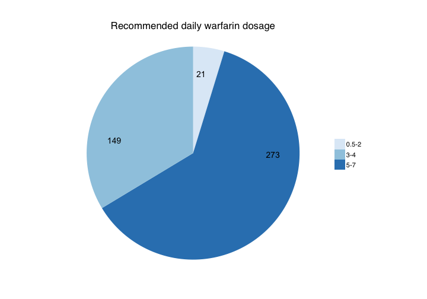
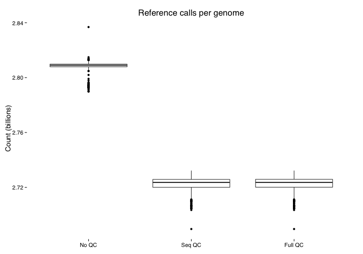
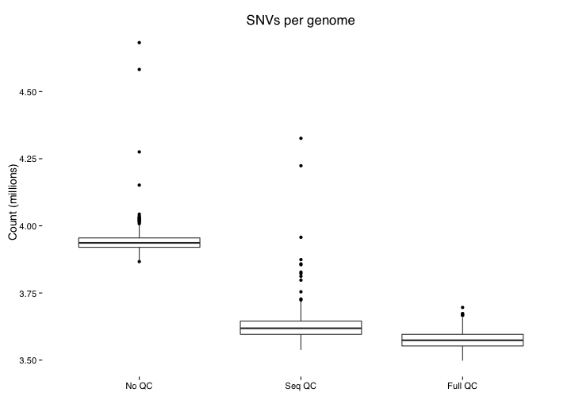
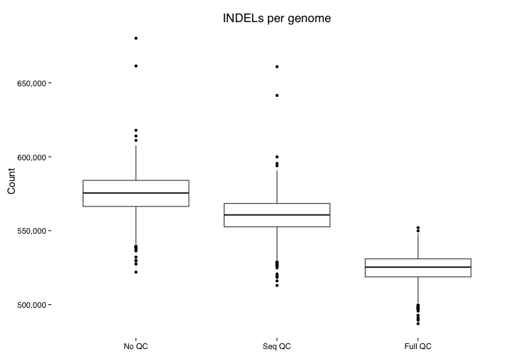
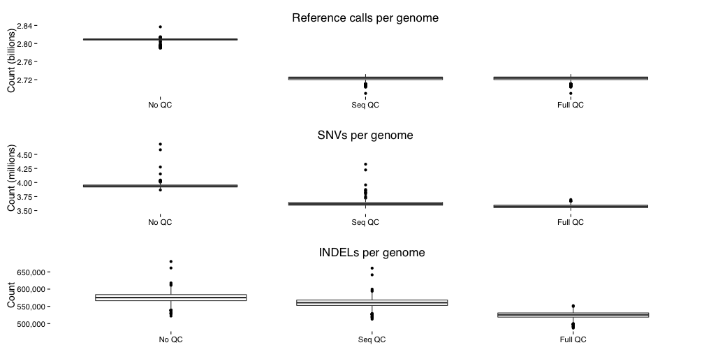

# Biological Plots

* [Setup](#setup)
* [Genotype Distribution](#genotype-distribution)
* [Callability](#callability)
* [WGS Statistics](#wgs-statistics)
* [Allele Frequency Distribution](#allele-frequency)
* [BRCA1 Mutation Spectrum](#brca1-mutation-spectrum)
* [Variant Distribution](#variant-distribution)
* [Pathogenic Variants on ACMG Genes](#acgm-genes)
* [Allele Frequency Distributions vs 1000 Genomes](#af-1kg)

## Setup


Plot theme

```r
plot_theme = theme_minimal(base_size = 14, base_family = "Helvetica") + 
  theme(axis.line = element_line(colour = "black"),
        panel.grid = element_blank())
```


```r
boxPlotTheme = theme_minimal(base_size=14, base_family = "Helvetica") +
  theme(panel.grid = element_blank())
```

Tables for biological queries

```r
queryReplacements <- list("_THE_TABLE_"="va_aaa_pilot_data.genome_calls_full_qc",
                          "_THE_EXPANDED_TABLE_"="va_aaa_pilot_data.multi_sample_variants_full_qc",
                          "_BLACKLISTED_TABLE_"="resources.blacklisted_positions",
                          "_GENOTYPING_TABLE_"="va_aaa_pilot_data.genotyping_data",
                          "_ANNOVAR_TABLE_"="resources.annovar_hg19_aaa",
                          "_CHR_LENGTHS_"="stanford.edu:gbsc-stanford-google:resources.hg19_Assembly_BinaRuns",
                          "_PATIENT_INFO_"="va_aaa_pilot_data.patient_info",
                          "_ACMG_GENES_"="stanford.edu:gbsc-stanford-google:resources.56ACMGgenes_Tx")
```


## Genotype Distribution
#### Genotype Counts per Chromosome

```r
genotypeCountResult <- DisplayAndDispatchQuery("../sql/genotype-counts.sql",
                                               project=project,
                                               replacements=queryReplacements)
```

```
SELECT
Genotype,
COUNT(genotype) AS Cnt
FROM
(
  SELECT
  reference_name,
  start,
  reference_bases,
  alternates,
  genotype
  FROM
  (
    SELECT
    reference_name,
    start,
    reference_bases,
    GROUP_CONCAT(alternate_bases) WITHIN RECORD AS alternates,
    GROUP_CONCAT(STRING(call.genotype), "/") WITHIN call AS genotype,
    GROUP_CONCAT(QC) WITHIN RECORD AS qc,
    GROUP_CONCAT(call.QC) WITHIN CALL AS call_qc,
    FROM 
    [va_aaa_pilot_data.multi_sample_variants_full_qc]
    OMIT call IF SOME(call.qc IS NOT NULL)
    HAVING QC IS NULL
  )
  GROUP EACH BY
  reference_name,
  start,
  reference_bases,
  alternates,
  genotype
)
GROUP BY
Genotype
ORDER BY
Genotype
```

Setup

```r
genotypeCountResult <- genotypeCountResult[complete.cases(genotypeCountResult),]
genotypeCountResult$Cnt = genotypeCountResult$Cnt/1000000
```


```r
counts = ggplot(genotypeCountResult) +
  geom_bar(aes(x=Genotype, y=Cnt), stat="identity") +
  xlab("Genotypes") + 
  ylab("SNV Count (millions)") + 
  scale_y_continuous(labels=comma, expand = c(0, 0)) + 
  plot_theme
counts
```


#### Variant Counts By Chromosome

```r
variantCountResult <- DisplayAndDispatchQuery("../sql/variants-by-chromosome.sql",
                                              project=project,
                                              replacements=queryReplacements)
```

```
SELECT
reference_name,
VAR_type,
COUNT(VAR_type) AS Cnt
FROM
(
  SELECT
  reference_name,
  start,
  reference_bases,
  alternates,
  VAR_type
  FROM
  (
    SELECT
    reference_name,
    start,
    reference_bases,
    GROUP_CONCAT(alternate_bases) WITHIN RECORD AS alternates,
    GROUP_CONCAT(QC) WITHIN RECORD AS qc,
    GROUP_CONCAT(call.QC) WITHIN CALL AS call_qc,
    IF(LENGTH(reference_bases)=1 AND LENGTH(alternate_bases)=1, "SNV", "INDEL") AS VAR_type
    FROM 
    [va_aaa_pilot_data.multi_sample_variants_full_qc]
    OMIT call IF EVERY(call.genotype <= 0) 
      OR SOME(call.qc IS NOT NULL)
    HAVING QC IS NULL
  )
  GROUP EACH BY
  reference_name,
  start,
  reference_bases,
  alternates,
  VAR_type
)
GROUP BY
reference_name,
VAR_type
ORDER BY
reference_name,
VAR_type

Running query:   RUNNING  2.5s
Running query:   RUNNING  3.2s
Running query:   RUNNING  3.8s
Running query:   RUNNING  4.5s
Running query:   RUNNING  5.1s
Running query:   RUNNING  5.7s
Running query:   RUNNING  6.4s
Running query:   RUNNING  7.0s
Running query:   RUNNING  7.8s
Running query:   RUNNING  8.5s
Running query:   RUNNING  9.1s
Running query:   RUNNING  9.7s
Running query:   RUNNING 10.3s
Running query:   RUNNING 11.0s
Running query:   RUNNING 11.7s
Running query:   RUNNING 12.3s
Running query:   RUNNING 13.0s
Running query:   RUNNING 13.6s
Running query:   RUNNING 14.2s
Running query:   RUNNING 14.9s
```

Setup

```r
variantCountResult <- join(variantCountResult, chromosomeLengths, by = "reference_name")
variantCountResult$scaled_count <- variantCountResult$Cnt / variantCountResult$length

chromosomes <- c("chr1", "chr2", "chr3", "chr4", "chr5", "chr6", "chr7", "chr8", "chr9", "chr10", "chr11", "chr12", "chr13", "chr14", "chr15", "chr16", "chr17", "chr18", "chr19", "chr20", "chr21", "chr22", "chrX", "chrY", "chrM")
snps <- variantCountResult[grep("SNV", variantCountResult$VAR_type), ]
snps$reference_name <- factor(snps$reference_name, levels=chromosomes)
snps <- snps[complete.cases(snps),]
snps$Cnt <- snps$Cnt/1000000
indels <- variantCountResult[grep("INDEL", variantCountResult$VAR_type), ]
indels$reference_name <- factor(indels$reference_name, levels=chromosomes)
indels <- indels[complete.cases(indels),]
```


```r
snvs = ggplot(data=snps, aes(y=Cnt, x=reference_name)) + 
  geom_point(size=4) + 
  ylab("SNV Count (millions)") +
  xlab("Chromosome") +
  scale_y_continuous(label=comma) +
  plot_theme +
  theme(axis.text.x = element_text(angle=90, vjust=1)) 
snvs
```


```r
indels = ggplot(data=indels, aes(y=Cnt, x=reference_name)) + 
  geom_point(size=4) + 
  ylab("Indel Count") +
  xlab("Chromosome") +
  scale_y_continuous(label=comma) +
  plot_theme +
  theme(axis.text.x = element_text(angle=90, vjust=1)) 
indels
```


#### Saturation Rate

```r
# Need to redo queries for this
genomeCount = c(1,2,3,4,5,10,50,100,200,300,400,460)
snvCount = c(3590360,4847512,5627244,6158953,6616457,
              8014799,11841547,14387937,18693833,21567571,23638061,25763436)
saturationRate = data_frame(genomeCount, snvCount)
saturationRate$snvCount = saturationRate$snvCount/1000000
```


```r
saturation = ggplot(saturationRate) +
  geom_point(aes(x=genomeCount, y=snvCount), size=4) +
  xlab("Number of Genomes") +
  ylab("Unique SNVs (millions)") +
  scale_y_continuous(label=comma) +
  plot_theme
saturation
```


#### Multiplot

```r
multiplot(snvs,indels, counts, saturation, cols=2)
```




## Callability

```r
callability <- DisplayAndDispatchQuery("../sql/callability.sql",
                                              project=project,
                                              replacements=queryReplacements)
```

```
SELECT
call.call_set_name,
reference_name,
contig.len,
num_SNVs,
num_REFs,
(num_SNVs + num_REFs) AS num_called_point_pos,
ROUND((num_SNVs + num_REFs) / contig.len, 3) AS prop_w_point_ino,
(contig.len - (num_SNVs + num_REFs)) AS pos_no_point_info,
ROUND((contig.len - (num_SNVs + num_REFs)) / contig.len, 3) prop_no_point_info
FROM
(
  SELECT
  call.call_set_name,
  reference_name,
  assembly.LENGTH AS contig.len,
  SUM(call.FILTER="PASS" AND (LENGTH(reference_bases)=1 AND (LENGTH(alternates)=1 OR (LENGTH(alternates)=3 AND alternates CONTAINS ",")))) AS num_SNVs,
  SUM(IF (genotypes=="0/0", (end - start), 0)) AS num_REFs
  FROM (
    SELECT
    call.call_set_name,
    reference_name,
    start,
    end,
    reference_bases,
    GROUP_CONCAT(alternate_bases) WITHIN RECORD AS alternates,
    GROUP_CONCAT(STRING(call.genotype), "/") WITHIN call AS genotypes,
    GROUP_CONCAT(call.QC) WITHIN call AS call_qc,
    GROUP_CONCAT(QC) WITHIN RECORD AS cohort_qc,
    call.FILTER
    FROM 
    [va_aaa_pilot_data.genome_calls_full_qc]
    OMIT
    call IF SOME(call.QC IS NOT NULL)
    HAVING
    cohort_qc IS NULL
  ) AS geno
  JOIN 
  [stanford.edu:gbsc-stanford-google:resources.hg19_Assembly_BinaRuns] AS assembly
  ON
  geno.reference_name = assembly.CHR
  GROUP BY
  call.call_set_name,
  reference_name,
  contig.len
)
ORDER BY
call.call_set_name,
reference_name,
Running query:   RUNNING  2.6s
Running query:   RUNNING  3.2s
Running query:   RUNNING  3.8s
Running query:   RUNNING  4.5s
Running query:   RUNNING  5.1s
Running query:   RUNNING  5.7s
Running query:   RUNNING  6.4s
Running query:   RUNNING  7.0s
Running query:   RUNNING  7.6s
Running query:   RUNNING  8.2s
Running query:   RUNNING  8.8s
Running query:   RUNNING  9.5s
Running query:   RUNNING 10.1s
Running query:   RUNNING 10.7s
Running query:   RUNNING 11.4s
Running query:   RUNNING 12.0s
Running query:   RUNNING 12.6s
Running query:   RUNNING 13.3s
Running query:   RUNNING 13.9s
Running query:   RUNNING 14.5s
Running query:   RUNNING 15.1s
Running query:   RUNNING 15.8s
Running query:   RUNNING 16.4s
Running query:   RUNNING 17.0s
Running query:   RUNNING 17.6s
Running query:   RUNNING 18.3s
Running query:   RUNNING 18.9s
Running query:   RUNNING 19.5s
Running query:   RUNNING 20.2s
Running query:   RUNNING 20.8s
Running query:   RUNNING 21.4s
Running query:   RUNNING 22.1s
Running query:   RUNNING 22.7s
Running query:   RUNNING 23.3s
Running query:   RUNNING 23.9s
Running query:   RUNNING 24.6s
Running query:   RUNNING 25.2s
Running query:   RUNNING 25.8s
Running query:   RUNNING 26.4s
Running query:   RUNNING 27.0s
Running query:   RUNNING 27.7s
Running query:   RUNNING 28.3s
Running query:   RUNNING 28.9s
Running query:   RUNNING 29.6s
Running query:   RUNNING 30.2s
Running query:   RUNNING 30.8s
Running query:   RUNNING 31.4s

Retrieving data:  6.1s
Retrieving data:  9.0s
Retrieving data: 11.0s
Retrieving data: 13.0s
```

Setup

```r
sample = 'LP6005038-DNA_A01'
selection = callability[callability$call_call_set_name == sample,]
selection$reference_name <- factor(selection$reference_name, levels=chromosomes)
selection <- selection[complete.cases(selection),]
selection$remainder <- selection$contig_len - selection$pos_no_point_info 

faceted = melt(selection, id.vars=c("reference_name"),measure.vars=c("prop_w_point_ino","pos_no_point_info","remainder"))
faceted$color = faceted$variable
faceted[faceted$variable=="remainder",]$variable <- 'pos_no_point_info'
faceted$variable <- factor(faceted$variable)
levels(faceted$variable) <- c("Proportion of positions called", "Number of positions")
levels(faceted$color) <- c("Proportion of positions called", "Number of missing positions", "Remainder of hg19 callable positions")
```


```r
ggplot(faceted) + 
  geom_bar(aes(reference_name,value, fill=color), stat="identity") +
  facet_grid(variable ~ ., scales="free_y") +
  scale_y_continuous(labels=comma, expand=c(0,0)) +
  plot_theme +
  ggtitle("LP6005038-DNA_A01 callability") +
  xlab("Chromosome") +
  scale_fill_brewer(palette=1) +
  theme(axis.text.x = element_text(angle=90, vjust=0.5, hjust=1),
    axis.title.y=element_blank(),
    legend.title=element_blank())
```




## WGS Statistics

#### Ti/Tv for SNVs

```r
titvBySample <- DisplayAndDispatchQuery("../sql/titv-by-sample.sql",
                                              project=project,
                                              replacements=queryReplacements)
```

```
SELECT
call.call_set_name AS sample.id,
transitions,
transversions,
transitions/transversions AS titv,
num_variants,
FROM 
(
  SELECT
  call.call_set_name,
  SUM(mutation IN ('A->G', 'G->A', 'C->T', 'T->C')) AS transitions,
  SUM(mutation IN ('A->C', 'C->A', 'G->T', 'T->G',
                   'A->T', 'T->A', 'C->G', 'G->C')) AS transversions,
  COUNT(mutation) AS num_variants
  FROM 
  (
    SELECT
    call.call_set_name,
    CONCAT(reference_bases, CONCAT(STRING('->'), alternate_bases)) AS mutation,
    COUNT(alternate_bases) WITHIN RECORD AS num_alts,
    GROUP_CONCAT(QC) WITHIN RECORD AS qc,
    GROUP_CONCAT(call.QC) WITHIN CALL AS call_qc,
    FROM
    FLATTEN([va_aaa_pilot_data.multi_sample_variants_full_qc], alternate_bases)
    OMIT call IF EVERY (call.genotype <= 0)
    OR SOME(call.qc IS NOT NULL)
    HAVING
    num_alts = 1
    AND QC IS NULL
  )
  GROUP BY
  call.call_set_name
)
Running query:   RUNNING  2.7s
Running query:   RUNNING  3.3s
Running query:   RUNNING  3.9s
Running query:   RUNNING  4.6s
Running query:   RUNNING  5.2s
Running query:   RUNNING  5.8s
Running query:   RUNNING  6.5s
Running query:   RUNNING  7.1s
Running query:   RUNNING  7.7s
Running query:   RUNNING  8.4s
Running query:   RUNNING  9.0s
Running query:   RUNNING  9.8s
Running query:   RUNNING 10.4s
Running query:   RUNNING 11.0s
Running query:   RUNNING 11.7s
Running query:   RUNNING 12.3s
Running query:   RUNNING 12.9s
Running query:   RUNNING 13.6s
Running query:   RUNNING 14.2s
Running query:   RUNNING 14.8s
Running query:   RUNNING 15.4s
Running query:   RUNNING 16.1s
```


```r
titv = ggplot(titvBySample) +
  geom_boxplot(aes(x="SNV", y=titv)) +
  ylab("Ti/Tv") +
  ggtitle("Ti/Tv for SNVs in each genome") +
  boxPlotTheme +
  theme(axis.text.x=element_blank(),
        axis.title.x=element_blank())
titv
```


#### Het/Hom for SNVs

```r
hetHomSnv <- DisplayAndDispatchQuery("../sql/hethom-snv.sql",
                                              project=project,
                                              replacements=queryReplacements)
```

```
SELECT
sample.id,
(hom_AA_count + het_RA_count) AS all_SNV_count,
hom_AA_count,
het_RA_count,
ROUND((het_RA_count/hom_AA_count)*1000)/1000 AS Het_Hom_ratio
FROM
(
  SELECT
  call.call_set_name AS sample.id,
  SUM(genotype="1/1" AND (LENGTH(reference_bases)=1 AND (LENGTH(alternates)=1 OR (LENGTH(alternates)=3 AND alternates CONTAINS ",")))) AS hom_AA_count,
  SUM((genotype="0/1" OR genotype="1/0" OR genotype="1/2") AND (LENGTH(reference_bases)=1 AND (LENGTH(alternates)=1 OR (LENGTH(alternates)=3 AND alternates CONTAINS ",")))) AS het_RA_count    
  FROM
  (
    SELECT
    call.call_set_name,
    reference_name,
    start,
    end,
    reference_bases,
    GROUP_CONCAT(alternate_bases) WITHIN RECORD AS alternates,
    GROUP_CONCAT(STRING(call.genotype), "/") WITHIN call AS genotype,
    GROUP_CONCAT(call.QC) WITHIN call AS call_qc,
    GROUP_CONCAT(QC) WITHIN RECORD AS cohort_qc,
    call.FILTER
    FROM 
    FLATTEN([va_aaa_pilot_data.multi_sample_variants_full_qc], alternate_bases)
    OMIT call IF SOME(call.qc IS NOT NULL)
    HAVING
    cohort_qc IS NULL AND call.FILTER = "PASS"
  ) 
  GROUP BY
  sample.id
)
GROUP BY
sample.id,
hom_AA_count,
het_RA_count,
all_SNV_count,
Het_Hom_ratio
ORDER BY
sample.id;
Running query:   RUNNING  2.5s
Running query:   RUNNING  3.1s
Running query:   RUNNING  3.8s
Running query:   RUNNING  4.4s
Running query:   RUNNING  5.0s
Running query:   RUNNING  5.6s
Running query:   RUNNING  6.3s
Running query:   RUNNING  6.9s
Running query:   RUNNING  7.5s
Running query:   RUNNING  8.1s
Running query:   RUNNING  8.8s
Running query:   RUNNING  9.4s
Running query:   RUNNING 10.0s
Running query:   RUNNING 10.7s
Running query:   RUNNING 11.3s
Running query:   RUNNING 11.9s
Running query:   RUNNING 12.6s
Running query:   RUNNING 13.2s
Running query:   RUNNING 13.8s
Running query:   RUNNING 14.4s
Running query:   RUNNING 15.1s
Running query:   RUNNING 15.7s
Running query:   RUNNING 16.4s
Running query:   RUNNING 17.0s
Running query:   RUNNING 17.6s
Running query:   RUNNING 18.3s
Running query:   RUNNING 18.9s
Running query:   RUNNING 19.5s
Running query:   RUNNING 20.1s
Running query:   RUNNING 20.8s
Running query:   RUNNING 21.4s
Running query:   RUNNING 22.0s
Running query:   RUNNING 22.6s
Running query:   RUNNING 23.2s
Running query:   RUNNING 23.9s
Running query:   RUNNING 24.5s
Running query:   RUNNING 25.1s
Running query:   RUNNING 25.7s
Running query:   RUNNING 26.4s
Running query:   RUNNING 27.0s
Running query:   RUNNING 27.6s
Running query:   RUNNING 28.2s
Running query:   RUNNING 28.9s
Running query:   RUNNING 29.5s
Running query:   RUNNING 30.1s
Running query:   RUNNING 30.7s
Running query:   RUNNING 31.4s
```


```r
hethom= ggplot(hetHomSnv) +
  geom_boxplot(aes(x="SNV", y=Het_Hom_ratio)) +
  ylab("Het/Hom") +
  ggtitle("Het/Hom for SNVs in each genome") +
  boxPlotTheme + 
  theme(axis.text.x=element_blank(),
        axis.title.x=element_blank())
hethom
```


#### SNVs in dbSNP

```r
dbSNPcount <- DisplayAndDispatchQuery("../sql/dbsnp-count.sql",
                                              project=project,
                                              replacements=queryReplacements)
```

```
SELECT
call.call_set_name AS sample_id,
VAR_type,
COUNT(call.call_set_name) AS num_VAR,
COUNT(dbSNP) AS num_VAR_dbSNP
FROM (
  SELECT
  call.call_set_name,
  IF(LENGTH(reference_bases)=1 AND (LENGTH(alternates)=1 OR (LENGTH(alternates)=3 AND alternates CONTAINS ",")) , "SNV", "INDEL") AS VAR_type,
  dbSNP
  FROM (
    SELECT
    call.call_set_name,
    reference_name,
    start,
    reference_bases,
    GROUP_CONCAT(alternate_bases) WITHIN RECORD AS alternates,
    GROUP_CONCAT(names) WITHIN record AS dbSNP,
    GROUP_CONCAT(call.QC) WITHIN call AS call_qc,
    GROUP_CONCAT(QC) WITHIN RECORD AS cohort_qc,
    call.FILTER
    FROM 
    FLATTEN([va_aaa_pilot_data.multi_sample_variants_full_qc], alternate_bases)
    OMIT call IF SOME(call.QC IS NOT NULL)
    HAVING
    cohort_qc IS NULL AND call.FILTER = "PASS"
  )
)
GROUP BY
sample_id,
VAR_type
ORDER BY
sample_id,
VAR_type
Running query:   RUNNING  2.5s
Running query:   RUNNING  3.1s
Running query:   RUNNING  3.8s
Running query:   RUNNING  4.4s
Running query:   RUNNING  5.0s
Running query:   RUNNING  5.7s
Running query:   RUNNING  6.3s
Running query:   RUNNING  6.9s
Running query:   RUNNING  7.5s
Running query:   RUNNING  8.2s
Running query:   RUNNING  8.8s
Running query:   RUNNING  9.4s
Running query:   RUNNING 10.0s
Running query:   RUNNING 10.7s
Running query:   RUNNING 11.3s
Running query:   RUNNING 12.0s
Running query:   RUNNING 12.6s
Running query:   RUNNING 13.3s
```

```r
dbSNPcount$proportion = dbSNPcount$num_VAR_dbSNP/dbSNPcount$num_VAR
```


```r
dbSNP = ggplot(dbSNPcount) +
  geom_boxplot(aes(x=VAR_type, y=proportion)) +
  ylab("Proportion of Variants in dbSNP") +
  ggtitle("Proportion of variants in dbSNP by variant type") +
  scale_y_continuous(label=comma) +
  boxPlotTheme +
  theme(axis.title.x=element_blank())
dbSNP
```


#### Private SNV Counts

```r
privateSNVs <- DisplayAndDispatchQuery("../sql/private-snv-counts.sql",
                                              project=project,
                                              replacements=queryReplacements)
```

```
SELECT
call.call_set_name AS sample_id,
COUNT(call.call_set_name) AS private_SNVs_count
FROM
(
  SELECT
  call.call_set_name,
  COUNT(call.call_set_name) WITHIN RECORD AS num_samples_with_VARs,
  GROUP_CONCAT(call.QC) WITHIN call AS call_qc,
  GROUP_CONCAT(QC) WITHIN RECORD AS cohort_qc,
  FROM
  [va_aaa_pilot_data.multi_sample_variants_full_qc]
  OMIT 
  call IF EVERY(call.FILTER != "PASS") 
  OR SOME(call.QC IS NOT NULL)
  HAVING
  num_samples_with_VARs = 1
  AND cohort_qc IS NULL
)
GROUP EACH BY
sample_id
ORDER BY
sample_id ASC;
Running query:   RUNNING  2.5s
Running query:   RUNNING  3.1s
Running query:   RUNNING  3.8s
Running query:   RUNNING  4.4s
Running query:   RUNNING  5.0s
Running query:   RUNNING  5.7s
Running query:   RUNNING  6.3s
```


```r
privateVariants = ggplot(privateSNVs) +
  geom_boxplot(aes(x="SNV", y=private_SNVs_count)) +
  ylab("Private Variants") +
  ggtitle("Number of private variants per genome") +
  scale_y_continuous(label=comma) +
  boxPlotTheme + 
  theme(axis.text.x=element_blank(),
        axis.title.x=element_blank())
privateVariants 
```


#### Multiplot

```r
multiplot(titv, dbSNP, hethom, privateVariants, cols=2)
```


## Allele Frequency Distribution

```r
rarity <- DisplayAndDispatchQuery("../sql/variant-rarity.sql",
                                              project=project,
                                              replacements=queryReplacements)
```

```
SELECT 
reference_name,
rarity,
COUNT(rarity) AS count
FROM (
  SELECT 
  reference_name, 
  start,
  end,
  reference_bases,
  alternates,
  num_samples,
  ROUND(num_samples/459, 4) AS allele_frequency,
  CASE WHEN num_samples = 1 THEN "very_rare"
  WHEN num_samples = 2 THEN "rare" 
  WHEN num_samples >= 3 AND num_samples <= 23 THEN "relatively_common"
  WHEN num_samples >= 24 THEN "common"
  ELSE "NONE"
  END AS rarity 
  FROM (
    SELECT
    reference_name,
    start,
    end,
    reference_bases,
    GROUP_CONCAT(alternate_bases) WITHIN RECORD AS alternates,
    GROUP_CONCAT(call.QC) WITHIN call AS call_qc,
    GROUP_CONCAT(QC) WITHIN RECORD AS cohort_qc,
    COUNT(call.call_set_name) WITHIN RECORD AS num_samples,
    FROM
    [va_aaa_pilot_data.multi_sample_variants_full_qc]
    OMIT 
    call IF EVERY(call.FILTER != "PASS")
    OR SOME(call.QC IS NOT NULL)
    HAVING
    cohort_qc IS NULL 
    AND reference_name in ("chr1", "chr2", "chr3", "chr4", "chr5",
                           "chr6", "chr7", "chr8", "chr9", "chr10",
                           "chr11", "chr12", "chr13", "chr14", "chr15",
                           "chr16", "chr17", "chr18", "chr19", "chr20",
                           "chr21", "chr22", "chrX", "chrY")
  )
  GROUP EACH BY
  reference_name,
  start,
  end,
  reference_bases,
  alternates,
  call_qc,
  cohort_qc,
  num_samples,
  allele_frequency,
  rarity
)
GROUP BY 
reference_name, 
rarity
ORDER BY
reference_name,
rarity
Running query:   RUNNING  2.5s
Running query:   RUNNING  3.1s
Running query:   RUNNING  3.8s
Running query:   RUNNING  4.4s
Running query:   RUNNING  5.0s
Running query:   RUNNING  5.7s
Running query:   RUNNING  6.3s
Running query:   RUNNING  6.9s
Running query:   RUNNING  7.5s
Running query:   RUNNING  8.2s
Running query:   RUNNING  8.8s
Running query:   RUNNING  9.4s
Running query:   RUNNING 10.0s
Running query:   RUNNING 10.6s
Running query:   RUNNING 11.3s
Running query:   RUNNING 11.9s
Running query:   RUNNING 12.5s
Running query:   RUNNING 13.2s
Running query:   RUNNING 13.8s
Running query:   RUNNING 14.4s
Running query:   RUNNING 15.0s
Running query:   RUNNING 15.6s
Running query:   RUNNING 16.2s
Running query:   RUNNING 16.9s
Running query:   RUNNING 17.5s
Running query:   RUNNING 18.1s
Running query:   RUNNING 18.7s
Running query:   RUNNING 19.3s
Running query:   RUNNING 20.0s
Running query:   RUNNING 20.6s
Running query:   RUNNING 21.2s
Running query:   RUNNING 21.8s
Running query:   RUNNING 22.5s
Running query:   RUNNING 23.1s
```

```r
rarity$total = sapply(1:nrow(rarity), function(x){
  chr = rarity[x,]$reference_name
  variantCount = sum(rarity[rarity$reference_name == chr,]$count)
  variantCount
})
rarity$proportion = rarity$count/rarity$total
rarity$reference_name <- factor(rarity$reference_name, levels=chromosomes)
rarity$rarity <- factor(rarity$rarity, levels = c("very_rare", "rare", "relatively_common", "common"), ordered=TRUE)
```


```r
ggplot(rarity) +
  geom_bar(aes(factor(reference_name), proportion, fill=rarity, order=rarity), stat='identity', position='stack') +
  xlab("Chromosome") +
  ylab("Proportion") +
  ggtitle("Allele frequency distribution") +
  scale_y_continuous(expand = c(0, 0)) +
  scale_fill_brewer(palette=1, breaks=c("common","relatively_common","rare", "very_rare"),
                    labels=c("Common", "Relatively common", "Rare", "Very rare")) +
  boxPlotTheme + 
  theme(axis.text.x=element_text(angle=90,hjust=1,vjust=0.5),
        legend.title=element_blank())
```




## P53 Mutation Spectrum

```r
require(NMF)
```

```
## Loading required package: NMF
## Loading required package: pkgmaker
## Loading required package: registry
## Loading required package: rngtools
## Loading required package: cluster
## NMF - BioConductor layer [NO: missing Biobase] | Shared memory capabilities [NO: bigmemory] | Cores 3/4
##   To enable the Bioconductor layer, try: install.extras('
## NMF
## ') [with Bioconductor repository enabled]
##   To enable shared memory capabilities, try: install.extras('
## NMF
## ')
```

```r
require(RColorBrewer)
```

```
## Loading required package: RColorBrewer
```


```r
mutationSpectrum <- DisplayAndDispatchQuery("../sql/mutation-spectrum-p53.sql",
                                              project=project,
                                              replacements=queryReplacements,
                                              max=Inf)
```

```
SELECT
call.call_set_name,
reference_name,
window,
window * 1000 AS window_start,
((window * 1000) + 999) AS window_end,
MIN(start) AS min_variant_position,
MAX(start) AS max_variant_position,
COUNT(call.call_set_name) AS num_variants_in_window
FROM (
  SELECT
  call.call_set_name,
  reference_name,
  start,
  end,
  INTEGER(FLOOR(start / 1000)) AS window,
  reference_bases,
  GROUP_CONCAT(alternate_bases) WITHIN RECORD AS alternates,
  GROUP_CONCAT(call.QC) WITHIN call AS call_qc,
  GROUP_CONCAT(QC) WITHIN RECORD AS cohort_qc,
  call.FILTER
  FROM
  [va_aaa_pilot_data.multi_sample_variants_full_qc]
  OMIT 
  call IF EVERY(call.FILTER != "PASS")
  OR SOME(call.QC IS NOT NULL)
  HAVING
  cohort_qc IS NULL
  AND reference_name = "chr17"
  AND ((start <= 7661779 AND end >= 7687550) OR (start >= 7661779 AND start <= 7687550))
)
GROUP BY
call.call_set_name,
reference_name,
window,
window_start,
window_end,
ORDER BY
window ASC,
call.call_set_name ASC;
Running query:   RUNNING  2.6s
Running query:   RUNNING  3.2s
Running query:   RUNNING  3.8s
Running query:   RUNNING  4.4s
Running query:   RUNNING  5.1s
Running query:   RUNNING  5.7s
Running query:   RUNNING  6.3s
Running query:   RUNNING  6.9s
Running query:   RUNNING  7.5s
Running query:   RUNNING  8.2s
Running query:   RUNNING  8.8s
Running query:   RUNNING  9.4s
Running query:   RUNNING 10.0s
Running query:   RUNNING 10.7s
Running query:   RUNNING 11.3s
```

Get Patient Info

```r
patientInfo <- DisplayAndDispatchQuery("../sql/patient-info.sql",
                                              project=project,
                                              replacements=queryReplacements,
                                              max=Inf)
```

```
SELECT 
  IlluminaID AS sample_id,
  AAA_SIZE,
  CASE WHEN AAA_SIZE >= 3 
      THEN 'CASE'
    WHEN AAA_SIZE < 3 
      THEN 'CONTROL'
    ELSE 'NONE'
  END AS COHORT,
FROM
  [va_aaa_pilot_data.patient_info]
```

Convert mutation information to matrix 

```r
spectrum <- dcast(mutationSpectrum, call_call_set_name ~ window_start, value.var = "num_variants_in_window", na.rm=TRUE)
spectrum[is.na(spectrum)] <- 0

spectrumMatrix = as.matrix(spectrum[,!colnames(spectrum) %in% c("call_call_set_name")])
rownames(spectrumMatrix) = spectrum$call_call_set_name

sampleIds = data.frame(rownames(spectrumMatrix))
names(sampleIds) = 'sample_id'

annotations = merge(x = sampleIds, y = patientInfo, by = "sample_id", all.x = TRUE)
annotations = annotations[order(annotations$COHORT),]
spectrum = spectrum[annotations$sample_id,]
```

Set up for plot

```r
colors = c("blue", "red")
names(colors) = c("CASE", "CONTROL")
annotationColors = list(Cohort=colors)

cohort = data.frame(annotations$COHORT)
names(cohort) = "Cohort"
```


```r
aheatmap(t(spectrumMatrix), Rowv=NA, Colv=FALSE, color="Reds:50",labCol="",main="P53 mutation spectrum in 1kb windows", fontsize=14)
```


## Variant Distribution

```r
regionalCounts <- DisplayAndDispatchQuery("../sql/regional-variant-count.sql",
                                              project=project,
                                              replacements=queryReplacements,
                                              max=Inf)
```

```
SELECT
Sample_id,
Chromosome,
region,
cnt,
LENGTH AS chromosome_length
FROM
(
  SELECT
  call.call_set_name AS Sample_id,
  reference_name AS Chromosome,
  Func_refGene AS region,
  COUNT(geno.start) AS cnt
  FROM 
  [resources.annovar_hg19_aaa] AS anno
  JOIN EACH
  (
    SELECT
    call.call_set_name,
    reference_name,
    start,
    end,
    reference_bases,
    GROUP_CONCAT(alternate_bases) WITHIN RECORD AS alternates,
    GROUP_CONCAT(call.QC) WITHIN call AS call_qc,
    GROUP_CONCAT(QC) WITHIN RECORD AS cohort_qc
    FROM
    [va_aaa_pilot_data.multi_sample_variants_full_qc]
    OMIT 
    call IF EVERY(call.FILTER != "PASS") 
    OR SOME(call.QC IS NOT NULL)
    HAVING
    cohort_qc IS NULL 
  ) AS geno
  ON
  anno.Chr = geno.reference_name
  AND anno.Start = geno.start
  AND anno.End = geno.end
  AND anno.ALT = geno.alternates
  GROUP EACH BY
  Sample_id,
  Chromosome,
  region
) AS cal
JOIN
[stanford.edu:gbsc-stanford-google:resources.hg19_Assembly_BinaRuns] AS ref
ON
cal.Chromosome = ref.CHR
ORDER BY
Sample_id,
region,
Chromosome;

Running query:   RUNNING  2.5s
Running query:   RUNNING  3.2s
Running query:   RUNNING  3.8s
Running query:   RUNNING  4.4s
Running query:   RUNNING  5.0s
Running query:   RUNNING  5.7s
Running query:   RUNNING  6.3s
Running query:   RUNNING  6.9s
Running query:   RUNNING  7.5s
Running query:   RUNNING  8.2s
Running query:   RUNNING  8.8s
Running query:   RUNNING  9.4s
Running query:   RUNNING 10.0s
Running query:   RUNNING 10.7s
Running query:   RUNNING 11.3s
Running query:   RUNNING 12.0s
Running query:   RUNNING 12.6s
Running query:   RUNNING 13.2s
Running query:   RUNNING 13.8s
Running query:   RUNNING 14.4s
Running query:   RUNNING 15.1s
Running query:   RUNNING 15.7s
Running query:   RUNNING 16.3s
Running query:   RUNNING 17.0s
Running query:   RUNNING 17.6s
Running query:   RUNNING 18.2s
Running query:   RUNNING 18.9s
Running query:   RUNNING 19.5s

Retrieving data:  2.9s
Retrieving data:  4.1s
Retrieving data:  5.5s
Retrieving data:  6.8s
Retrieving data:  8.2s
Retrieving data:  9.4s
Retrieving data: 10.6s
Retrieving data: 11.6s
Retrieving data: 12.7s
Retrieving data: 13.9s
Retrieving data: 15.1s
Retrieving data: 16.3s
Retrieving data: 17.5s
Retrieving data: 18.7s
Retrieving data: 19.9s
Retrieving data: 21.0s
```

```r
regionalCounts$Chromosome <- factor(regionalCounts$Chromosome, levels=chromosomes)
regionalCounts$scaled <- regionalCounts$cnt/regionalCounts$chromosome_length
regionalCounts <- regionalCounts[complete.cases(regionalCounts),]
```

#### Exonic

```r
exonic = ggplot(regionalCounts) +
  geom_boxplot(data=subset(regionalCounts,region=="exonic"), aes(Chromosome,scaled)) +
  ggtitle("Variants in Exonic Regions") +
  boxPlotTheme + 
  theme(axis.text.x=element_text(angle=90,hjust=1,vjust=0.5),
        axis.text.y=element_blank(),
        axis.ticks.y=element_blank(),
        axis.title=element_blank())
exonic
```


#### Intronic

```r
intronic = ggplot(regionalCounts) +
  geom_boxplot(data=subset(regionalCounts,region=="intronic"), aes(Chromosome,scaled)) +
  ggtitle("Variants in Intronic Regions") +
  boxPlotTheme + 
  theme(axis.text.x=element_text(angle=90,hjust=1,vjust=0.5),
        axis.text.y=element_blank(),
        axis.ticks.y=element_blank(),
        axis.title=element_blank())
intronic
```


#### UTR3

```r
utr3 = ggplot(regionalCounts) +
  geom_boxplot(data=subset(regionalCounts,region=="UTR3"), aes(Chromosome,scaled)) +
  ggtitle("Variants in UTR3 Regions") +
  boxPlotTheme + 
  theme(axis.text.x=element_text(angle=90,hjust=1,vjust=0.5),
        axis.text.y=element_blank(),
        axis.ticks.y=element_blank(),
        axis.title=element_blank())
utr3
```


#### UTR5

```r
utr5 = ggplot(regionalCounts) +
  geom_boxplot(data=subset(regionalCounts,region=="UTR5"), aes(Chromosome,scaled)) +
  ggtitle("Variants in UTR5 Regions") +
  boxPlotTheme + 
  theme(axis.text.x=element_text(angle=90,hjust=1,vjust=0.5),
        axis.text.y=element_blank(),
        axis.ticks.y=element_blank(),
        axis.title=element_blank())
utr5
```


#### Intergenic

```r
intergenic = ggplot(regionalCounts) +
  geom_boxplot(data=subset(regionalCounts,region=="intergenic"), aes(Chromosome,scaled)) +
  ggtitle("Variants in Intergenic Regions") +
  boxPlotTheme + 
  theme(axis.text.x=element_text(angle=90,hjust=1,vjust=0.5),
        axis.text.y=element_blank(),
        axis.ticks.y=element_blank(),
        axis.title=element_blank())
intergenic
```


#### Splicing

```r
splicing = ggplot(regionalCounts) +
  geom_boxplot(data=subset(regionalCounts,region=="splicing"), aes(Chromosome,scaled)) +
  ggtitle("Variants in Splicing Regions") +
  boxPlotTheme + 
  theme(axis.text.x=element_text(angle=90,hjust=1,vjust=0.5),
        axis.text.y=element_blank(),
        axis.ticks.y=element_blank(),
        axis.title=element_blank())
splicing
```


#### Multiplot
#### Normalized variant counts by genomic region

```r
multiplot(exonic,utr3, intergenic, intronic, utr5, splicing, cols=2)
```


## Pathogenic Variants on ACMG Genes

```r
acmgVariants <- DisplayAndDispatchQuery("../sql/acmg-pathogenic-variants-counts.sql",
                                              project=project,
                                              replacements=queryReplacements)
```

```
SELECT
Gene,
Sample_id,
COUNT(Tx_Start) AS count
FROM(
  SELECT
  Gene,
  Chr,
  Tx_Start,
  Tx_End,
  Pos,
  Sample_id,
  REF,
  ALT,
  Genotype,
  type AS var_type,
  clinicalsignificance AS Clin_Significance,
  acmg_Phenotype,
  ACMG_age_onset
  FROM
  [gbsc-gcp-project-mvp:va_aaa_pilot_data.56_acmg_variants] AS var_acmg
  JOIN 
  (
    SELECT 
    CONCAT(STRING("chr"),
           STRING(chromosome)) AS contig,
    start,
    type,
    clinicalsignificance
    FROM
    [google.com:biggene:annotations.clinvar] 
    WHERE
    type = 'single nucleotide variant'
    AND clinicalsignificance = 'Pathogenic'
  ) AS clin
  ON
  var_acmg.Chr = clin.contig
  AND var_acmg.Pos = clin.start)
GROUP BY
Gene,
Sample_id
#ORDER BY
#  Gene ASC,
#  Sample_id ASC;
```

#### Setup

```r
acmgExpanded <- dcast(acmgVariants, Sample_id ~ Gene, value.var = "count", na.rm=TRUE)
missing = subset(x, !(sample_id %in% acmgExpanded$Sample_id))
```

```
## Error in subset(x, !(sample_id %in% acmgExpanded$Sample_id)): object 'x' not found
```

```r
genes = names(acmgExpanded)[2:ncol(acmgExpanded)]
missing[,genes] <- NA
```

```
## Error in missing[, genes] <- NA: object of type 'special' is not subsettable
```

```r
names(missing) <- names(acmgExpanded)
```

```
## Error in names(missing) <- names(acmgExpanded): names() applied to a non-vector
```

```r
acmgExpanded <- rbind(acmgExpanded, missing)
```

```
## Error in rep(xi, length.out = nvar): attempt to replicate an object of type 'special'
```

```r
sampleIds = data.frame(acmgExpanded$Sample_id)
names(sampleIds) = "sample_id"
annotations = merge(x = sampleIds, y = patientInfo, by = "sample_id", all.x = TRUE)
annotations = annotations[order(annotations$COHORT),]
acmgExpanded = acmgExpanded[annotations$sample_id,]
acmgExpanded[is.na(acmgExpanded)] <- 0
acmgMatrix = as.matrix(acmgExpanded[,!colnames(acmgExpanded) %in% c("Sample_id")])
rownames(acmgMatrix) = acmgExpanded$Sample_id
```

Setup for plot

```r
sampleIds = data.frame(rownames(acmgMatrix))
names(sampleIds) = 'sample_id'

colors = c("blue", "red")
names(colors) = c("CASE", "CONTROL")
annotationColors = list(Cohort=colors)

cohort = data.frame(annotations$COHORT)
names(cohort) = "Cohort"
```


```r
aheatmap(t(acmgMatrix), Rowv=NA, Colv=FALSE, color="Reds:2",labCol="",main="Pathogenic variants within ACMG genes", fontsize=14)
```


## Allele Frequency Distributions vs 1000 Genomes

```r
alleleFrequencies <- DisplayAndDispatchQuery("../sql/1kg-AAA-variant-overlap.sql",
                                              project=project,
                                              replacements=queryReplacements)
```

```
SELECT 
AGREEMENT,
AAA,
K1G,
COUNT(*) AS COUNT

FROM (
SELECT 

CASE
  WHEN aaaChr22_allele_frequency >= 0.05 AND k1gChr22_k1000g2012apr_EUR >= 0.05
    THEN "HIGH"
  WHEN aaaChr22_allele_frequency >= 0.005 AND aaaChr22_allele_frequency < 0.05 
    AND k1gChr22_k1000g2012apr_EUR >= 0.005 AND k1gChr22_k1000g2012apr_EUR < 0.05 
    THEN "MODERATE"
  WHEN aaaChr22_allele_frequency >= 0.001 AND aaaChr22_allele_frequency < 0.005 
    AND k1gChr22_k1000g2012apr_EUR >= 0.001 AND k1gChr22_k1000g2012apr_EUR < 0.005 
    THEN "LOW"
  WHEN aaaChr22_allele_frequency IS NULL AND k1gChr22_k1000g2012apr_EUR IS NULL
    THEN "NONE"
  ELSE "DISAGREEMENT"
END AS AGREEMENT,

CASE
  WHEN aaaChr22_allele_frequency >= 0.05
    THEN "HIGH"
  WHEN aaaChr22_allele_frequency >= 0.005 AND aaaChr22_allele_frequency < 0.05 
    THEN "MODERATE"
  WHEN aaaChr22_allele_frequency >= 0.001 AND aaaChr22_allele_frequency < 0.005 
    THEN "LOW"  
END AS AAA,

CASE
  WHEN k1gChr22_k1000g2012apr_EUR >= 0.05
    THEN "HIGH"
  WHEN k1gChr22_k1000g2012apr_EUR >= 0.005 AND k1gChr22_k1000g2012apr_EUR < 0.05 
    THEN "MODERATE"
  WHEN k1gChr22_k1000g2012apr_EUR >= 0.001 AND k1gChr22_k1000g2012apr_EUR < 0.005 
    THEN "LOW"  
END AS K1G,

CASE 
  WHEN aaaChr22_allele_frequency IS NOT NULL AND k1gChr22_k1000g2012apr_EUR IS NOT NULL
    THEN "BOTH"
  WHEN aaaChr22_allele_frequency IS NOT NULL AND k1gChr22_k1000g2012apr_EUR IS NULL 
    THEN "AAA"
  WHEN aaaChr22_allele_frequency IS NULL AND k1gChr22_k1000g2012apr_EUR IS NOT NULL
    THEN "1KG"
END AS population,
*
FROM 
  [analysis.aaa_1000g_chr22_AF_full])
WHERE AGREEMENT != "NONE"
#WHERE
#  aaaChr22_allele_frequency IS NOT NULL
#  AND k1gChr22_k1000g2012apr_EUR IS NOT NULL
GROUP BY 
  AGREEMENT,
  AAA,
  K1G
LIMIT 1000
```

Setup

```r
frequencies = melt(alleleFrequencies, id=c("AGREEMENT","COUNT"))
frequencies = frequencies[complete.cases(frequencies),]
frequencies = frequencies[!(frequencies$AGREEMENT != "DISAGREEMENT" & frequencies$variable == "AAA"),]
frequencies$variable <- factor(frequencies$variable, levels=c("AAA","K1G","BOTH"))
frequencies[frequencies$AGREEMENT != "DISAGREEMENT",]$variable = "BOTH"
names(frequencies) = c("agreement", "count", "population", "frequency")
frequencies$frequency <- factor(frequencies$frequency, levels=c("HIGH","MODERATE","LOW"))
frequencies$normalized = sapply(1:nrow(frequencies), function(x){
  freq = frequencies[x,]$frequency
  freqTotal = sum(frequencies[frequencies$frequency == freq,]$count)
  normalized = frequencies[x,]$count/freqTotal
  normalized
})
```


```r
ggplot(frequencies) +
  geom_bar(aes(frequency, normalized, fill=population, order=population), stat="identity") +
  xlab("Allele frequency") +
  ylab("Proportion of total count") +
  ggtitle("Allele frequency overlap\nbetween genomes from this study and the\nEuropean subpopulation in 1000 Genomes") +
  plot_theme + 
  scale_y_continuous(expand = c(0, 0)) +
  scale_fill_brewer(palette=1, breaks=c("AAA","K1G","BOTH"),
                    labels=c("This study", "1000 Genomes specific", "Overlapping alleles")) +
  theme(legend.title=element_blank()) +
  guides(fill = guide_legend(reverse = TRUE)) +
  scale_x_discrete(breaks = c("HIGH", "MODERATE", "LOW"), labels=c(">0.05", "0.005-0.05","0.001-0.005"))
```


## Query run times

```r
runtimes = read.csv('../data/query_run_times.csv')
```

Setup

```r
dataTraversed = melt(runtimes, id.vars = "Query", measure.vars=c("DataTraversed5Genomes","DataTraversed460Genomes"))
times = melt(runtimes, id.vars = "Query", measure.vars=c("AverageRunTime5Genomes","AverageRunTime460Genomes"))
times$plot="Average Run Time (seconds)"
dataTraversed$plot="Data Processed (gigabytes)"
queryInfo = rbind(times,dataTraversed)
levels(queryInfo$variable) <- c(levels(queryInfo$variable), "5 Genomes", "460 Genomes")
queryInfo[queryInfo == "AverageRunTime5Genomes"] <- "5 Genomes"
queryInfo[queryInfo == "AverageRunTime460Genomes"] <- "460 Genomes"
queryInfo[queryInfo == "DataTraversed5Genomes"] <- "5 Genomes"
queryInfo[queryInfo == "DataTraversed460Genomes"] <- "460 Genomes"
levels(queryInfo$variable) <- c("5 Genomes", "460 Genomes")
```

```
## Error in `levels<-.factor`(`*tmp*`, value = c("5 Genomes", "460 Genomes": number of levels differs
```

```r
queryInfo$variable <- factor(queryInfo$variable)
```


```r
runTimeFacet = ggplot(queryInfo) +
  geom_bar(aes(Query, value, fill=variable), stat="identity", position="dodge") +
  facet_grid(plot ~ ., scales="free_y") +
  plot_theme +
  theme(axis.text.x = element_text(angle=90, vjust=0.5, hjust=1),
  axis.title.y=element_blank(),
  legend.title=element_blank()) +
  scale_fill_hue(l=40) +
  ggtitle("Query processing information in BigQuery") +
  scale_y_continuous(labels=comma, expand = c(0, 0))  
runTimeFacet
```



Same plot with the bottom plot on log scale

Setup

```r
avgRunTime = queryInfo[queryInfo$plot == "Average Run Time (seconds)",]
p1 = ggplot(avgRunTime) +
  geom_bar(aes(Query, value, fill=variable), stat="identity", position="dodge") +
  plot_theme +
  theme(axis.text.x = element_text(angle=90, vjust=0.5, hjust=1),
  legend.title=element_blank()) +
  scale_fill_hue(l=40) +
  ylab("Average Run Time (sedonds)") +
  ggtitle("Query processing information in BigQuery") +
  scale_y_continuous(labels=comma, expand = c(0, 0)) +
  theme(axis.title.x=element_blank(),
        axis.text.x=element_blank())


dataProcessed = queryInfo[queryInfo$plot == "Data Processed (gigabytes)",]
dataProcessed$value = dataProcessed$value * 1024
p2 = ggplot(dataProcessed) +
  geom_bar(aes(Query, value, fill=variable), stat="identity", position="dodge") +
  ylab("Data processed (gigabytes)") +
  plot_theme +
  theme(axis.text.x = element_text(angle=90, vjust=0.5, hjust=1),
    legend.title=element_blank()) +
  scale_fill_hue(l=40) +
  scale_y_continuous(expand = c(0, 0), trans='log', breaks=c(10.24,102.4,1024,10240,102400,409600), labels=c(0.01, 0.1, 1, 10, 100, 400)) 
```


```r
multiplot(p1, p2)
```



## Warfarin Dosage

```r
warfarin <- DisplayAndDispatchQuery("../sql/warfarin-dosage.sql",
                                              project=project,
                                              replacements=queryReplacements)
```

```
SELECT
  dosage,
  COUNT(*) AS count
FROM (
SELECT 
  call.call_set_name,
  snps,
  CASE
    WHEN (snps LIKE '%rs9923231:ref%' AND snps LIKE '%rs1799853:ref%' AND snps LIKE '%rs1057910:ref%') THEN '5-7'
    WHEN (snps LIKE '%rs9923231:het%' AND snps LIKE '%rs1799853:ref%' AND snps LIKE '%rs1057910:ref%') THEN '5-7' 
    WHEN (snps LIKE '%rs9923231:hom%' AND snps LIKE '%rs1799853:ref%' AND snps LIKE '%rs1057910:ref%') THEN '3-4'
    
    WHEN (snps LIKE '%rs9923231:ref%' AND snps LIKE '%rs1057910:ref%' AND snps LIKE '%rs1799853:het%') THEN '5-7'
    WHEN (snps LIKE '%rs9923231:het%' AND snps LIKE '%rs1057910:ref%' AND snps LIKE '%rs1799853:het%') THEN '3-4'
    WHEN (snps LIKE '%rs9923231:hom%' AND snps LIKE '%rs1057910:ref%' AND snps LIKE '%rs1799853:het%') THEN '3-4' 
    
    WHEN (snps LIKE '%rs9923231:ref%' AND snps LIKE '%rs1799853:ref%' AND snps LIKE '%rs1057910:het%') THEN '3-4'
    WHEN (snps LIKE '%rs9923231:het%' AND snps LIKE '%rs1799853:ref%' AND snps LIKE '%rs1057910:het%') THEN '3-4' 
    WHEN (snps LIKE '%rs9923231:hom%' AND snps LIKE '%rs1799853:ref%' AND snps LIKE '%rs1057910:het%') THEN '0.5-2' 

    WHEN (snps LIKE '%rs9923231:ref%' AND snps LIKE '%rs1799853:hom%' AND snps LIKE '%rs1057910:ref%') THEN '3-4'
    WHEN (snps LIKE '%rs9923231:het%' AND snps LIKE '%rs1799853:hom%' AND snps LIKE '%rs1057910:ref%') THEN '3-4' 
    WHEN (snps LIKE '%rs9923231:hom%' AND snps LIKE '%rs1799853:hom%' AND snps LIKE '%rs1057910:ref%') THEN '0.5-2' 
    
    WHEN ((snps LIKE '%rs9923231:ref%' AND snps LIKE '%rs1799853:het%' AND snps LIKE '%rs1057910:het%')
      OR (snps LIKE '%rs9923231:ref%' AND snps LIKE '%rs1799853:hom%' AND snps LIKE '%rs1057910:hom%')) THEN '3-4'
    WHEN ((snps LIKE '%rs9923231:het%' AND snps LIKE '%rs1799853:het%' AND snps LIKE '%rs1057910:het%')
      OR (snps LIKE '%rs9923231:het%' AND snps LIKE '%rs1799853:hom%' AND snps LIKE '%rs1057910:hom%')) THEN '0.5-2'
    WHEN ((snps LIKE '%rs9923231:hom%' AND snps LIKE '%rs1799853:het%' AND snps LIKE '%rs1057910:het%')
      OR (snps LIKE '%rs9923231:hom%' AND snps LIKE '%rs1799853:hom%' AND snps LIKE '%rs1057910:hom%')) THEN '0.5-2'
    
    WHEN (snps LIKE '%rs9923231:ref%' AND snps LIKE '%rs1799853:ref%' AND snps LIKE '%rs1057910:hom%') THEN '0.5-2'
    WHEN (snps LIKE '%rs9923231:het%' AND snps LIKE '%rs1799853:ref%' AND snps LIKE '%rs1057910:hom%') THEN '0.5-2' 
    WHEN (snps LIKE '%rs9923231:hom%' AND snps LIKE '%rs1799853:ref%' AND snps LIKE '%rs1057910:hom%') THEN '0.5-2'
    ELSE 'undeterminable'
  END AS dosage
FROM (
SELECT
  call.call_set_name,
  GROUP_CONCAT(geno) AS snps
FROM (
SELECT
  call.call_set_name,
  names,
  genotype,
  CASE 
    WHEN (genotype = '0,0') THEN CONCAT(names, ':ref')
    WHEN (genotype = '0,1') THEN CONCAT(names, ':het')
    WHEN (genotype = '1,1') THEN CONCAT(names, ':hom')
    ELSE NULL
  END AS geno
FROM (
SELECT
  call.call_set_name,
  names,
  GROUP_CONCAT(STRING(call.genotype)) WITHIN call AS genotype
FROM
  (FLATTEN((va_aaa_pilot_data.multi_sample_variants_full_qc),call.call_set_name))
OMIT call IF call.call_set_name in ('LP6005038-DNA_C02', 'LP6005243-DNA_H03','LP6005243-DNA_A08')
HAVING
  names in ('rs1057910', 'rs1799853', 'rs9923231')
)
GROUP BY
  call.call_set_name,
  names,
  genotype,
  geno)
GROUP BY
  call.call_set_name))
GROUP BY
  dosage
Running query:   RUNNING  2.5s
Running query:   RUNNING  3.2s
Running query:   RUNNING  3.8s
Running query:   RUNNING  4.4s
Running query:   RUNNING  5.1s
Running query:   RUNNING  5.7s
Running query:   RUNNING  6.3s
Running query:   RUNNING  6.9s
Running query:   RUNNING  7.5s
Running query:   RUNNING  8.2s
Running query:   RUNNING  8.8s
Running query:   RUNNING  9.4s
Running query:   RUNNING 10.0s
Running query:   RUNNING 10.7s
Running query:   RUNNING 11.3s
Running query:   RUNNING 11.9s
Running query:   RUNNING 12.5s
Running query:   RUNNING 13.2s
Running query:   RUNNING 13.8s
Running query:   RUNNING 14.4s
Running query:   RUNNING 15.1s
Running query:   RUNNING 15.7s
Running query:   RUNNING 16.3s
Running query:   RUNNING 16.9s
Running query:   RUNNING 17.6s
Running query:   RUNNING 18.2s
Running query:   RUNNING 18.8s
Running query:   RUNNING 19.4s
Running query:   RUNNING 20.0s
Running query:   RUNNING 20.7s
Running query:   RUNNING 21.3s
```


```r
ggplot(warfarin) +
  geom_bar(aes('dosage',count, fill=dosage), width=1, stat="identity") +
  coord_polar(theta='y') +
  geom_text(aes(x=1.25,y = count/3 + c(0, cumsum(count)[-length(count)]), 
            label = count), size=5) +
  boxPlotTheme +
  ggtitle("Recommended daily warfarin dosage") +
  guides(fill=guide_legend(title="Recommended\ndosage")) +
  scale_fill_brewer(palette=1) +
  theme(axis.ticks=element_blank(),
            axis.text=element_blank(),
            axis.title=element_blank(),
            panel.border=element_blank(),
            plot.title = element_text(vjust=-2),
            legend.title = element_blank()) 
```



## Variant Counts Per Genome

```r
noQcTable = list("_THE_TABLE_"="gbsc-gcp-project-mvp:va_aaa_pilot_data.genome_calls_no_qc")
noqc <- DisplayAndDispatchQuery("../sql/variant-counts.sql",
                                              project=project,
                                              replacements=noQcTable)
```

```
SELECT
call.call_set_name AS sample.id,
VAR_type,
FLOAT(SUM(end - start)) AS Length,
COUNT(VAR_type) AS Cnt
FROM
(
  SELECT
  call.call_set_name,
  reference_name,
  start,
  end,
  reference_bases,
  IF(LENGTH(reference_bases)=1 AND LENGTH(alts)=1, "SNV", 
     (IF(LENGTH(reference_bases)=1 AND alts IS NULL, "REF", "INDEL"))) AS VAR_type
  #VAR_type
  FROM
  (
    SELECT
    call.call_set_name,
    reference_name,
    start,
    end,
    reference_bases,
    GROUP_CONCAT(alternate_bases) WITHIN RECORD AS alts,
    #_QCSELECT_
    FROM 
    [gbsc-gcp-project-mvp:va_aaa_pilot_data.genome_calls_no_qc]
    OMIT call IF EVERY(call.genotype < 0)
    #_QC_
  )
  GROUP EACH BY
  call.call_set_name,
  reference_name,
  start,
  reference_bases,
  end,
  VAR_type
)
GROUP EACH BY
sample.id,
VAR_type

Running query:   RUNNING  2.5s
Running query:   RUNNING  3.1s
Running query:   RUNNING  3.8s
Running query:   RUNNING  4.4s
Running query:   RUNNING  5.0s
Running query:   RUNNING  5.6s
Running query:   RUNNING  6.2s
Running query:   RUNNING  6.9s
Running query:   RUNNING  7.5s
Running query:   RUNNING  8.1s
Running query:   RUNNING  8.7s
Running query:   RUNNING  9.4s
Running query:   RUNNING 10.0s
Running query:   RUNNING 10.6s
Running query:   RUNNING 11.2s
Running query:   RUNNING 11.9s
Running query:   RUNNING 12.5s
Running query:   RUNNING 13.1s
Running query:   RUNNING 13.7s
Running query:   RUNNING 14.4s
Running query:   RUNNING 15.0s
Running query:   RUNNING 15.6s
Running query:   RUNNING 16.2s
Running query:   RUNNING 16.9s
Running query:   RUNNING 17.5s
Running query:   RUNNING 18.1s
Running query:   RUNNING 18.7s
Running query:   RUNNING 19.4s
Running query:   RUNNING 20.0s
Running query:   RUNNING 20.6s
Running query:   RUNNING 21.3s
Running query:   RUNNING 21.9s
Running query:   RUNNING 22.5s
Running query:   RUNNING 23.2s
Running query:   RUNNING 23.8s
Running query:   RUNNING 24.4s
Running query:   RUNNING 25.0s
Running query:   RUNNING 25.7s
Running query:   RUNNING 26.3s
```

```r
noqc[noqc$VAR_type=="REF",]$Cnt <- noqc[noqc$VAR_type=="REF",]$Length
noqc$Group = "No QC"
```


```r
seqQcTable = list("_THE_TABLE_"="gbsc-gcp-project-mvp:va_aaa_pilot_data.genome_calls_seq_qc")
seqqc <- DisplayAndDispatchQuery("../sql/variant-counts.sql",
                                              project=project,
                                              replacements=seqQcTable)
```

```
SELECT
call.call_set_name AS sample.id,
VAR_type,
FLOAT(SUM(end - start)) AS Length,
COUNT(VAR_type) AS Cnt
FROM
(
  SELECT
  call.call_set_name,
  reference_name,
  start,
  end,
  reference_bases,
  IF(LENGTH(reference_bases)=1 AND LENGTH(alts)=1, "SNV", 
     (IF(LENGTH(reference_bases)=1 AND alts IS NULL, "REF", "INDEL"))) AS VAR_type
  #VAR_type
  FROM
  (
    SELECT
    call.call_set_name,
    reference_name,
    start,
    end,
    reference_bases,
    GROUP_CONCAT(alternate_bases) WITHIN RECORD AS alts,
    #_QCSELECT_
    FROM 
    [gbsc-gcp-project-mvp:va_aaa_pilot_data.genome_calls_seq_qc]
    OMIT call IF EVERY(call.genotype < 0)
    #_QC_
  )
  GROUP EACH BY
  call.call_set_name,
  reference_name,
  start,
  reference_bases,
  end,
  VAR_type
)
GROUP EACH BY
sample.id,
VAR_type

Running query:   RUNNING  2.5s
Running query:   RUNNING  3.1s
Running query:   RUNNING  3.8s
Running query:   RUNNING  4.4s
Running query:   RUNNING  5.0s
Running query:   RUNNING  5.6s
Running query:   RUNNING  6.3s
Running query:   RUNNING  6.9s
Running query:   RUNNING  7.5s
Running query:   RUNNING  8.1s
Running query:   RUNNING  8.7s
Running query:   RUNNING  9.3s
Running query:   RUNNING 10.0s
Running query:   RUNNING 10.6s
Running query:   RUNNING 11.2s
Running query:   RUNNING 11.8s
Running query:   RUNNING 12.5s
Running query:   RUNNING 13.1s
Running query:   RUNNING 13.7s
Running query:   RUNNING 14.4s
Running query:   RUNNING 15.0s
Running query:   RUNNING 15.6s
Running query:   RUNNING 16.2s
Running query:   RUNNING 16.8s
Running query:   RUNNING 17.5s
Running query:   RUNNING 18.1s
Running query:   RUNNING 19.0s
Running query:   RUNNING 19.6s
Running query:   RUNNING 20.2s
Running query:   RUNNING 20.9s
```

```r
seqqc[seqqc$VAR_type=="REF",]$Cnt <- seqqc[seqqc$VAR_type=="REF",]$Length
seqqc$Group = "Seq QC"
```


```r
fullQcTable = list("_THE_TABLE_"="gbsc-gcp-project-mvp:va_aaa_pilot_data.genome_calls_full_qc",
                   "#_QC_"="OR SOME(call.QC IS NOT NULL) HAVING QC IS NULL",
                   "#_QCSELECT_"="GROUP_CONCAT(QC) WITHIN RECORD AS qc")
fullqc <- DisplayAndDispatchQuery("../sql/variant-counts.sql",
                                              project=project,
                                              replacements=fullQcTable)
```

```
SELECT
call.call_set_name AS sample.id,
VAR_type,
FLOAT(SUM(end - start)) AS Length,
COUNT(VAR_type) AS Cnt
FROM
(
  SELECT
  call.call_set_name,
  reference_name,
  start,
  end,
  reference_bases,
  IF(LENGTH(reference_bases)=1 AND LENGTH(alts)=1, "SNV", 
     (IF(LENGTH(reference_bases)=1 AND alts IS NULL, "REF", "INDEL"))) AS VAR_type
  #VAR_type
  FROM
  (
    SELECT
    call.call_set_name,
    reference_name,
    start,
    end,
    reference_bases,
    GROUP_CONCAT(alternate_bases) WITHIN RECORD AS alts,
    GROUP_CONCAT(QC) WITHIN RECORD AS qc
    FROM 
    [gbsc-gcp-project-mvp:va_aaa_pilot_data.genome_calls_full_qc]
    OMIT call IF EVERY(call.genotype < 0)
    OR SOME(call.QC IS NOT NULL) HAVING QC IS NULL
  )
  GROUP EACH BY
  call.call_set_name,
  reference_name,
  start,
  reference_bases,
  end,
  VAR_type
)
GROUP EACH BY
sample.id,
VAR_type

Running query:   RUNNING  2.5s
Running query:   RUNNING  3.1s
Running query:   RUNNING  3.8s
Running query:   RUNNING  4.4s
Running query:   RUNNING  5.0s
Running query:   RUNNING  5.6s
Running query:   RUNNING  6.3s
Running query:   RUNNING  6.9s
Running query:   RUNNING  7.5s
Running query:   RUNNING  8.2s
Running query:   RUNNING  8.8s
Running query:   RUNNING  9.4s
Running query:   RUNNING 10.0s
Running query:   RUNNING 10.7s
Running query:   RUNNING 11.3s
Running query:   RUNNING 11.9s
Running query:   RUNNING 12.6s
Running query:   RUNNING 13.2s
Running query:   RUNNING 13.8s
Running query:   RUNNING 14.4s
Running query:   RUNNING 15.1s
Running query:   RUNNING 15.7s
Running query:   RUNNING 16.3s
Running query:   RUNNING 16.9s
Running query:   RUNNING 17.5s
Running query:   RUNNING 18.2s
Running query:   RUNNING 18.8s
Running query:   RUNNING 19.4s
Running query:   RUNNING 20.1s
Running query:   RUNNING 20.7s
Running query:   RUNNING 21.3s
Running query:   RUNNING 21.9s
Running query:   RUNNING 22.6s
Running query:   RUNNING 23.2s
Running query:   RUNNING 23.8s
Running query:   RUNNING 24.4s
Running query:   RUNNING 25.0s
Running query:   RUNNING 25.7s
Running query:   RUNNING 26.3s
Running query:   RUNNING 26.9s
Running query:   RUNNING 27.5s
Running query:   RUNNING 28.2s
Running query:   RUNNING 28.8s
Running query:   RUNNING 29.4s
Running query:   RUNNING 30.1s
Running query:   RUNNING 30.7s
Running query:   RUNNING 31.3s
```

```r
fullqc[fullqc$VAR_type=="REF",]$Cnt <- fullqc[fullqc$VAR_type=="REF",]$Length
fullqc$Group = "Full QC"
```


```r
refs = rbind(noqc[noqc$VAR_type=="REF",],seqqc[seqqc$VAR_type=="REF",],fullqc[fullqc$VAR_type=="REF",])
refs$Group = factor(refs$Group, levels = c("No QC", "Seq QC", "Full QC"))
refs$Cnt = refs$Cnt/1000000000
```


```r
refCounts = ggplot(refs) +
  geom_boxplot(aes(Group, Cnt)) +
  boxPlotTheme +
  ylab("Count (billions)") + 
  ggtitle("Reference calls per genome") +
  xlab("QC level") +
  theme(axis.title.x=element_blank())
refCounts
```




```r
snvs = rbind(noqc[noqc$VAR_type=="SNV",],seqqc[seqqc$VAR_type=="SNV",],fullqc[fullqc$VAR_type=="SNV",])
snvs$Group = factor(snvs$Group, levels = c("No QC", "Seq QC", "Full QC"))
snvs$Cnt = snvs$Cnt/1000000
```


```r
snvCounts = ggplot(snvs) +
  geom_boxplot(aes(Group, Cnt)) +
  boxPlotTheme +
  ylab("Count (millions)") +
  ggtitle("SNVs per genome") +
  xlab("QC level") +
  theme(axis.title.x=element_blank())
snvCounts
```




```r
indels = rbind(noqc[noqc$VAR_type=="INDEL",],seqqc[seqqc$VAR_type=="INDEL",],fullqc[fullqc$VAR_type=="INDEL",])
indels$Group = factor(indels$Group, levels = c("No QC", "Seq QC", "Full QC"))
```


```r
indelCounts = ggplot(indels) +
  geom_boxplot(aes(Group, Cnt)) +
  scale_y_continuous(labels=comma) +
  boxPlotTheme +
  ggtitle("INDELs per genome") +
  ylab("Count") +
  theme(axis.title.x=element_blank())
indelCounts
```




```r
multiplot(refCounts,snvCounts,indelCounts)
```



