# Biological Plots

* [Setup](#setup)
* [Genotype Distribution](#genotype-distribution)
* [Callability](#callability)
* [WGS Statistics](#wgs-statistics)
* [Allele Frequency Distribution](#allele-frequency)
* [BRCA1 Mutation Spectrum](#brca1-mutation-spectrum)
* [Variant Distribution](#variant-distribution)
* [Pathogenic Variants on ACMG Genes](#acgm-genes)
* [Allele Frequency Distributions vs 1000 Genomes](#af-1kg)

## Setup


Plot theme

```r
plot_theme = theme_minimal(base_size = 14, base_family = "Helvetica") + 
  theme(axis.line = element_line(colour = "black"),
        panel.grid = element_blank())
```


```r
boxPlotTheme = theme_minimal(base_size=14, base_family = "Helvetica") +
  theme(panel.grid = element_blank())
```

Tables for biological queries

```r
queryReplacements <- list("_THE_TABLE_"="va_aaa_pilot_data.genome_calls_full_qc",
                          "_THE_EXPANDED_TABLE_"="va_aaa_pilot_data.multi_sample_variants_full_qc",
                          "_BLACKLISTED_TABLE_"="resources.blacklisted_positions",
                          "_GENOTYPING_TABLE_"="va_aaa_pilot_data.genotyping_data",
                          "_ANNOVAR_TABLE_"="resources.annovar_hg19_aaa",
                          "_CHR_LENGTHS_"="stanford.edu:gbsc-stanford-google:resources.hg19_Assembly_BinaRuns",
                          "_PATIENT_INFO_"="va_aaa_pilot_data.patient_info",
                          "_ACMG_GENES_"="stanford.edu:gbsc-stanford-google:resources.56ACMGgenes_Tx")
```


## Genotype Distribution
#### Genotype Counts per Chromosome

```r
genotypeCountResult <- DisplayAndDispatchQuery("../sql/genotype-counts.sql",
                                               project=project,
                                               replacements=queryReplacements)
```

```
SELECT
Genotype,
COUNT(genotype) AS Cnt
FROM
(
  SELECT
  reference_name,
  start,
  reference_bases,
  alternates,
  genotype
  FROM
  (
    SELECT
    reference_name,
    start,
    reference_bases,
    GROUP_CONCAT(alternate_bases) WITHIN RECORD AS alternates,
    GROUP_CONCAT(STRING(call.genotype), "/") WITHIN call AS genotype,
    GROUP_CONCAT(QC) WITHIN RECORD AS qc,
    GROUP_CONCAT(call.QC) WITHIN CALL AS call_qc,
    FROM 
    [va_aaa_pilot_data.multi_sample_variants_full_qc]
    OMIT call IF SOME(call.qc IS NOT NULL)
    HAVING QC IS NULL
  )
  GROUP EACH BY
  reference_name,
  start,
  reference_bases,
  alternates,
  genotype
)
GROUP BY
Genotype
ORDER BY
Genotype
```

```r
genotypeCountResult <- genotypeCountResult[complete.cases(genotypeCountResult),]
```


```r
counts = ggplot(genotypeCountResult) +
  geom_bar(aes(x=Genotype, y=Cnt), stat="identity") +
  xlab("Genotypes") + 
  ylab("SNV Count") + 
  scale_y_continuous(labels=comma, expand = c(0, 0)) + 
  plot_theme
counts
```

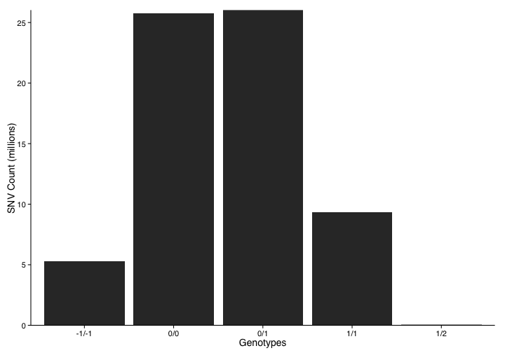

#### Variant Counts By Chromosome

```r
variantCountResult <- DisplayAndDispatchQuery("../sql/variants-by-chromosome.sql",
                                              project=project,
                                              replacements=queryReplacements)
```

```
SELECT
reference_name,
VAR_type,
COUNT(VAR_type) AS Cnt
FROM
(
  SELECT
  reference_name,
  start,
  reference_bases,
  alternates,
  VAR_type
  FROM
  (
    SELECT
    reference_name,
    start,
    reference_bases,
    GROUP_CONCAT(alternate_bases) WITHIN RECORD AS alternates,
    GROUP_CONCAT(QC) WITHIN RECORD AS qc,
    GROUP_CONCAT(call.QC) WITHIN CALL AS call_qc,
    IF(LENGTH(reference_bases)=1 AND LENGTH(alternate_bases)=1, "SNV", "INDEL") AS VAR_type
    FROM 
    [va_aaa_pilot_data.multi_sample_variants_full_qc]
    OMIT call IF EVERY(call.genotype <= 0) 
      OR SOME(call.qc IS NOT NULL)
    HAVING QC IS NULL
  )
  GROUP EACH BY
  reference_name,
  start,
  reference_bases,
  alternates,
  VAR_type
)
GROUP BY
reference_name,
VAR_type
ORDER BY
reference_name,
VAR_type
```

```r
variantCountResult <- join(variantCountResult, chromosomeLengths, by = "reference_name")
variantCountResult$scaled_count <- variantCountResult$Cnt / variantCountResult$length

chromosomes <- c("chr1", "chr2", "chr3", "chr4", "chr5", "chr6", "chr7", "chr8", "chr9", "chr10", "chr11", "chr12", "chr13", "chr14", "chr15", "chr16", "chr17", "chr18", "chr19", "chr20", "chr21", "chr22", "chrX", "chrY", "chrM")
snps <- variantCountResult[grep("SNV", variantCountResult$VAR_type), ]
snps$reference_name <- factor(snps$reference_name, levels=chromosomes)
snps <- snps[complete.cases(snps),]

indels <- variantCountResult[grep("INDEL", variantCountResult$VAR_type), ]
indels$reference_name <- factor(indels$reference_name, levels=chromosomes)
indels <- indels[complete.cases(indels),]
```


```r
snvs = ggplot(data=snps, aes(y=Cnt, x=reference_name)) + 
  geom_point(size=4) + 
  ylab("SNV Count") +
  xlab("Chromosome") +
  scale_y_continuous(label=comma) +
  plot_theme +
  theme(axis.text.x = element_text(angle=90, vjust=1)) 
snvs
```

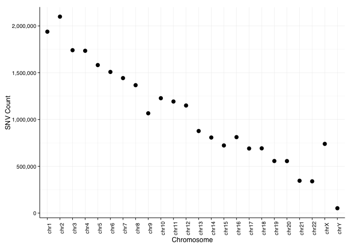


```r
indels = ggplot(data=indels, aes(y=Cnt, x=reference_name)) + 
  geom_point(size=4) + 
  ylab("Indel Count") +
  xlab("Chromosome") +
  scale_y_continuous(label=comma) +
  plot_theme +
  theme(axis.text.x = element_text(angle=90, vjust=1)) 
indels
```

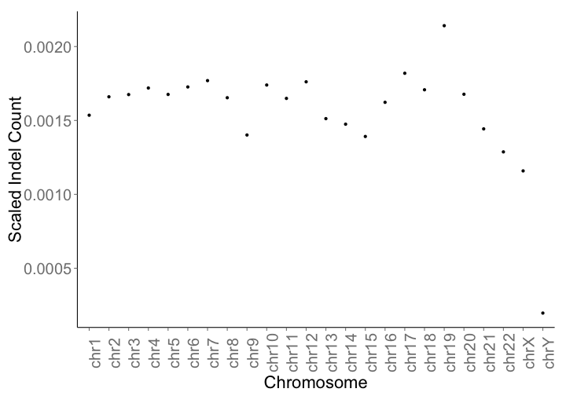

#### Saturation Rate

```r
# Need to redo queries for this
genomeCount = c(1,2,3,4,5,10,50,100,200,300,400,478)
snvCount = c(3590360,4847512,5627244,6158953,6616457,
              8014799,11841547,14387937,18693833,21567571,23638061,25890797)
saturationRate = data_frame(genomeCount, snvCount)
```


```r
saturation = ggplot(saturationRate) +
  geom_point(aes(x=genomeCount, y=snvCount), size=4) +
  xlab("Number of Genomes") +
  ylab("Unique SNVs") +
  scale_y_continuous(label=comma) +
  plot_theme
saturation
```

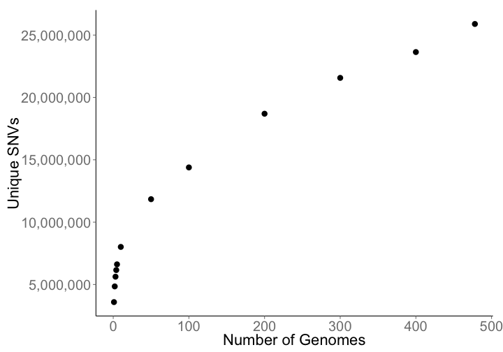

#### Multiplot

```r
multiplot(snvs,indels, counts, saturation, cols=2)
```


## Callability

```r
callability <- DisplayAndDispatchQuery("../sql/callability.sql",
                                              project=project,
                                              replacements=queryReplacements)
```

```
SELECT
call.call_set_name,
reference_name,
contig.len,
num_SNVs,
num_REFs,
(num_SNVs + num_REFs) AS num_called_point_pos,
ROUND((num_SNVs + num_REFs) / contig.len, 3) AS prop_w_point_ino,
(contig.len - (num_SNVs + num_REFs)) AS pos_no_point_info,
ROUND((contig.len - (num_SNVs + num_REFs)) / contig.len, 3) prop_no_point_info
FROM
(
  SELECT
  call.call_set_name,
  reference_name,
  assembly.LENGTH AS contig.len,
  SUM(call.FILTER="PASS" AND (LENGTH(reference_bases)=1 AND (LENGTH(alternates)=1 OR (LENGTH(alternates)=3 AND alternates CONTAINS ",")))) AS num_SNVs,
  SUM(IF (genotypes=="0/0", (end - start), 0)) AS num_REFs
  FROM (
    SELECT
    call.call_set_name,
    reference_name,
    start,
    end,
    reference_bases,
    GROUP_CONCAT(alternate_bases) WITHIN RECORD AS alternates,
    GROUP_CONCAT(STRING(call.genotype), "/") WITHIN call AS genotypes,
    GROUP_CONCAT(call.QC) WITHIN call AS call_qc,
    GROUP_CONCAT(QC) WITHIN RECORD AS cohort_qc,
    call.FILTER
    FROM 
    [va_aaa_pilot_data.genome_calls_full_qc]
    OMIT
    call IF SOME(call.QC IS NOT NULL)
    HAVING
    cohort_qc IS NULL
  ) AS geno
  JOIN 
  [stanford.edu:gbsc-stanford-google:resources.hg19_Assembly_BinaRuns] AS assembly
  ON
  geno.reference_name = assembly.CHR
  GROUP BY
  call.call_set_name,
  reference_name,
  contig.len
)
ORDER BY
call.call_set_name,
reference_name,
Retrieving data: 17.1s
Retrieving data: 29.6s
Retrieving data: 41.4s
Retrieving data: 52.7s
```

Setup

```r
sample = 'LP6005038-DNA_A01'
selection = callability[callability$call_call_set_name == sample,]
selection$reference_name <- factor(selection$reference_name, levels=chromosomes)
selection <- selection[complete.cases(selection),]

faceted = melt(selection, id.vars="reference_name",measure.vars=c("prop_w_point_ino","pos_no_point_info"))

levels(faceted$variable) <- c("Proportion of Positions Called", "Number of Missing Positions")
```


```r
ggplot(faceted) + 
  geom_bar(aes(reference_name,value), stat="identity") +
  facet_grid(variable ~ ., scales="free_y") +
  scale_y_continuous(labels=comma, expand=c(0,0)) +
  plot_theme +
  xlab("Chromosome") +
  theme(axis.text.x = element_text(angle=90, vjust=0.5, hjust=1),
  axis.title.y=element_blank())
```

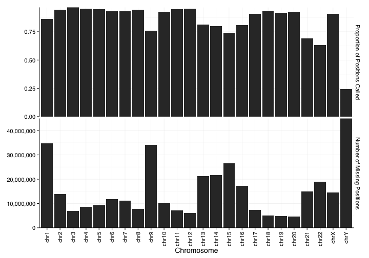


## WGS Statistics

#### Ti/Tv for SNVs

```r
titvBySample <- DisplayAndDispatchQuery("../sql/titv-by-sample.sql",
                                              project=project,
                                              replacements=queryReplacements)
```

```
SELECT
call.call_set_name AS sample.id,
transitions,
transversions,
transitions/transversions AS titv,
num_variants,
FROM 
(
  SELECT
  call.call_set_name,
  SUM(mutation IN ('A->G', 'G->A', 'C->T', 'T->C')) AS transitions,
  SUM(mutation IN ('A->C', 'C->A', 'G->T', 'T->G',
                   'A->T', 'T->A', 'C->G', 'G->C')) AS transversions,
  COUNT(mutation) AS num_variants
  FROM 
  (
    SELECT
    call.call_set_name,
    CONCAT(reference_bases, CONCAT(STRING('->'), alternate_bases)) AS mutation,
    COUNT(alternate_bases) WITHIN RECORD AS num_alts,
    GROUP_CONCAT(QC) WITHIN RECORD AS qc,
    GROUP_CONCAT(call.QC) WITHIN CALL AS call_qc,
    FROM
    FLATTEN([va_aaa_pilot_data.multi_sample_variants_full_qc], alternate_bases)
    OMIT call IF EVERY (call.genotype <= 0)
    OR SOME(call.qc IS NOT NULL)
    HAVING
    num_alts = 1
    AND QC IS NULL
  )
  GROUP BY
  call.call_set_name
)
```


```r
titv = ggplot(titvBySample) +
  geom_boxplot(aes(x="SNV", y=titv)) +
  xlab("SNVs") +
  ylab("Ti/Tv") +
  ggtitle("Ti/Tv for SNVs in each genome") +
  boxPlotTheme +
  theme(axis.text.x=element_blank())
titv
```

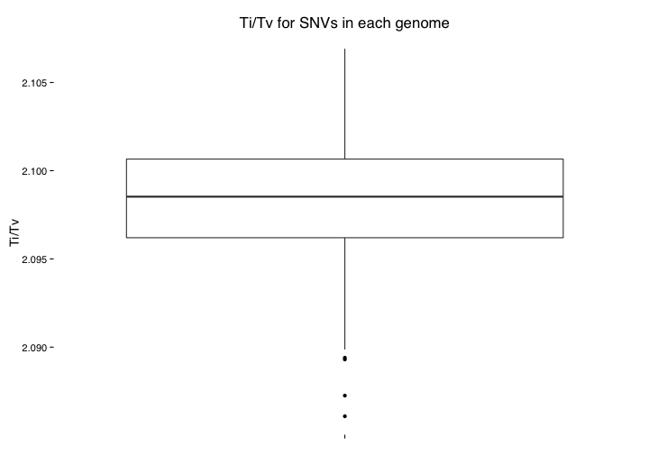

#### Het/Hom for SNVs

```r
hetHomSnv <- DisplayAndDispatchQuery("../sql/hethom-snv.sql",
                                              project=project,
                                              replacements=queryReplacements)
```

```
SELECT
sample.id,
(hom_AA_count + het_RA_count) AS all_SNV_count,
hom_AA_count,
het_RA_count,
ROUND((het_RA_count/hom_AA_count)*1000)/1000 AS Het_Hom_ratio
FROM
(
  SELECT
  call.call_set_name AS sample.id,
  SUM(genotype="1/1" AND (LENGTH(reference_bases)=1 AND (LENGTH(alternates)=1 OR (LENGTH(alternates)=3 AND alternates CONTAINS ",")))) AS hom_AA_count,
  SUM((genotype="0/1" OR genotype="1/0" OR genotype="1/2") AND (LENGTH(reference_bases)=1 AND (LENGTH(alternates)=1 OR (LENGTH(alternates)=3 AND alternates CONTAINS ",")))) AS het_RA_count    
  FROM
  (
    SELECT
    call.call_set_name,
    reference_name,
    start,
    end,
    reference_bases,
    GROUP_CONCAT(alternate_bases) WITHIN RECORD AS alternates,
    GROUP_CONCAT(STRING(call.genotype), "/") WITHIN call AS genotype,
    GROUP_CONCAT(call.QC) WITHIN call AS call_qc,
    GROUP_CONCAT(QC) WITHIN RECORD AS cohort_qc,
    call.FILTER
    FROM 
    FLATTEN([va_aaa_pilot_data.multi_sample_variants_full_qc], alternate_bases)
    OMIT call IF SOME(call.qc IS NOT NULL)
    HAVING
    cohort_qc IS NULL AND call.FILTER = "PASS"
  ) 
  GROUP BY
  sample.id
)
GROUP BY
sample.id,
hom_AA_count,
het_RA_count,
all_SNV_count,
Het_Hom_ratio
ORDER BY
sample.id;
```


```r
hethom= ggplot(hetHomSnv) +
  geom_boxplot(aes(x="SNV", y=Het_Hom_ratio)) +
  xlab("Sample") +
  ylab("Het/Hom") +
  ggtitle("Het/Hom for SNVs in each genome") +
  boxPlotTheme + 
  theme(axis.text.x=element_blank())
hethom
```

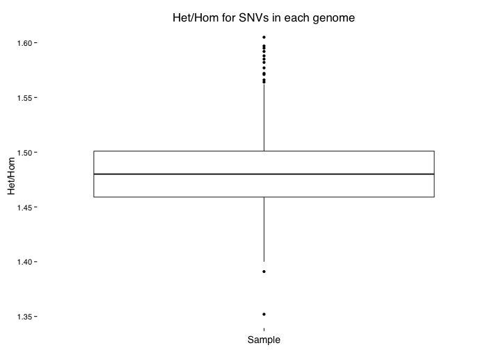

#### SNVs in dbSNP

```r
dbSNPcount <- DisplayAndDispatchQuery("../sql/dbsnp-count.sql",
                                              project=project,
                                              replacements=queryReplacements)
```

```
SELECT
call.call_set_name AS sample_id,
VAR_type,
COUNT(call.call_set_name) AS num_VAR,
COUNT(dbSNP) AS num_VAR_dbSNP
FROM (
  SELECT
  call.call_set_name,
  IF(LENGTH(reference_bases)=1 AND (LENGTH(alternates)=1 OR (LENGTH(alternates)=3 AND alternates CONTAINS ",")) , "SNV", "INDEL") AS VAR_type,
  dbSNP
  FROM (
    SELECT
    call.call_set_name,
    reference_name,
    start,
    reference_bases,
    GROUP_CONCAT(alternate_bases) WITHIN RECORD AS alternates,
    GROUP_CONCAT(names) WITHIN record AS dbSNP,
    GROUP_CONCAT(call.QC) WITHIN call AS call_qc,
    GROUP_CONCAT(QC) WITHIN RECORD AS cohort_qc,
    call.FILTER
    FROM 
    FLATTEN([va_aaa_pilot_data.multi_sample_variants_full_qc], alternate_bases)
    OMIT call IF SOME(call.QC IS NOT NULL)
    HAVING
    cohort_qc IS NULL AND call.FILTER = "PASS"
  )
)
GROUP BY
sample_id,
VAR_type
ORDER BY
sample_id,
VAR_type
```

```r
dbSNPcount$proportion = dbSNPcount$num_VAR_dbSNP/dbSNPcount$num_VAR
```


```r
dbSNP = ggplot(dbSNPcount) +
  geom_boxplot(aes(x=VAR_type, y=proportion)) +
  xlab("Variant type") +
  ylab("Proportion of Variants in dbSNP") +
  ggtitle("Proportion of variants in dbSNP by variant type") +
  scale_y_continuous(label=comma) +
  boxPlotTheme 
dbSNP
```

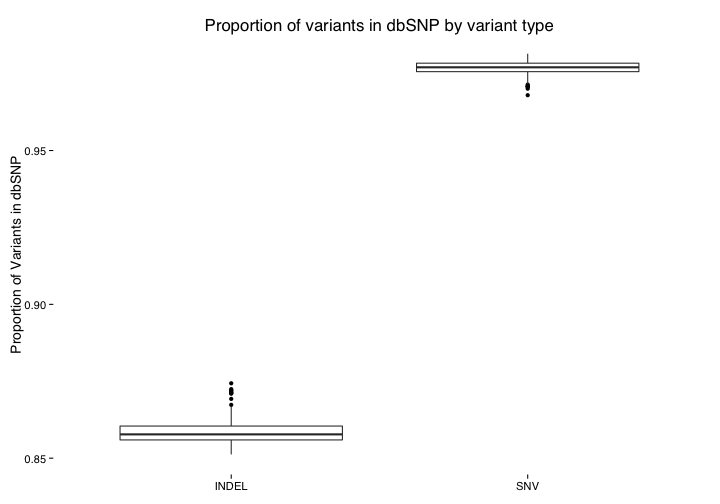

#### Private SNV Counts

```r
privateSNVs <- DisplayAndDispatchQuery("../sql/private-snv-counts.sql",
                                              project=project,
                                              replacements=queryReplacements)
```

```
SELECT
call.call_set_name AS sample_id,
COUNT(call.call_set_name) AS private_SNVs_count
FROM
(
  SELECT
  call.call_set_name,
  COUNT(call.call_set_name) WITHIN RECORD AS num_samples_with_VARs,
  GROUP_CONCAT(call.QC) WITHIN call AS call_qc,
  GROUP_CONCAT(QC) WITHIN RECORD AS cohort_qc,
  FROM
  [va_aaa_pilot_data.multi_sample_variants_full_qc]
  OMIT 
  call IF EVERY(call.FILTER != "PASS") 
  OR SOME(call.QC IS NOT NULL)
  HAVING
  num_samples_with_VARs = 1
  AND cohort_qc IS NULL
)
GROUP EACH BY
sample_id
ORDER BY
sample_id ASC;
```


```r
privateVariants = ggplot(privateSNVs) +
  geom_boxplot(aes(x="SNV", y=private_SNVs_count)) +
  xlab("Sample") +
  ylab("Private Variants") +
  ggtitle("Number of private variants per genome") +
  boxPlotTheme + 
  theme(axis.text.x=element_blank())
privateVariants 
```

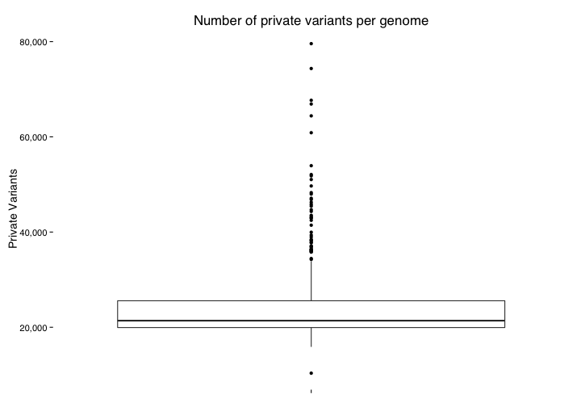

#### Multiplot

```r
multiplot(titv, dbSNP, hethom, privateVariants, cols=2)
```

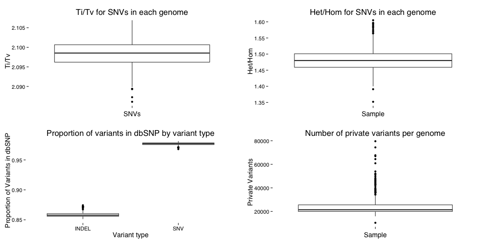


## Allele Frequency Distribution

```r
rarity <- DisplayAndDispatchQuery("../sql/variant-rarity.sql",
                                              project=project,
                                              replacements=queryReplacements)
```

```
SELECT 
reference_name,
rarity,
COUNT(rarity) AS count
FROM (
  SELECT 
  reference_name, 
  start,
  end,
  reference_bases,
  alternates,
  num_samples,
  ROUND(num_samples/459, 4) AS allele_frequency,
  CASE WHEN num_samples = 1 THEN "very_rare"
  WHEN num_samples = 2 THEN "rare" 
  WHEN num_samples >= 3 AND num_samples <= 23 THEN "relatively_common"
  WHEN num_samples >= 24 THEN "common"
  ELSE "NONE"
  END AS rarity 
  FROM (
    SELECT
    reference_name,
    start,
    end,
    reference_bases,
    GROUP_CONCAT(alternate_bases) WITHIN RECORD AS alternates,
    GROUP_CONCAT(call.QC) WITHIN call AS call_qc,
    GROUP_CONCAT(QC) WITHIN RECORD AS cohort_qc,
    COUNT(call.call_set_name) WITHIN RECORD AS num_samples,
    FROM
    [va_aaa_pilot_data.multi_sample_variants_full_qc]
    OMIT 
    call IF EVERY(call.FILTER != "PASS")
    OR SOME(call.QC IS NOT NULL)
    HAVING
    cohort_qc IS NULL 
    AND reference_name in ("chr1", "chr2", "chr3", "chr4", "chr5",
                           "chr6", "chr7", "chr8", "chr9", "chr10",
                           "chr11", "chr12", "chr13", "chr14", "chr15",
                           "chr16", "chr17", "chr18", "chr19", "chr20",
                           "chr21", "chr22", "chrX", "chrY")
  )
  GROUP EACH BY
  reference_name,
  start,
  end,
  reference_bases,
  alternates,
  call_qc,
  cohort_qc,
  num_samples,
  allele_frequency,
  rarity
)
GROUP BY 
reference_name, 
rarity
ORDER BY
reference_name,
rarity
```

```r
rarity$total = sapply(1:nrow(rarity), function(x){
  chr = rarity[x,]$reference_name
  variantCount = sum(rarity[rarity$reference_name == chr,]$count)
  variantCount
})
rarity$proportion = rarity$count/rarity$total
rarity$reference_name <- factor(rarity$reference_name, levels=chromosomes)
rarity$rarity <- factor(rarity$rarity, levels = c("very_rare", "rare", "relatively_common", "common"), ordered=TRUE)
```


```r
ggplot(rarity) +
  geom_bar(aes(factor(reference_name), proportion, fill=rarity, order=rarity), stat='identity', position='stack') +
  xlab("Chromosome") +
  ylab("Proportion") +
  ggtitle("Allele frequency distribution") +
  scale_y_continuous(expand = c(0, 0)) +
  scale_fill_brewer(palette=1, breaks=c("common","relatively_common","rare", "very_rare"),
                    labels=c("Common", "Relatively common", "Rare", "Very rare")) +
  boxPlotTheme + 
  theme(axis.text.x=element_text(angle=90,hjust=1,vjust=0.5),
        legend.title=element_blank())
```

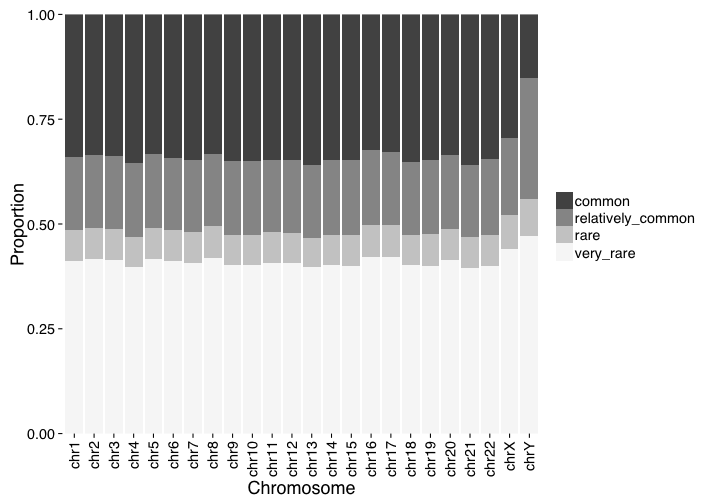


## BRCA1 Mutation Spectrum

```r
require(NMF)
require(RColorBrewer)
```


```r
mutationSpectrum <- DisplayAndDispatchQuery("../sql/mutation-spectrum-brca1.sql",
                                              project=project,
                                              replacements=queryReplacements,
                                              max=Inf)
```

```
SELECT
call.call_set_name,
reference_name,
window,
window * 5000 AS window_start,
((window * 5000) + 4999) AS window_end,
MIN(start) AS min_variant_position,
MAX(start) AS max_variant_position,
COUNT(call.call_set_name) AS num_variants_in_window
FROM (
  SELECT
  call.call_set_name,
  reference_name,
  start,
  end,
  INTEGER(FLOOR(start / 5000)) AS window,
  reference_bases,
  GROUP_CONCAT(alternate_bases) WITHIN RECORD AS alternates,
  GROUP_CONCAT(call.QC) WITHIN call AS call_qc,
  GROUP_CONCAT(QC) WITHIN RECORD AS cohort_qc,
  call.FILTER
  FROM
  [va_aaa_pilot_data.multi_sample_variants_full_qc]
  OMIT 
  call IF EVERY(call.FILTER != "PASS")
  OR SOME(call.QC IS NOT NULL)
  HAVING
  cohort_qc IS NULL
  AND reference_name = "chr17"
  AND ((start <= 41196311 AND end >= 41277500) OR (start >= 41196311 AND start <= 41277500))
)
GROUP BY
call.call_set_name,
reference_name,
window,
window_start,
window_end,
ORDER BY
window ASC,
call.call_set_name ASC;
```

Get Patient Info

```r
patientInfo <- DisplayAndDispatchQuery("../sql/patient-info.sql",
                                              project=project,
                                              replacements=queryReplacements,
                                              max=Inf)
```

```
SELECT 
  IlluminaID AS sample_id,
  AAA_SIZE,
  CASE WHEN AAA_SIZE >= 3 
      THEN 'CASE'
    WHEN AAA_SIZE < 3 
      THEN 'CONTROL'
    ELSE 'NONE'
  END AS COHORT,
FROM
  [va_aaa_pilot_data.patient_info]
```

Get z scores

```r
mutationSpectrum$zscores = sapply(1:nrow(mutationSpectrum), function(x){
  count = mutationSpectrum[x,]$num_variants_in_window
  sample = mutationSpectrum[x,]$call_call_set_name
  mean = mean(mutationSpectrum[mutationSpectrum$call_call_set_name == sample,]$num_variants_in_window)
  sd = sd(mutationSpectrum[mutationSpectrum$call_call_set_name == sample,]$num_variants_in_window) 
  
  z = (count-mean)/sd
  z
})
```

Convert mutation information to matrix 

```r
spectrum <- dcast(mutationSpectrum, call_call_set_name ~ window_start, value.var = "zscores", na.rm=TRUE)
spectrum[is.na(spectrum)] <- 0

sampleIds = data.frame(rownames(spectrumMatrix))
names(sampleIds) = 'sample_id'

annotations = merge(x = sampleIds, y = patientInfo, by = "sample_id", all.x = TRUE)
annotations = annotations[order(annotations$COHORT),]
spectrum = spectrum[annotations$sample_id,]

spectrumMatrix = as.matrix(spectrum[,!colnames(spectrum) %in% c("call_call_set_name")])
rownames(spectrumMatrix) = spectrum$call_call_set_name
```

Set up for plot

```r
colors = c("blue", "red")
names(colors) = c("CASE", "CONTROL")
annotationColors = list(Cohort=colors)

cohort = data.frame(annotations$COHORT)
names(cohort) = "Cohort"
```


```r
aheatmap(t(spectrumMatrix), Rowv=NA, Colv=NA, color="-RdBu:50",labCol="",main="BRCA1 mutation spectrum in 5kb windows", fontsize=14)
```

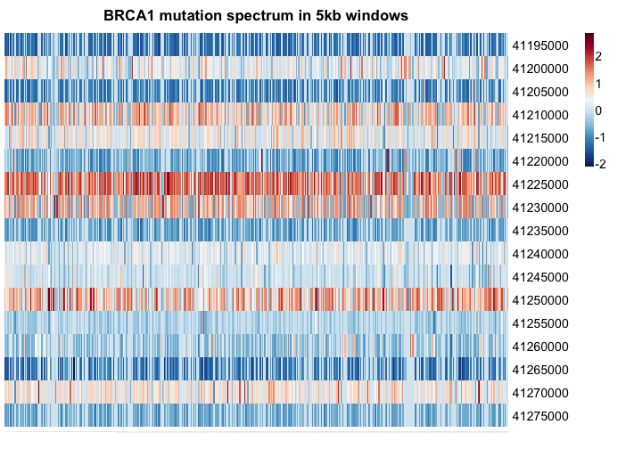


## Variant Distribution

```r
regionalCounts <- DisplayAndDispatchQuery("../sql/regional-variant-count.sql",
                                              project=project,
                                              replacements=queryReplacements,
                                              max=Inf)
```

```
SELECT
Sample_id,
Chromosome,
region,
cnt,
LENGTH AS chromosome_length
FROM
(
  SELECT
  call.call_set_name AS Sample_id,
  reference_name AS Chromosome,
  Func_refGene AS region,
  COUNT(geno.start) AS cnt
  FROM 
  [resources.annovar_hg19_aaa] AS anno
  JOIN EACH
  (
    SELECT
    call.call_set_name,
    reference_name,
    start,
    end,
    reference_bases,
    GROUP_CONCAT(alternate_bases) WITHIN RECORD AS alternates,
    GROUP_CONCAT(call.QC) WITHIN call AS call_qc,
    GROUP_CONCAT(QC) WITHIN RECORD AS cohort_qc
    FROM
    [va_aaa_pilot_data.multi_sample_variants_full_qc]
    OMIT 
    call IF EVERY(call.FILTER != "PASS") 
    OR SOME(call.QC IS NOT NULL)
    HAVING
    cohort_qc IS NULL 
  ) AS geno
  ON
  anno.Chr = geno.reference_name
  AND anno.Start = geno.start
  AND anno.End = geno.end
  AND anno.ALT = geno.alternates
  GROUP EACH BY
  Sample_id,
  Chromosome,
  region
) AS cal
JOIN
[stanford.edu:gbsc-stanford-google:resources.hg19_Assembly_BinaRuns] AS ref
ON
cal.Chromosome = ref.CHR
ORDER BY
Sample_id,
region,
Chromosome;

Retrieving data:  8.2s
Retrieving data: 14.6s
Retrieving data: 21.3s
Retrieving data: 30.2s
Retrieving data: 38.8s
Retrieving data: 46.3s
Retrieving data: 53.1s
Retrieving data: 59.0s
Retrieving data: 66.3s
Retrieving data: 73.8s
Retrieving data: 81.6s
Retrieving data: 88.7s
Retrieving data: 96.0s
Retrieving data: 101.9s
Retrieving data: 109.8s
Retrieving data: 116.7s
Retrieving data: 151.7s
```

```r
regionalCounts$Chromosome <- factor(regionalCounts$Chromosome, levels=chromosomes)
regionalCounts$scaled <- regionalCounts$cnt/regionalCounts$chromosome_length
regionalCounts <- regionalCounts[complete.cases(regionalCounts),]
```

#### Exonic

```r
exonic = ggplot(regionalCounts) +
  geom_boxplot(data=subset(regionalCounts,region=="exonic"), aes(Chromosome,scaled)) +
  ggtitle("Variants in Exonic Regions") +
  boxPlotTheme + 
  theme(axis.text.x=element_text(angle=90,hjust=1,vjust=0.5),
        axis.text.y=element_blank(),
        axis.ticks.y=element_blank(),
        axis.title=element_blank())
exonic
```

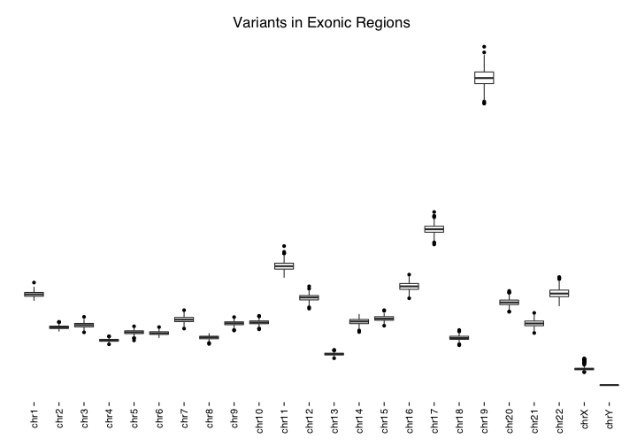

#### Intronic

```r
intronic = ggplot(regionalCounts) +
  geom_boxplot(data=subset(regionalCounts,region=="intronic"), aes(Chromosome,scaled)) +
  ggtitle("Variants in Intronic Regions") +
  boxPlotTheme + 
  theme(axis.text.x=element_text(angle=90,hjust=1,vjust=0.5),
        axis.text.y=element_blank(),
        axis.ticks.y=element_blank(),
        axis.title=element_blank())
intronic
```

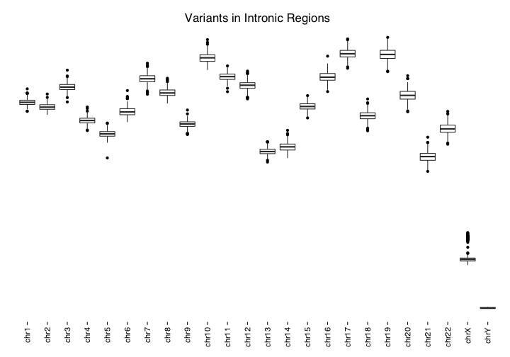

#### UTR3

```r
utr3 = ggplot(regionalCounts) +
  geom_boxplot(data=subset(regionalCounts,region=="UTR3"), aes(Chromosome,scaled)) +
  ggtitle("Variants in UTR3 Regions") +
  boxPlotTheme + 
  theme(axis.text.x=element_text(angle=90,hjust=1,vjust=0.5),
        axis.text.y=element_blank(),
        axis.ticks.y=element_blank(),
        axis.title=element_blank())
utr3
```

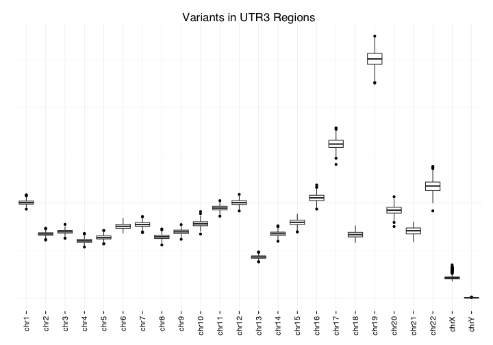

#### UTR5

```r
utr5 = ggplot(regionalCounts) +
  geom_boxplot(data=subset(regionalCounts,region=="UTR5"), aes(Chromosome,scaled)) +
  ggtitle("Variants in UTR5 Regions") +
  boxPlotTheme + 
  theme(axis.text.x=element_text(angle=90,hjust=1,vjust=0.5),
        axis.text.y=element_blank(),
        axis.ticks.y=element_blank(),
        axis.title=element_blank())
utr5
```


#### Intergenic

```r
intergenic = ggplot(regionalCounts) +
  geom_boxplot(data=subset(regionalCounts,region=="intergenic"), aes(Chromosome,scaled)) +
  ggtitle("Variants in Intergenic Regions") +
  boxPlotTheme + 
  theme(axis.text.x=element_text(angle=90,hjust=1,vjust=0.5),
        axis.text.y=element_blank(),
        axis.ticks.y=element_blank(),
        axis.title=element_blank())
intergenic
```

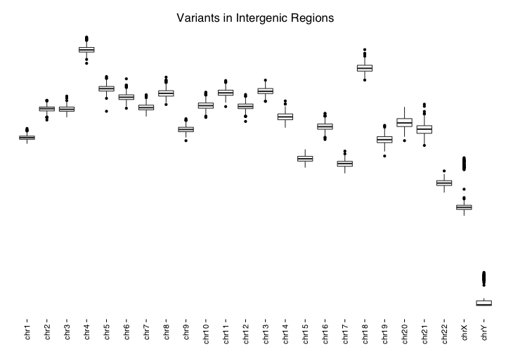

#### Splicing

```r
splicing = ggplot(regionalCounts) +
  geom_boxplot(data=subset(regionalCounts,region=="splicing"), aes(Chromosome,scaled)) +
  ggtitle("Variants in Splicing Regions") +
  boxPlotTheme + 
  theme(axis.text.x=element_text(angle=90,hjust=1,vjust=0.5),
        axis.text.y=element_blank(),
        axis.ticks.y=element_blank(),
        axis.title=element_blank())
splicing
```

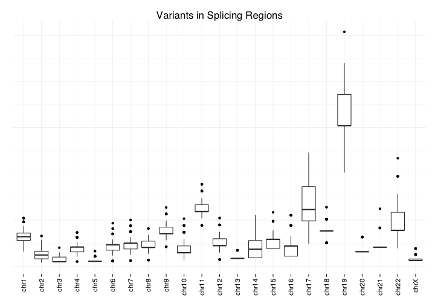

#### Multiplot
#### Normalized variant counts by genomic region

```r
multiplot(exonic,utr3, intergenic, intronic, utr5, splicing, cols=2)
```


## Pathogenic Variants on ACMG Genes

```r
acmgVariants <- DisplayAndDispatchQuery("../sql/acmg-variants.sql",
                                              project=project,
                                              replacements=queryReplacements)
```

```
SELECT
refseq_GENE AS Gene,
refseq_CHR AS Chr,
refseq_Tx_START As Transcript_start,
refseq_Tx_END AS Transcript_end,
(refseq_Tx_END - refseq_Tx_START) AS Length_gene,
call.call_set_name AS Sample_id,
COUNT(start) AS Cnt_var
FROM
(
  SELECT
  call.call_set_name,
  reference_name,
  start,
  end,
  reference_bases,
  GROUP_CONCAT(alternate_bases) WITHIN RECORD AS alternates,
  GROUP_CONCAT(call.QC) WITHIN call AS call_qc,
  GROUP_CONCAT(QC) WITHIN RECORD AS cohort_qc,
  call.FILTER
  FROM
  [va_aaa_pilot_data.multi_sample_variants_full_qc]
  OMIT 
  call IF EVERY(call.FILTER != "PASS")
  OR SOME(call.QC IS NOT NULL)
  HAVING
  cohort_qc IS NULL
) as geno
CROSS JOIN
[stanford.edu:gbsc-stanford-google:resources.56ACMGgenes_Tx] AS Acmg 
WHERE
geno.reference_name = Acmg.refseq_CHR
AND geno.end <= Acmg.refseq_Tx_END
AND geno.start >= Acmg.refseq_Tx_START
GROUP BY
Gene,
Chr,
Transcript_start,
Transcript_end,
Length_gene,
Sample_id
ORDER BY
Gene,
Sample_id

Retrieving data:  9.2s
Retrieving data: 19.2s
```

#### Setup
Get z scores

```r
acmgVariants$zscores = sapply(1:nrow(acmgVariants), function(x){
  count = acmgVariants[x,]$Cnt_var
  sample = acmgVariants[x,]$Sample_id
  mean = mean(acmgVariants[acmgVariants$Sample_id == sample,]$Cnt_var)
  sd = sd(acmgVariants[acmgVariants$Sample_id == sample,]$Cnt_var) 
  z = (count-mean)/sd
  z
})
```


```r
acmgExpanded <- dcast(acmgVariants, Sample_id ~ Gene, value.var = "zscores", na.rm=TRUE)
sampleIds = data.frame(acmgExpanded$Sample_id)
names(sampleIds) = "sample_id"
annotations = merge(x = sampleIds, y = patientInfo, by = "sample_id", all.x = TRUE)
annotations = annotations[order(annotations$COHORT),]
acmgExpanded = acmgExpanded[annotations$sample_id,]
acmgExpanded[is.na(acmgExpanded)] <- 0
acmgMatrix = as.matrix(acmgExpanded[,!colnames(acmgExpanded) %in% c("Sample_id")])
rownames(acmgMatrix) = acmgExpanded$Sample_id
```

Setup for plot

```r
sampleIds = data.frame(rownames(acmgMatrix))
names(sampleIds) = 'sample_id'

colors = c("blue", "red")
names(colors) = c("CASE", "CONTROL")
annotationColors = list(Cohort=colors)

cohort = data.frame(annotations$COHORT)
names(cohort) = "Cohort"
```


```r
aheatmap(t(acmgMatrix), Rowv=NA, Colv=NA, color="-RdBu:50",labCol="",main="Pathogenic variants within ACMG genes", fontsize=14, breaks=0)
```

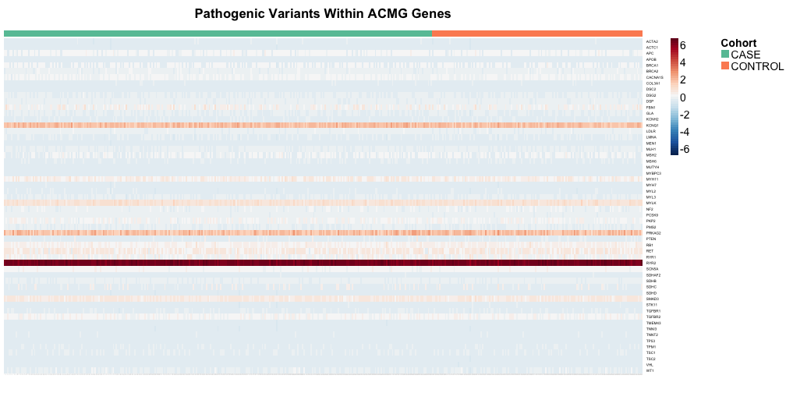


## Allele Frequency Distributions vs 1000 Genomes

```r
alleleFrequencies <- DisplayAndDispatchQuery("../sql/1kg-AAA-variant-overlap.sql",
                                              project=project,
                                              replacements=queryReplacements)
```

```
SELECT 
AGREEMENT,
AAA,
K1G,
COUNT(*) AS COUNT

FROM (
SELECT 

CASE
  WHEN aaaChr22_allele_frequency >= 0.05 AND k1gChr22_k1000g2012apr_EUR >= 0.05
    THEN "HIGH"
  WHEN aaaChr22_allele_frequency >= 0.005 AND aaaChr22_allele_frequency < 0.05 
    AND k1gChr22_k1000g2012apr_EUR >= 0.005 AND k1gChr22_k1000g2012apr_EUR < 0.05 
    THEN "MODERATE"
  WHEN aaaChr22_allele_frequency >= 0.001 AND aaaChr22_allele_frequency < 0.005 
    AND k1gChr22_k1000g2012apr_EUR >= 0.001 AND k1gChr22_k1000g2012apr_EUR < 0.005 
    THEN "LOW"
  WHEN aaaChr22_allele_frequency IS NULL AND k1gChr22_k1000g2012apr_EUR IS NULL
    THEN "NONE"
  ELSE "DISAGREEMENT"
END AS AGREEMENT,

CASE
  WHEN aaaChr22_allele_frequency >= 0.05
    THEN "HIGH"
  WHEN aaaChr22_allele_frequency >= 0.005 AND aaaChr22_allele_frequency < 0.05 
    THEN "MODERATE"
  WHEN aaaChr22_allele_frequency >= 0.001 AND aaaChr22_allele_frequency < 0.005 
    THEN "LOW"  
END AS AAA,

CASE
  WHEN k1gChr22_k1000g2012apr_EUR >= 0.05
    THEN "HIGH"
  WHEN k1gChr22_k1000g2012apr_EUR >= 0.005 AND k1gChr22_k1000g2012apr_EUR < 0.05 
    THEN "MODERATE"
  WHEN k1gChr22_k1000g2012apr_EUR >= 0.001 AND k1gChr22_k1000g2012apr_EUR < 0.005 
    THEN "LOW"  
END AS K1G,

CASE 
  WHEN aaaChr22_allele_frequency IS NOT NULL AND k1gChr22_k1000g2012apr_EUR IS NOT NULL
    THEN "BOTH"
  WHEN aaaChr22_allele_frequency IS NOT NULL AND k1gChr22_k1000g2012apr_EUR IS NULL 
    THEN "AAA"
  WHEN aaaChr22_allele_frequency IS NULL AND k1gChr22_k1000g2012apr_EUR IS NOT NULL
    THEN "1KG"
END AS population,
*
FROM 
  [analysis.aaa_1000g_chr22_AF_full])
WHERE AGREEMENT != "NONE"
#WHERE
#  aaaChr22_allele_frequency IS NOT NULL
#  AND k1gChr22_k1000g2012apr_EUR IS NOT NULL
GROUP BY 
  AGREEMENT,
  AAA,
  K1G
LIMIT 1000
```

Setup

```r
frequencies = melt(alleleFrequencies, id=c("AGREEMENT","COUNT"))
frequencies = frequencies[complete.cases(frequencies),]
frequencies = frequencies[!(frequencies$AGREEMENT != "DISAGREEMENT" & frequencies$variable == "AAA"),]
frequencies$variable <- factor(frequencies$variable, levels=c("AAA","K1G","BOTH"))
frequencies[frequencies$AGREEMENT != "DISAGREEMENT",]$variable = "BOTH"
names(frequencies) = c("agreement", "count", "population", "frequency")
frequencies$frequency <- factor(frequencies$frequency, levels=c("HIGH","MODERATE","LOW"))
frequencies$normalized = sapply(1:nrow(frequencies), function(x){
  freq = frequencies[x,]$frequency
  freqTotal = sum(frequencies[frequencies$frequency == freq,]$count)
  normalized = frequencies[x,]$count/freqTotal
  normalized
})
```


```r
ggplot(frequencies) +
  geom_bar(aes(frequency, normalized, fill=population, order=population), stat="identity") +
  xlab("Allele frequency") +
  ylab("Proportion of total count") +
  ggtitle("Allele frequency overlap between\ndeeply sequenced genomes and the\nEuropean subpopulation in 1000 Genomes") +
  plot_theme + 
  scale_y_continuous(expand = c(0, 0)) +
  scale_fill_brewer(palette=1, breaks=c("AAA","K1G","BOTH"),
                    labels=c("Deeply sequenced\ngenomes specific", "1000 Genomes specific", "Overlapping alleles")) +
  theme(legend.title=element_blank()) +
  guides(fill = guide_legend(reverse = TRUE)) +
  scale_x_discrete(breaks = c("HIGH", "MODERATE", "LOW"), labels=c(">0.05", "0.005-0.05","0.001-0.005"))
```

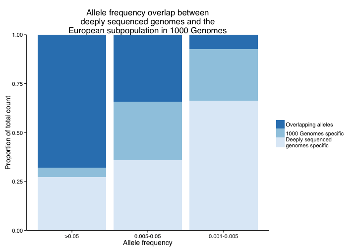

