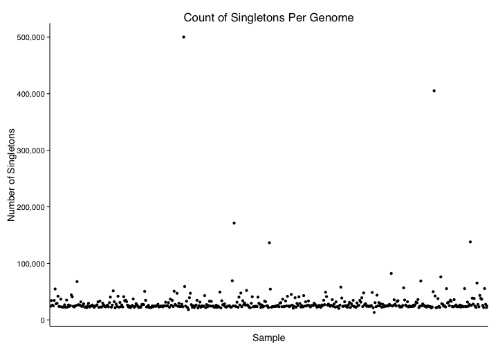
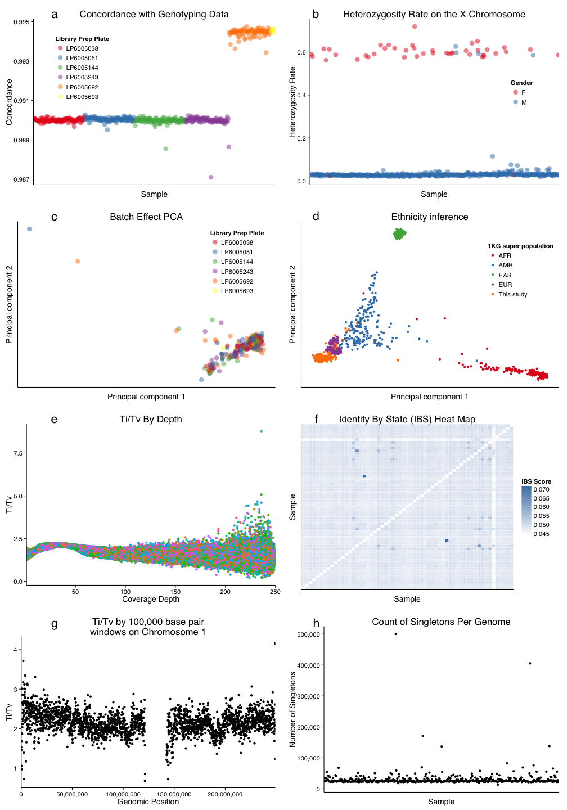

# Publication Plots - QC

## Setup


Plot theme

```r
plot_theme = theme_minimal(base_size = 14, base_family = "Helvetica") + 
  theme(axis.line = element_line(colour = "black"),
        panel.grid = element_blank())
```

## QC Plots
Tables for sample level qc plots

```r
queryReplacements <- list("_THE_TABLE_"="va_aaa_pilot_data.genome_calls_seq_qc",
                          "_THE_EXPANDED_TABLE_"="va_aaa_pilot_data.multi_sample_variants_seq_qc",
                          "_BLACKLISTED_TABLE_"="resources.blacklisted_positions",
                          "_GENOTYPING_TABLE_"="va_aaa_pilot_data.genotyping_data")
```

#### Genotyping Concordance

```r
concordanceResult <- DisplayAndDispatchQuery("../sql/genotyping-concordance.sql",
                                             project=project,
                                             replacements=queryReplacements)
```

```
SELECT
  sample_id,
  calls_in_common,
  identical_calls,
  (identical_calls/calls_in_common) AS concordance
FROM (
  SELECT 
    sample_id,
    COUNT(seq_genotype) AS calls_in_common,
    SUM(IF(seq_genotype = gen_genotype, 1, 0)) AS identical_calls,
  FROM (
    SELECT
      seq.sample_id AS sample_id,
      seq.reference_name AS reference_name,
      seq.start AS start,
      seq.end AS end,
      seq.genotype AS seq_genotype,
      gen.genotype AS gen_genotype,
    FROM (
      SELECT
        sample_id,
        reference_name,
        start,
        end,
        genotype,
        bin,
      FROM js(
        (SELECT
          call.call_set_name,
          reference_name,
          start,
          end,
          call.genotype,
          reference_bases,
          GROUP_CONCAT(alternate_bases) WITHIN RECORD AS alts,
          COUNT(alternate_bases) WITHIN RECORD AS num_alts,
        FROM
          [va_aaa_pilot_data.genome_calls_seq_qc]
         #_WHERE_
        OMIT 
          call IF EVERY (call.genotype < 0)
        HAVING 
          num_alts <= 1
          AND reference_bases IN ('A','C','G','T')
          AND (alts IS null
            OR LENGTH(alts) <= 1)
        ),
        // Start javascript function
        // Input Columns
        call.call_set_name, reference_name, start, end, call.genotype,
        // Output Schema
        "[{name: 'sample_id', type: 'string'},
        {name: 'reference_name', type: 'string'},
        {name: 'start', type: 'integer'},
        {name: 'end', type: 'integer'},
        {name: 'genotype', type: 'string'},
        {name: 'bin', type: 'integer'}]",
        // Function
        "function(r, emit) {
          for (c of r.call) {
            var binSize = 5000;
            var startBin = Math.floor(r.start/binSize);
            var endBin = Math.floor(r.end/binSize);
            var genotype = JSON.stringify(c.genotype.sort());
            for (var bin = startBin; bin <= endBin; bin++){
              emit({
                sample_id: c.call_set_name,
                reference_name: r.reference_name,
                start: r.start,
                end: r.end,
                genotype: genotype,
                bin: bin,
              })
            }
          }
        }")) AS seq
JOIN EACH (
  SELECT
    sample_id,
    reference_name,
    start,
    end,
    genotype,
    bin,
  FROM js(
    (SELECT
      call.call_set_name,
      reference_name,
      start,
      end,
      call.genotype,
    FROM
      [va_aaa_pilot_data.genotyping_data]
      OMIT call IF EVERY (call.genotype < 0)       
    ),
    // Start javascript function
    // Input Columns
    call.call_set_name, reference_name, start, end, call.genotype,
    // Output Schema
    "[{name: 'sample_id', type: 'string'},
    {name: 'reference_name', type: 'string'},
    {name: 'start', type: 'integer'},
    {name: 'end', type: 'integer'},
    {name: 'genotype', type: 'string'},
    {name: 'bin', type: 'integer'}]",
    // Function
    "function(r, emit) {
      for (c of r.call) {
        var binSize = 5000;
        var bin = Math.floor(r.start/binSize);
        var genotype = JSON.stringify(c.genotype.sort());
        var re = /\d+/;
        var chr = 'chr' + r.reference_name.match(re);
        emit({
          sample_id: c.call_set_name,
          reference_name: chr,
          start: r.start,
          end: r.end,
          genotype: genotype,
          bin: bin,
        })
      }
    }")) AS gen
ON
  seq.sample_id = gen.sample_id
  AND seq.reference_name = gen.reference_name
  AND seq.bin = gen.bin
WHERE
  seq.start <= gen.start
  AND seq.end >= gen.end )
GROUP BY 
  sample_id)
Running query:   RUNNING  2.5s
Running query:   RUNNING  3.1s
Running query:   RUNNING  3.8s
Running query:   RUNNING  4.4s
Running query:   RUNNING  5.0s
Running query:   RUNNING  5.9s
Running query:   RUNNING  6.5s
Running query:   RUNNING  7.1s
Running query:   RUNNING  7.8s
Running query:   RUNNING  8.4s
Running query:   RUNNING  9.1s
Running query:   RUNNING  9.7s
Running query:   RUNNING 10.3s
Running query:   RUNNING 11.0s
Running query:   RUNNING 11.7s
Running query:   RUNNING 12.3s
Running query:   RUNNING 13.0s
Running query:   RUNNING 13.6s
Running query:   RUNNING 14.2s
Running query:   RUNNING 14.8s
Running query:   RUNNING 15.5s
Running query:   RUNNING 16.1s
Running query:   RUNNING 16.7s
Running query:   RUNNING 17.4s
Running query:   RUNNING 18.1s
Running query:   RUNNING 18.7s
Running query:   RUNNING 19.3s
Running query:   RUNNING 20.0s
Running query:   RUNNING 20.6s
Running query:   RUNNING 21.2s
Running query:   RUNNING 21.9s
Running query:   RUNNING 22.5s
Running query:   RUNNING 23.1s
Running query:   RUNNING 23.8s
Running query:   RUNNING 24.4s
Running query:   RUNNING 25.0s
Running query:   RUNNING 25.6s
Running query:   RUNNING 26.3s
Running query:   RUNNING 26.9s
Running query:   RUNNING 27.7s
Running query:   RUNNING 28.3s
Running query:   RUNNING 29.0s
Running query:   RUNNING 29.6s
Running query:   RUNNING 30.2s
Running query:   RUNNING 30.9s
Running query:   RUNNING 31.5s
Running query:   RUNNING 32.4s
Running query:   RUNNING 33.0s
Running query:   RUNNING 33.6s
Running query:   RUNNING 34.3s
Running query:   RUNNING 34.9s
Running query:   RUNNING 35.5s
Running query:   RUNNING 36.2s
Running query:   RUNNING 36.8s
Running query:   RUNNING 37.4s
Running query:   RUNNING 38.0s
Running query:   RUNNING 38.7s
Running query:   RUNNING 39.3s
Running query:   RUNNING 40.0s
Running query:   RUNNING 40.6s
Running query:   RUNNING 41.4s
Running query:   RUNNING 42.1s
Running query:   RUNNING 42.7s
Running query:   RUNNING 43.6s
Running query:   RUNNING 44.2s
Running query:   RUNNING 44.9s
Running query:   RUNNING 45.5s
Running query:   RUNNING 46.2s
Running query:   RUNNING 46.9s
Running query:   RUNNING 47.5s
Running query:   RUNNING 48.1s
Running query:   RUNNING 48.8s
Running query:   RUNNING 49.4s
Running query:   RUNNING 50.0s
Running query:   RUNNING 50.7s
Running query:   RUNNING 51.3s
Running query:   RUNNING 51.9s
Running query:   RUNNING 52.6s
Running query:   RUNNING 53.2s
Running query:   RUNNING 53.8s
Running query:   RUNNING 54.5s
Running query:   RUNNING 55.1s
Running query:   RUNNING 55.7s
Running query:   RUNNING 56.3s
Running query:   RUNNING 57.0s
Running query:   RUNNING 57.6s
Running query:   RUNNING 58.2s
Running query:   RUNNING 58.8s
Running query:   RUNNING 59.5s
Running query:   RUNNING 60.1s
Running query:   RUNNING 60.7s
Running query:   RUNNING 61.4s
Running query:   RUNNING 62.0s
Running query:   RUNNING 62.6s
Running query:   RUNNING 63.2s
Running query:   RUNNING 63.9s
Running query:   RUNNING 64.5s
Running query:   RUNNING 65.1s
Running query:   RUNNING 65.8s
Running query:   RUNNING 66.4s
Running query:   RUNNING 67.0s
Running query:   RUNNING 67.7s
Running query:   RUNNING 68.3s
Running query:   RUNNING 68.9s
Running query:   RUNNING 69.6s
Running query:   RUNNING 70.2s
Running query:   RUNNING 70.8s
Running query:   RUNNING 71.5s
Running query:   RUNNING 72.1s
Running query:   RUNNING 72.7s
Running query:   RUNNING 73.4s
Running query:   RUNNING 74.0s
Running query:   RUNNING 74.6s
Running query:   RUNNING 75.3s
Running query:   RUNNING 75.9s
Running query:   RUNNING 76.5s
Running query:   RUNNING 77.2s
Running query:   RUNNING 77.8s
Running query:   RUNNING 78.4s
Running query:   RUNNING 79.1s
Running query:   RUNNING 79.7s
Running query:   RUNNING 80.3s
Running query:   RUNNING 80.9s
Running query:   RUNNING 81.6s
Running query:   RUNNING 82.2s
Running query:   RUNNING 82.8s
Running query:   RUNNING 83.4s
Running query:   RUNNING 84.1s
Running query:   RUNNING 84.7s
Running query:   RUNNING 85.3s
Running query:   RUNNING 86.0s
Running query:   RUNNING 86.6s
Running query:   RUNNING 87.2s
Running query:   RUNNING 87.8s
Running query:   RUNNING 88.5s
Running query:   RUNNING 89.1s
Running query:   RUNNING 89.7s
Running query:   RUNNING 90.4s
Running query:   RUNNING 91.0s
Running query:   RUNNING 91.6s
Running query:   RUNNING 92.3s
Running query:   RUNNING 92.9s
Running query:   RUNNING 93.5s
Running query:   RUNNING 94.1s
Running query:   RUNNING 94.8s
Running query:   RUNNING 95.5s
Running query:   RUNNING 96.1s
Running query:   RUNNING 96.7s
Running query:   RUNNING 97.3s
Running query:   RUNNING 98.0s
Running query:   RUNNING 98.6s
Running query:   RUNNING 99.2s
Running query:   RUNNING 100.0s
Running query:   RUNNING 100.6s
Running query:   RUNNING 101.2s
Running query:   RUNNING 101.8s
Running query:   RUNNING 102.5s
Running query:   RUNNING 103.2s
Running query:   RUNNING 103.9s
Running query:   RUNNING 104.5s
Running query:   RUNNING 105.1s
Running query:   RUNNING 105.8s
Running query:   RUNNING 106.4s
Running query:   RUNNING 107.0s
Running query:   RUNNING 107.6s
Running query:   RUNNING 108.2s
Running query:   RUNNING 108.9s
Running query:   RUNNING 109.5s
Running query:   RUNNING 110.1s
Running query:   RUNNING 110.8s
Running query:   RUNNING 111.4s
Running query:   RUNNING 112.0s
Running query:   RUNNING 112.6s
Running query:   RUNNING 113.3s
Running query:   RUNNING 113.9s
Running query:   RUNNING 114.5s
Running query:   RUNNING 115.2s
Running query:   RUNNING 115.8s
Running query:   RUNNING 116.5s
Running query:   RUNNING 117.1s
Running query:   RUNNING 117.7s
Running query:   RUNNING 118.3s
Running query:   RUNNING 119.0s
Running query:   RUNNING 119.6s
Running query:   RUNNING 120.2s
Running query:   RUNNING 120.9s
Running query:   RUNNING 121.5s
Running query:   RUNNING 122.1s
Running query:   RUNNING 123.0s
Running query:   RUNNING 123.7s
Running query:   RUNNING 124.3s
Running query:   RUNNING 124.9s
Running query:   RUNNING 125.5s
Running query:   RUNNING 126.1s
Running query:   RUNNING 126.8s
Running query:   RUNNING 127.4s
Running query:   RUNNING 128.0s
Running query:   RUNNING 128.7s
Running query:   RUNNING 129.3s
Running query:   RUNNING 129.9s
Running query:   RUNNING 130.6s
Running query:   RUNNING 131.3s
Running query:   RUNNING 131.9s
Running query:   RUNNING 132.5s
Running query:   RUNNING 133.1s
Running query:   RUNNING 133.8s
Running query:   RUNNING 134.4s
Running query:   RUNNING 135.0s
Running query:   RUNNING 135.6s
Running query:   RUNNING 136.2s
Running query:   RUNNING 136.9s
Running query:   RUNNING 137.5s
Running query:   RUNNING 138.1s
Running query:   RUNNING 138.7s
Running query:   RUNNING 139.3s
Running query:   RUNNING 140.0s
Running query:   RUNNING 140.6s
Running query:   RUNNING 141.2s
Running query:   RUNNING 141.8s
Running query:   RUNNING 142.4s
Running query:   RUNNING 143.1s
Running query:   RUNNING 143.7s
Running query:   RUNNING 144.4s
Running query:   RUNNING 145.0s
Running query:   RUNNING 145.6s
Running query:   RUNNING 146.2s
Running query:   RUNNING 146.9s
Running query:   RUNNING 147.5s
Running query:   RUNNING 148.2s
Running query:   RUNNING 148.8s
Running query:   RUNNING 149.4s
Running query:   RUNNING 150.0s
Running query:   RUNNING 150.6s
Running query:   RUNNING 151.3s
Running query:   RUNNING 151.9s
Running query:   RUNNING 152.5s
Running query:   RUNNING 153.1s
Running query:   RUNNING 153.7s
Running query:   RUNNING 154.4s
Running query:   RUNNING 155.0s
Running query:   RUNNING 155.6s
Running query:   RUNNING 156.2s
Running query:   RUNNING 156.8s
Running query:   RUNNING 157.5s
Running query:   RUNNING 158.1s
Running query:   RUNNING 158.7s
Running query:   RUNNING 159.3s
Running query:   RUNNING 160.0s
Running query:   RUNNING 160.6s
Running query:   RUNNING 161.2s
Running query:   RUNNING 161.8s
Running query:   RUNNING 162.5s
Running query:   RUNNING 163.1s
Running query:   RUNNING 163.7s
Running query:   RUNNING 164.3s
Running query:   RUNNING 165.0s
Running query:   RUNNING 165.6s
Running query:   RUNNING 166.2s
Running query:   RUNNING 166.8s
Running query:   RUNNING 167.4s
Running query:   RUNNING 168.1s
Running query:   RUNNING 168.7s
Running query:   RUNNING 169.3s
Running query:   RUNNING 170.0s
Running query:   RUNNING 170.6s
Running query:   RUNNING 171.2s
Running query:   RUNNING 171.9s
Running query:   RUNNING 172.5s
Running query:   RUNNING 173.1s
Running query:   RUNNING 173.7s
Running query:   RUNNING 174.4s
Running query:   RUNNING 175.0s
Running query:   RUNNING 175.6s
Running query:   RUNNING 176.2s
Running query:   RUNNING 176.9s
Running query:   RUNNING 177.5s
Running query:   RUNNING 178.1s
Running query:   RUNNING 178.7s
Running query:   RUNNING 179.4s
Running query:   RUNNING 180.0s
Running query:   RUNNING 180.6s
Running query:   RUNNING 181.2s
Running query:   RUNNING 181.9s
Running query:   RUNNING 182.5s
Running query:   RUNNING 183.1s
Running query:   RUNNING 183.7s
Running query:   RUNNING 184.3s
Running query:   RUNNING 185.0s
Running query:   RUNNING 185.6s
Running query:   RUNNING 186.2s
Running query:   RUNNING 186.8s
Running query:   RUNNING 187.4s
Running query:   RUNNING 188.1s
Running query:   RUNNING 188.7s
Running query:   RUNNING 189.3s
Running query:   RUNNING 189.9s
Running query:   RUNNING 190.6s
Running query:   RUNNING 191.2s
Running query:   RUNNING 191.8s
Running query:   RUNNING 192.4s
Running query:   RUNNING 193.0s
Running query:   RUNNING 193.7s
Running query:   RUNNING 194.3s
Running query:   RUNNING 194.9s
Running query:   RUNNING 195.6s
Running query:   RUNNING 196.2s
Running query:   RUNNING 196.8s
Running query:   RUNNING 197.5s
Running query:   RUNNING 198.1s
Running query:   RUNNING 198.7s
Running query:   RUNNING 199.3s
Running query:   RUNNING 200.0s
Running query:   RUNNING 200.6s
Running query:   RUNNING 201.2s
Running query:   RUNNING 201.9s
Running query:   RUNNING 202.5s
Running query:   RUNNING 203.1s
Running query:   RUNNING 203.7s
Running query:   RUNNING 204.4s
Running query:   RUNNING 205.0s
Running query:   RUNNING 205.6s
Running query:   RUNNING 206.2s
Running query:   RUNNING 206.9s
Running query:   RUNNING 207.5s
Running query:   RUNNING 208.1s
Running query:   RUNNING 208.7s
Running query:   RUNNING 209.3s
Running query:   RUNNING 209.9s
Running query:   RUNNING 210.6s
Running query:   RUNNING 211.2s
Running query:   RUNNING 211.8s
Running query:   RUNNING 212.5s
Running query:   RUNNING 213.1s
Running query:   RUNNING 213.7s
Running query:   RUNNING 214.3s
Running query:   RUNNING 214.9s
Running query:   RUNNING 215.6s
Running query:   RUNNING 216.2s
Running query:   RUNNING 216.8s
Running query:   RUNNING 217.5s
Running query:   RUNNING 218.1s
Running query:   RUNNING 218.7s
Running query:   RUNNING 219.3s
Running query:   RUNNING 220.0s
Running query:   RUNNING 220.6s
Running query:   RUNNING 221.2s
Running query:   RUNNING 221.8s
Running query:   RUNNING 222.5s
Running query:   RUNNING 223.1s
Running query:   RUNNING 223.7s
Running query:   RUNNING 224.3s
Running query:   RUNNING 224.9s
Running query:   RUNNING 225.6s
Running query:   RUNNING 226.2s
Running query:   RUNNING 226.8s
Running query:   RUNNING 227.4s
Running query:   RUNNING 228.1s
Running query:   RUNNING 228.7s
Running query:   RUNNING 229.3s
Running query:   RUNNING 229.9s
Running query:   RUNNING 230.6s
Running query:   RUNNING 231.2s
Running query:   RUNNING 231.8s
Running query:   RUNNING 232.4s
Running query:   RUNNING 233.1s
Running query:   RUNNING 233.7s
Running query:   RUNNING 234.3s
Running query:   RUNNING 234.9s
Running query:   RUNNING 235.6s
Running query:   RUNNING 236.2s
Running query:   RUNNING 236.8s
Running query:   RUNNING 237.4s
Running query:   RUNNING 238.1s
Running query:   RUNNING 238.7s
Running query:   RUNNING 239.3s
Running query:   RUNNING 239.9s
Running query:   RUNNING 240.7s
Running query:   RUNNING 241.3s
Running query:   RUNNING 241.9s
Running query:   RUNNING 242.5s
Running query:   RUNNING 243.1s
Running query:   RUNNING 243.8s
Running query:   RUNNING 244.4s
Running query:   RUNNING 245.0s
Running query:   RUNNING 245.6s
Running query:   RUNNING 246.2s
Running query:   RUNNING 246.9s
Running query:   RUNNING 247.5s
Running query:   RUNNING 248.1s
Running query:   RUNNING 248.7s
Running query:   RUNNING 249.3s
Running query:   RUNNING 250.0s
Running query:   RUNNING 250.6s
Running query:   RUNNING 251.2s
Running query:   RUNNING 251.8s
Running query:   RUNNING 252.4s
Running query:   RUNNING 253.1s
Running query:   RUNNING 253.7s
Running query:   RUNNING 254.3s
Running query:   RUNNING 255.0s
Running query:   RUNNING 255.6s
Running query:   RUNNING 256.2s
Running query:   RUNNING 256.8s
Running query:   RUNNING 257.4s
Running query:   RUNNING 258.1s
Running query:   RUNNING 258.7s
Running query:   RUNNING 259.3s
Running query:   RUNNING 259.9s
Running query:   RUNNING 260.5s
Running query:   RUNNING 261.1s
Running query:   RUNNING 261.8s
Running query:   RUNNING 262.4s
Running query:   RUNNING 263.0s
Running query:   RUNNING 263.6s
Running query:   RUNNING 264.3s
Running query:   RUNNING 264.9s
Running query:   RUNNING 265.5s
Running query:   RUNNING 266.1s
Running query:   RUNNING 266.7s
Running query:   RUNNING 267.4s
Running query:   RUNNING 268.0s
Running query:   RUNNING 268.6s
Running query:   RUNNING 269.2s
Running query:   RUNNING 269.9s
Running query:   RUNNING 270.5s
Running query:   RUNNING 271.1s
Running query:   RUNNING 271.7s
Running query:   RUNNING 272.4s
Running query:   RUNNING 273.0s
Running query:   RUNNING 273.6s
Running query:   RUNNING 274.3s
Running query:   RUNNING 274.9s
Running query:   RUNNING 275.5s
Running query:   RUNNING 276.1s
Running query:   RUNNING 276.8s
Running query:   RUNNING 277.4s
Running query:   RUNNING 278.0s
Running query:   RUNNING 278.6s
Running query:   RUNNING 279.3s
Running query:   RUNNING 279.9s
Running query:   RUNNING 280.5s
Running query:   RUNNING 281.1s
Running query:   RUNNING 281.7s
Running query:   RUNNING 282.4s
Running query:   RUNNING 283.0s
Running query:   RUNNING 283.6s
Running query:   RUNNING 284.3s
Running query:   RUNNING 284.9s
Running query:   RUNNING 285.5s
Running query:   RUNNING 286.1s
Running query:   RUNNING 286.8s
Running query:   RUNNING 287.4s
Running query:   RUNNING 288.0s
Running query:   RUNNING 288.6s
Running query:   RUNNING 289.3s
Running query:   RUNNING 289.9s
Running query:   RUNNING 290.5s
```

```r
plate = substr(concordanceResult$sample_id, 1, 9)
concordanceResult = cbind(concordanceResult, plate)
```


```r
concordance <- ggplot(concordanceResult) +
  geom_point(aes(x=sample_id, y=concordance, color=plate), size=4, alpha=0.5) +
  xlab("Sample") +
  ylab("Concordance") +
  ggtitle("Concordance with Genotyping Data") +
  scale_colour_brewer(name="Library Prep Plate", palette="Set1") +
  plot_theme + 
  theme(axis.text.x=element_blank(),
        panel.grid.major.x = element_blank(),
        panel.grid.minor.x = element_blank(),
        axis.ticks.x = element_blank(),
        legend.position = c(0.2, 0.7))
concordance
```


####Batch Effect PCA

```r
pcaFile = '/Users/gmcinnes/data/pca-all-genomes-all-references-no-tissue.tsv'
pcaResult = read.table(pcaFile)
names(pcaResult) = c('sample_id','pc1', 'pc2', 'something')
plate = substr(pcaResult$sample_id, 1, 9)
pcaResult = cbind(pcaResult, plate)
```


```r
batch <- ggplot(pcaResult, aes(pc1, pc2, color=plate)) + 
  geom_point(size=4, alpha=0.5) +
  ggtitle("Batch Effect PCA") +
  xlab("Principal component 1") + 
  ylab("Principal component 2") +
  scale_colour_brewer(name="Library Prep Plate", palette="Set1") +
  plot_theme +
  theme(axis.text.x=element_blank(),
        axis.text.y=element_blank(),
        axis.ticks=element_blank(),
        legend.position = c(0.85,0.75))
batch
```


#### IBS

```r
ibsDataFlowFilename = '../data/ibs-460.tsv'
ReadIBSFile <- function(ibsFilename, header=FALSE, rowNames=NULL) {
  ibsData <- read.table(file=ibsFilename, header=header,
                        row.names=rowNames, stringsAsFactors=FALSE)
  return (ibsData)
}
ibsDataflowData <- ReadIBSFile(ibsDataFlowFilename)

ColumnNames <- function(ibsData) { 
  if(3 == ncol(ibsData)) {
    colnames(ibsData) <- c("sample1", "sample2", "ibsScore")
  } else {
    colnames(ibsData) <- c("sample1", "sample2", "ibsScore", "similar", "observed")
  }
}
colnames(ibsDataflowData) <- ColumnNames(ibsDataflowData)

MakeIBSDataSymmetric <- function(ibsData) {
  ibsPairsMirrored <- data.frame(sample1=ibsData$sample2,
                                 sample2=ibsData$sample1,
                                 ibsScore=ibsData$ibsScore)
  ibsData <- rbind(ibsData[,1:3], ibsPairsMirrored)
}
ibsDataflowData <- MakeIBSDataSymmetric(ibsDataflowData)

ExcludeDiagonal <- function(ibsData) {
  ibsData <- filter(ibsData, ibsData$sample1 != ibsData$sample2)
  return (ibsData)
}
ibsDataflowDataSample <- ExcludeDiagonal(ibsDataflowData)


SampleIBSMatrix <- function(ibsData, sampleSize=50) {
  individuals <- unique(ibsData$sample1)
  sample <- sample(individuals, sampleSize)
  # In order to highlight related samples we make sure these are included in the subset
  related = c('LP6005051-DNA_D09',
              'LP6005051-DNA_E02', 
              'LP6005692-DNA_D05', 
              'LP6005243-DNA_E10',
              'LP6005144-DNA_A02',
              "LP6005051-DNA_D04",
              "LP6005243-DNA_H03",
              "LP6005144-DNA_D04",
              "LP6005692-DNA_E10",
              "LP6005692-DNA_G09")
  sample = c(sample, related)
  ibsData <- subset(ibsData, ibsData$sample1 %in% sample)
  ibsData <- subset(ibsData, ibsData$sample2 %in% sample)
  return (ibsData)
}
ibsDataflowDataSubset <- SampleIBSMatrix(ibsDataflowDataSample)

DrawHeatMap <- function(ibsData) {
  p <- ggplot(data=ibsData, aes(x=sample1, y=sample2)) +
    plot_theme +
    theme(axis.ticks=element_blank(), 
          axis.text=element_blank(),
          axis.line = element_line(colour = "black"),
          panel.grid.major = element_blank(),
          panel.grid.minor = element_blank()) +
    geom_tile(aes(fill=ibsScore), colour="white") +
    scale_fill_gradient(low="white", high="steelblue", na.value="black",
                        guide=guide_colourbar(title= "IBS Score")) +
    labs(list(title="Identity By State (IBS) Heat Map",
              x="Sample", y="Sample")) 
  p 
}
```


```r
ibs <- DrawHeatMap(ibsDataflowDataSubset)
ibs
```


#### Sex Inference

```r
result <- DisplayAndDispatchQuery("../sql/gender-check.sql",
                                  project=project,
                                  replacements=queryReplacements)
```

```
# Compute the the homozygous and heterozygous variant counts for each individual
# within chromosome X to help determine whether the gender phenotype value is
# correct for each individual.
SELECT
  call.call_set_name,
  ROUND((het_RA_count/(hom_AA_count + het_RA_count))*1000)/1000 AS perct_het_alt_in_snvs,
  ROUND((hom_AA_count/(hom_AA_count + het_RA_count))*1000)/1000 AS perct_hom_alt_in_snvs,
  (hom_AA_count + het_RA_count + hom_RR_count) AS all_callable_sites,
  hom_AA_count,
  het_RA_count,
  hom_RR_count,
  (hom_AA_count + het_RA_count) AS all_snvs,
FROM
  (
  SELECT
    call.call_set_name,
    SUM(0 = first_allele
      AND 0 = second_allele) AS hom_RR_count,
    SUM(first_allele = second_allele AND first_allele > 0) AS hom_AA_count,
    SUM((first_allele != second_allele OR second_allele IS NULL)
      AND (first_allele > 0 OR second_allele > 0)) AS het_RA_count
  FROM (
    SELECT
      reference_bases,
      GROUP_CONCAT(alternate_bases) WITHIN RECORD AS alternate_bases,
      COUNT(alternate_bases) WITHIN RECORD AS num_alts,
      call.call_set_name,
      NTH(1, call.genotype) WITHIN call AS first_allele,
      NTH(2, call.genotype) WITHIN call AS second_allele,
    FROM
      [va_aaa_pilot_data.multi_sample_variants_seq_qc]
    WHERE
      reference_name = 'chrX'
      AND start NOT BETWEEN 59999 AND 2699519
      AND start NOT BETWEEN 154931042 AND 155260559
    HAVING
      # Skip 1/2 genotypes _and non-SNP variants
      num_alts = 1
      AND reference_bases IN ('A','C','G','T')
      AND alternate_bases IN ('A','C','G','T')
      )
  GROUP BY
    call.call_set_name)
ORDER BY
  call.call_set_name

Running query:   RUNNING  2.6s
Running query:   RUNNING  3.3s
Running query:   RUNNING  3.9s
Running query:   RUNNING  4.5s
Running query:   RUNNING  5.1s
Running query:   RUNNING  5.7s
Running query:   RUNNING  6.4s
```

```r
joinedResult <- inner_join(result, sampleInfo)
```


```r
sex <- ggplot(joinedResult) +
  geom_point(aes(x=call_call_set_name, y=perct_het_alt_in_snvs, color=gender), size=4, alpha=0.5) +
  xlab("Sample") +
  ylab("Heterozygosity Rate") +
  ggtitle("Heterozygosity Rate on the X Chromosome") +
  scale_colour_brewer(palette="Set1", name="Gender") +
  plot_theme +
  theme(axis.ticks.x = element_blank(),
    axis.text.x = element_blank(),
    panel.grid.major.x = element_blank(),
    panel.grid.minor.x = element_blank(),
    legend.position = c(0.85, 0.55))
sex
```


Tables for sample level qc plots

```r
queryReplacements <- list("_THE_TABLE_"="va_aaa_pilot_data.genome_calls_seq_qc",
                          "_THE_EXPANDED_TABLE_"="va_aaa_pilot_data.multi_sample_variants_sample_qc",
                          "_BLACKLISTED_TABLE_"="resources.blacklisted_positions",
                          "_GENOTYPING_TABLE_"="va_aaa_pilot_data.genotyping_data")
```

#### Ti/Tv By Genomic Window

```r
titvWindowResults <- DisplayAndDispatchQuery("../sql/ti-tv-ratio.sql",
                                             project=project,
                                             replacements=c("#_WHERE_"="WHERE reference_name = 'chr1'",
                                                            "_WINDOW_SIZE_"="100000",
                                                            queryReplacements))
```

```
# Compute the Ti/Tv ratio for variants within genomic region windows.
SELECT
  reference_name,
  window * 100000 AS window_start,
  transitions,
  transversions,
  transitions/transversions AS titv,
  num_variants_in_window,
FROM (
  SELECT
    reference_name,
    window,
    SUM(mutation IN ('A->G', 'G->A', 'C->T', 'T->C')) AS transitions,
    SUM(mutation IN ('A->C', 'C->A', 'G->T', 'T->G',
                     'A->T', 'T->A', 'C->G', 'G->C')) AS transversions,
    COUNT(mutation) AS num_variants_in_window
  FROM (
    SELECT
      reference_name,
      reference_bases,
      alternate_bases,
      INTEGER(FLOOR(start / 100000)) AS window,
      CONCAT(reference_bases, CONCAT(STRING('->'), alternate_bases)) AS mutation,
      COUNT(alternate_bases) WITHIN RECORD AS num_alts,
    FROM
      [va_aaa_pilot_data.genome_calls_seq_qc]
    # Optionally add clause here to limit the query to a particular
    # region of the genome.
    WHERE reference_name = 'chr1'
    HAVING
      # Skip 1/2 genotypes _and non-SNP variants
      num_alts = 1
      AND reference_bases IN ('A','C','G','T')
      AND alternate_bases IN ('A','C','G','T'))
  GROUP BY
    reference_name,
    window)
ORDER BY
  window_start
```


```r
titv_gw <- ggplot(titvWindowResults, aes(x=window_start, y=titv)) +
  geom_point() +
  xlab("Genomic Position") +
  ylab("Ti/Tv") +
  scale_x_continuous(expand = c(0, 0), labels=comma) +
  ggtitle("Ti/Tv by 100,000 base pair\nwindows on Chromosome 1") +
  plot_theme
titv_gw
```


#### Ti/Tv By Depth

```r
query <- "../sql/ti-tv-by-depth.sql"
titv <- DisplayAndDispatchQuery(query,
                                project=project,
                                replacements=c(queryReplacements))
```

```
SELECT
  call.call_set_name,
  (transitions/transversions) AS titv_ratio,
  average_depth,
FROM (
  SELECT
    call.call_set_name,
    SUM(mutation IN ('A->G', 'G->A', 'C->T', 'T->C')) AS transitions,
    SUM(mutation IN ('A->C', 'C->A', 'G->T', 'T->G',
                     'A->T', 'T->A', 'C->G', 'G->C')) AS transversions,
    ROUND(AVG(call.DP)) AS average_depth,
  FROM (

    SELECT
      call.call_set_name,
      reference_bases,
      alternate_bases,
      CONCAT(reference_bases, CONCAT(STRING('->'), alternate_bases)) AS mutation,
      COUNT(alternate_bases) WITHIN RECORD AS num_alts,
      call.DP
    FROM (
      SELECT
        call.call_set_name,
        reference_bases,
        GROUP_CONCAT(alternate_bases) WITHIN RECORD AS alternate_bases,
        call.genotype,
        call.DP,
      FROM
        [va_aaa_pilot_data.multi_sample_variants_sample_qc]
      # Optionally add clause here to limit the query to a particular
      # region of the genome.
      #_WHERE_  
      )
    WHERE
      call.DP is not null
    HAVING
      # Skip 1/2 genotypes _and non-SNP variants
      num_alts = 1
      AND reference_bases IN ('A','C','G','T')
      AND alternate_bases IN ('A','C','G','T'))
    GROUP BY 
      call.call_set_name,
      call.DP,)
WHERE
  transversions > 0
GROUP BY
  call.call_set_name,
  titv_ratio,
  average_depth,

Running query:   RUNNING  2.5s
Running query:   RUNNING  3.1s
Running query:   RUNNING  3.7s
Running query:   RUNNING  4.3s
Running query:   RUNNING  5.0s
Running query:   RUNNING  5.6s
Running query:   RUNNING  6.2s
Running query:   RUNNING  6.8s
Running query:   RUNNING  7.4s
Running query:   RUNNING  8.0s
Running query:   RUNNING  8.7s
Running query:   RUNNING  9.3s
Running query:   RUNNING  9.9s
Running query:   RUNNING 10.5s
Running query:   RUNNING 11.1s
Running query:   RUNNING 11.8s
Running query:   RUNNING 12.4s
Running query:   RUNNING 13.0s
Running query:   RUNNING 13.6s
Running query:   RUNNING 14.2s
Running query:   RUNNING 14.9s
Running query:   RUNNING 15.5s
Running query:   RUNNING 16.1s
Running query:   RUNNING 16.7s
Running query:   RUNNING 17.3s
Running query:   RUNNING 17.9s
Running query:   RUNNING 18.6s
Running query:   RUNNING 19.2s
Running query:   RUNNING 19.8s
Running query:   RUNNING 20.4s
Running query:   RUNNING 21.0s
Running query:   RUNNING 21.7s
Running query:   RUNNING 22.3s
Running query:   RUNNING 22.9s
Running query:   RUNNING 23.5s
Running query:   RUNNING 24.1s
Running query:   RUNNING 24.8s
Running query:   RUNNING 25.4s
Running query:   RUNNING 26.0s
Running query:   RUNNING 26.6s
Running query:   RUNNING 27.2s
Running query:   RUNNING 27.9s
Running query:   RUNNING 28.8s
Running query:   RUNNING 29.4s
Running query:   RUNNING 30.0s
Running query:   RUNNING 30.6s
Running query:   RUNNING 31.2s
Running query:   RUNNING 31.8s
Running query:   RUNNING 32.5s
Running query:   RUNNING 33.1s
Running query:   RUNNING 33.7s
Running query:   RUNNING 34.3s
Running query:   RUNNING 35.0s
Running query:   RUNNING 35.6s
Running query:   RUNNING 36.2s
Running query:   RUNNING 36.8s
Running query:   RUNNING 37.4s
Running query:   RUNNING 38.1s
Running query:   RUNNING 38.7s
Running query:   RUNNING 39.3s
Running query:   RUNNING 39.9s
Running query:   RUNNING 40.5s
Running query:   RUNNING 41.1s
Running query:   RUNNING 41.8s
Running query:   RUNNING 42.4s
Running query:   RUNNING 43.0s
Running query:   RUNNING 43.6s
Running query:   RUNNING 44.2s
Running query:   RUNNING 44.9s
Running query:   RUNNING 45.5s
Running query:   RUNNING 46.1s
Running query:   RUNNING 46.7s
Running query:   RUNNING 47.4s
Running query:   RUNNING 48.0s
Running query:   RUNNING 48.6s
Running query:   RUNNING 49.2s
Running query:   RUNNING 49.8s
Running query:   RUNNING 50.5s
Running query:   RUNNING 51.1s
Running query:   RUNNING 51.7s
Running query:   RUNNING 52.3s
Running query:   RUNNING 53.0s
Running query:   RUNNING 53.6s
Running query:   RUNNING 54.2s
Running query:   RUNNING 54.9s
Running query:   RUNNING 55.5s
Running query:   RUNNING 56.1s
Running query:   RUNNING 56.7s
Running query:   RUNNING 57.4s
Running query:   RUNNING 58.0s
Running query:   RUNNING 58.6s
Running query:   RUNNING 59.2s
Running query:   RUNNING 59.8s
Running query:   RUNNING 60.4s
Running query:   RUNNING 61.1s
Running query:   RUNNING 61.7s
Running query:   RUNNING 62.3s
Running query:   RUNNING 62.9s
Running query:   RUNNING 63.5s
Running query:   RUNNING 64.2s
Running query:   RUNNING 64.8s
Running query:   RUNNING 65.4s
Running query:   RUNNING 66.0s
Running query:   RUNNING 66.6s
Running query:   RUNNING 67.3s
Running query:   RUNNING 67.9s
Running query:   RUNNING 68.5s

Retrieving data:  2.6s
Retrieving data:  3.7s
Retrieving data:  4.7s
Retrieving data:  5.6s
Retrieving data:  6.4s
Retrieving data:  7.4s
Retrieving data:  8.3s
Retrieving data:  9.2s
Retrieving data: 10.2s
Retrieving data: 11.0s
Retrieving data: 11.9s
```


```r
titv_depth <- ggplot(titv, aes(x=average_depth, y=titv_ratio, color=call_call_set_name)) + 
  geom_point(size=2) +
  ggtitle("Ti/Tv By Depth") +
  xlab("Coverage Depth") + 
  ylab("Ti/Tv") +
  theme_bw() +
  scale_x_continuous(expand = c(0, 0)) +
  plot_theme + 
  theme(legend.position="none")
titv_depth
```


## Ethnicity Inference

```r
pca = read.table('../data/aaa-vs-1kg-pca.tsv')
names(pca) <- c("sample_id","pc1","pc2")
```


```r
populations = read.csv('../data/1kg_info.csv')
pca = join(pca, populations, by='sample_id')
```


```r
ethnicity <- ggplot(pca) +
  geom_point(aes(pc1,pc2, color=Population)) +
  plot_theme + 
  ggtitle("Ethnicity inference") +
  scale_colour_brewer(name="1KG super population", palette="Set1") +
  xlab("Principal component 1") +
  ylab("Principal component 2") +
  theme(axis.ticks=element_blank(),
        axis.text=element_blank(),
        legend.position = c(0.85, 0.7))
ethnicity
```


## Private Variants

```r
singletons <- DisplayAndDispatchQuery("../sql/private-variants.sql",
                                  project=project,
                                  replacements=queryReplacements)
```

```
## # Compute private variants counts for each sample.
## SELECT
##   call.call_set_name,
##   COUNT(call.call_set_name) AS private_variant_count,
## FROM (
##   SELECT
##     reference_name,
##     start,
##     GROUP_CONCAT(CASE WHEN cnt = 1 THEN 'S'
##       WHEN cnt = 2 THEN 'D'
##       ELSE STRING(cnt) END) AS SINGLETON_DOUBLETON,
##     reference_bases,
##     alternate_bases,
##     GROUP_CONCAT(call.call_set_name) AS call.call_set_name,
##     GROUP_CONCAT(genotype) AS genotype,
##     SUM(num_samples_with_variant) AS num_samples_with_variant
##   FROM (
##     SELECT
##       reference_name,
##       start,
##       reference_bases,
##       alternate_bases,
##       alt_num,
##       call.call_set_name,
##       GROUP_CONCAT(STRING(call.genotype)) WITHIN call AS genotype,
##       SUM(call.genotype == alt_num) WITHIN call AS cnt,
##       COUNT(call.call_set_name) WITHIN RECORD AS num_samples_with_variant
##     FROM (
##         FLATTEN((
##           SELECT
##             reference_name,
##             start,
##             reference_bases,
##             alternate_bases,
##             POSITION(alternate_bases) AS alt_num,
##             call.call_set_name,
##             call.genotype,
##           FROM
##             [va_aaa_pilot_data.genome_calls_seq_qc]
##           # Optionally add a clause here to limit the query to a particular
##           # region of the genome.
##           #_WHERE_
##           OMIT call IF EVERY(call.genotype = -1)
##         ), alternate_bases)
##         )
##     OMIT RECORD IF alternate_bases IS NULL
##     HAVING
##       cnt > 0
##       )
##     GROUP EACH BY
##       reference_name,
##       start,
##       reference_bases,
##       alternate_bases
##   HAVING
##     num_samples_with_variant = 1
##     )
## GROUP BY
##   call.call_set_name
## #_ORDER_BY_
## 
Running query:   RUNNING  2.5s
Running query:   RUNNING  3.1s
Running query:   RUNNING  3.7s
Running query:   RUNNING  4.4s
Running query:   RUNNING  5.0s
Running query:   RUNNING  5.6s
Running query:   RUNNING  6.2s
Running query:   RUNNING  6.8s
Running query:   RUNNING  7.4s
Running query:   RUNNING  8.1s
Running query:   RUNNING  8.7s
Running query:   RUNNING  9.3s
Running query:   RUNNING  9.9s
Running query:   RUNNING 10.5s
Running query:   RUNNING 11.2s
Running query:   RUNNING 11.8s
```

```
## 167.7 gigabytes processed
```


```r
private <- ggplot(singletons) +
  geom_point(aes(x=call_call_set_name, y=private_variant_count)) +
  xlab("Sample") +
  ylab("Number of Singletons") +
  ggtitle("Count of Singletons Per Genome") +
  scale_y_continuous(labels=comma) +
  plot_theme +
  theme(axis.text.x=element_blank(),
        axis.ticks.x=element_blank())
private
```



## Multiplot

```r
multiplot(concordance,  batch,  titv_depth,  titv_gw, sex, ethnicity, ibs, private, cols=2)
```


