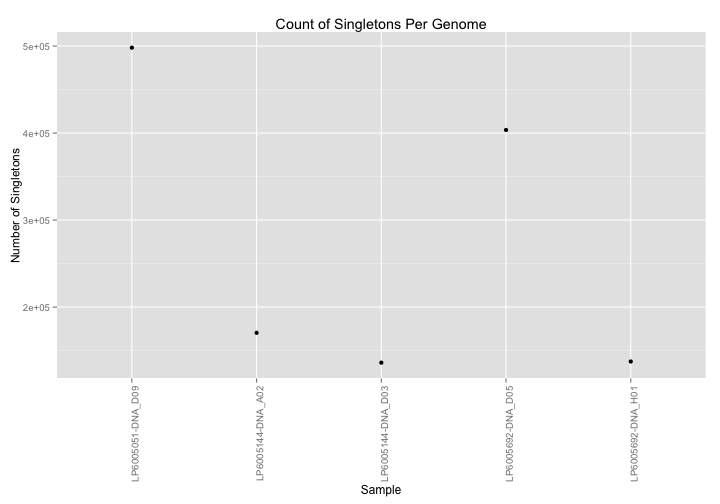
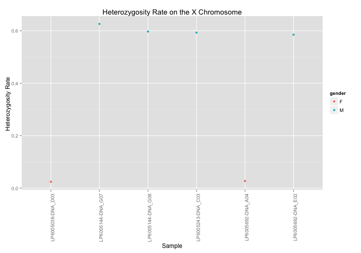

<!-- R Markdown Documentation, DO NOT EDIT THE PLAIN MARKDOWN VERSION OF THIS FILE -->

<!-- Copyright 2015 Google Inc. All rights reserved. -->

<!-- Licensed under the Apache License, Version 2.0 (the "License"); -->
<!-- you may not use this file except in compliance with the License. -->
<!-- You may obtain a copy of the License at -->

<!--     http://www.apache.org/licenses/LICENSE-2.0 -->

<!-- Unless required by applicable law or agreed to in writing, software -->
<!-- distributed under the License is distributed on an "AS IS" BASIS, -->
<!-- WITHOUT WARRANTIES OR CONDITIONS OF ANY KIND, either express or implied. -->
<!-- See the License for the specific language governing permissions and -->
<!-- limitations under the License. -->

*This code is used with permission by Google Genomics*
*https://github.com/googlegenomics*

# Sample-Level QC


```r
tableReplacement <- list("_THE_TABLE_"="va_aaa_pilot_data.all_genomes_gvcfs",
                          "_THE_EXPANDED_TABLE_"="va_aaa_pilot_data.all_genomes_expanded_vcfs_java",
                          "_PATIENT_INFO_"="va_aaa_pilot_data.patient_info")
sampleData <- read.csv("/Users/gmcinnes/GitHub/mvp_aaa_codelabs/qc/data/patient_info.csv")
sampleInfo <- select(sampleData, sample_id=Catalog.ID, gender=Gender)

#ibs <- read.table("./data/platinum-genomes-ibs.tsv",
#                  col.names=c("sample1", "sample2", "ibsScore", "similar", "observed"))

# To run this against other public data, source in one of the dataset helpers.  For example:
# source("./rHelpers/pgpCGIOnlyDataset.R")
```


* [Missingness Rate](#missingness-rate)
* [Singleton Rate](#singleton-rate)
* [Heterozygosity Rate and Inbreeding Coefficient](#homozygosity-rate-and-inbreeding-coefficient)
* [Sex Inference](#sex-inference)

## Missingness Rate

Identify all the genomes that have a sample level missingness greater than 0.1.


```r
result <- DisplayAndDispatchQuery("./sql/missingness-sample-level-fail.sql",
                                  project=project,
                                  replacements=tableReplacement)
```

```
# Select samples whose missingness is below desired threshold
SELECT
  sample_id,
  missingness
FROM (
SELECT 
  g.sample_id AS sample_id,
  ROUND(1 - ((hg19.count - g.all_calls_count)/hg19.count), 3) AS missingness
FROM (
  SELECT
    call.call_set_name AS sample_id,
    ref_count + alt_count AS all_calls_count,
  FROM (
    SELECT
      call.call_set_name,
      SUM(IF(genotype = '0,0',
        (end - start),
        0)) AS ref_count,
      SUM(IF(genotype NOT IN ('0,0', '-1,-1'),
        1,
        0)) AS alt_count,
    FROM (
    SELECT
      call.call_set_name AS sample_id,
      start,
      end,
      GROUP_CONCAT(STRING(call.genotype)) WITHIN call AS genotype
    FROM
      [va_aaa_pilot_data.all_genomes_gvcfs])
    GROUP BY
      call.call_set_name)) AS g
  CROSS JOIN (
    SELECT 
      COUNT(Chr) AS count
    FROM 
      [google.com:biggene:test.hg19]) AS hg19)
WHERE
  missingness < 0.9
ORDER BY
  g.sample_id
```
Number of rows returned by this query: 1.

Displaying the results:
<!-- html table generated in R 3.1.2 by xtable 1.7-4 package -->
<!-- Fri May  1 00:17:00 2015 -->
<table border=1>
<tr> <th> sample_id </th> <th> missingness </th>  </tr>
  <tr> <td> LP6005243-DNA_A08 </td> <td align="right"> 0.45 </td> </tr>
   </table>

And visualizing the results:

```r
ggplot(result) +
  geom_point(aes(x=sample_id, y=missingness)) +
  theme(axis.text.x=if(nrow(result) <= 20)
    {element_text(angle = 90, hjust = 1)} else {element_blank()}) +
  xlab("Sample") +
  ylab("Missingness Rate") +
  ggtitle("Genome-Specific Missingness")
```


## Singleton Rate

Identify genomes that have a singleton rate more than 3 standard deviations from the mean.


```r
result <- DisplayAndDispatchQuery("./sql/private-variants-metrics.sql",
                                  project=project,
                                  replacements=tableReplacement)
```

```
# Compute private variants counts for each sample.
SELECT 
ROUND(AVG(private_variant_count), 3) AS average,
ROUND(STDDEV(private_variant_count), 3) AS stddev
FROM (
  SELECT
  call.call_set_name,
  COUNT(call.call_set_name) AS private_variant_count,
  FROM (
    SELECT
    reference_name,
    start,
    GROUP_CONCAT(CASE WHEN cnt = 1 THEN 'S'
                 WHEN cnt = 2 THEN 'D'
                 ELSE STRING(cnt) END) AS SINGLETON_DOUBLETON,
    reference_bases,
    alternate_bases,
    GROUP_CONCAT(call.call_set_name) AS call.call_set_name,
    GROUP_CONCAT(genotype) AS genotype,
    SUM(num_samples_with_variant) AS num_samples_with_variant
    FROM (
      SELECT
      reference_name,
      start,
      reference_bases,
      alternate_bases,
      alt_num,
      call.call_set_name,
      GROUP_CONCAT(STRING(call.genotype)) WITHIN call AS genotype,
      SUM(call.genotype == alt_num) WITHIN call AS cnt,
      COUNT(call.call_set_name) WITHIN RECORD AS num_samples_with_variant
      FROM (
        FLATTEN((
          SELECT
          reference_name,
          start,
          reference_bases,
          alternate_bases,
          POSITION(alternate_bases) AS alt_num,
          call.call_set_name,
          call.genotype,
          FROM
          [va_aaa_pilot_data.all_genomes_gvcfs]
          # Optionally add a clause here to limit the query to a particular
          # region of the genome.
          #_WHERE_
          OMIT call IF EVERY(call.genotype = -1)
        ), alternate_bases)
      )
      OMIT RECORD IF alternate_bases IS NULL
      HAVING
      cnt > 0
    )
    GROUP EACH BY
    reference_name,
    start,
    reference_bases,
    alternate_bases
    HAVING
    num_samples_with_variant = 1
  )
  GROUP BY
  call.call_set_name)
```

Displaying the results:
<!-- html table generated in R 3.1.2 by xtable 1.7-4 package -->
<!-- Fri May  1 00:17:02 2015 -->
<table border=1>
<tr> <th> average </th> <th> stddev </th>  </tr>
  <tr> <td align="right"> 29762.24 </td> <td align="right"> 30638.08 </td> </tr>
   </table>

Determine cutoffs

```r
mean = result$average
stddev = result$stddev
max_value = mean + 3*stddev
min_value = mean - 3*stddev
```

Determine which genomes are outside our desired range


```r
values = list("_MAX_VALUE_" = max_value,
              "_MIN_VALUE_" = min_value)
result <- DisplayAndDispatchQuery("./sql/private-variants-fail.sql",
                                  project=project,
                                  replacements=c(tableReplacement, values))
```

```
# Compute private variants counts for each sample.
SELECT 
call.call_set_name,
private_variant_count
FROM (
  SELECT
  call.call_set_name,
  COUNT(call.call_set_name) AS private_variant_count,
  FROM (
    SELECT
    reference_name,
    start,
    GROUP_CONCAT(CASE WHEN cnt = 1 THEN 'S'
                 WHEN cnt = 2 THEN 'D'
                 ELSE STRING(cnt) END) AS SINGLETON_DOUBLETON,
    reference_bases,
    alternate_bases,
    GROUP_CONCAT(call.call_set_name) AS call.call_set_name,
    GROUP_CONCAT(genotype) AS genotype,
    SUM(num_samples_with_variant) AS num_samples_with_variant
    FROM (
      SELECT
      reference_name,
      start,
      reference_bases,
      alternate_bases,
      alt_num,
      call.call_set_name,
      GROUP_CONCAT(STRING(call.genotype)) WITHIN call AS genotype,
      SUM(call.genotype == alt_num) WITHIN call AS cnt,
      COUNT(call.call_set_name) WITHIN RECORD AS num_samples_with_variant
      FROM (
        FLATTEN((
          SELECT
          reference_name,
          start,
          reference_bases,
          alternate_bases,
          POSITION(alternate_bases) AS alt_num,
          call.call_set_name,
          call.genotype,
          FROM
          [va_aaa_pilot_data.all_genomes_gvcfs]
          # Optionally add a clause here to limit the query to a particular
          # region of the genome.
          #_WHERE_
          OMIT call IF EVERY(call.genotype = -1)
        ), alternate_bases)
      )
      OMIT RECORD IF alternate_bases IS NULL
      HAVING
      cnt > 0
    )
    GROUP EACH BY
    reference_name,
    start,
    reference_bases,
    alternate_bases
    HAVING
    num_samples_with_variant = 1
  )
  GROUP BY
  call.call_set_name)
WHERE
private_variant_count  > 121676.484 OR
private_variant_count < -62151.996
Running query:   RUNNING  2.5s
Running query:   RUNNING  3.1s
Running query:   RUNNING  3.8s
Running query:   RUNNING  4.4s
Running query:   RUNNING  5.0s
Running query:   RUNNING  5.6s
Running query:   RUNNING  6.2s
Running query:   RUNNING  6.8s
Running query:   RUNNING  7.5s
Running query:   RUNNING  8.1s
Running query:   RUNNING  8.7s
```

Displaying the results:
<!-- html table generated in R 3.1.2 by xtable 1.7-4 package -->
<!-- Fri May  1 00:17:14 2015 -->
<table border=1>
<tr> <th> call_call_set_name </th> <th> private_variant_count </th>  </tr>
  <tr> <td> LP6005051-DNA_D09 </td> <td align="right"> 498164 </td> </tr>
  <tr> <td> LP6005692-DNA_D05 </td> <td align="right"> 403557 </td> </tr>
  <tr> <td> LP6005692-DNA_H01 </td> <td align="right"> 137485 </td> </tr>
  <tr> <td> LP6005144-DNA_D03 </td> <td align="right"> 136157 </td> </tr>
  <tr> <td> LP6005144-DNA_A02 </td> <td align="right"> 170457 </td> </tr>
   </table>

And visualizing the results:

```r
ggplot(result) +
  geom_point(aes(x=call_call_set_name, y=private_variant_count)) +
  theme(axis.text.x=if(nrow(result) <= 20)
  {element_text(angle = 90, hjust = 1)} else {element_blank()}) +
  xlab("Sample") +
  ylab("Number of Singletons") +
  ggtitle("Count of Singletons Per Genome")
```



## Homozygosity Rate and Inbreeding Coefficient

Identify genomes that have an inbreeding coefficient outside the desired range.


```r
result <- DisplayAndDispatchQuery("./sql/inbreeding-coefficient-metrics.sql",
                                  project=project,
                                  replacements=tableReplacement)
```

```
# Compute the expected and observed homozygosity rate for each individual.
SELECT
ROUND(AVG(F), 3) AS average,
ROUND(STDDEV(F), 3) AS stddev
FROM (
  SELECT
  call.call_set_name,
  O_HOM,
  ROUND(E_HOM, 2) as E_HOM,
  N_SITES,
  ROUND((O_HOM - E_HOM) / (N_SITES - E_HOM), 5) AS F
  FROM (
    SELECT
    call.call_set_name,
    SUM(first_allele = second_allele) AS O_HOM,
    SUM(1.0 - (2.0 * freq * (1.0 - freq) * (called_allele_count / (called_allele_count - 1.0)))) AS E_HOM,
    COUNT(call.call_set_name) AS N_SITES,
    FROM (
      SELECT
      reference_name,
      start,
      reference_bases,
      GROUP_CONCAT(alternate_bases) WITHIN RECORD AS alternate_bases,
      call.call_set_name,
      NTH(1, call.genotype) WITHIN call AS first_allele,
      NTH(2, call.genotype) WITHIN call AS second_allele,
      COUNT(alternate_bases) WITHIN RECORD AS num_alts,
      SUM(call.genotype >= 0) WITHIN RECORD AS called_allele_count,
      IF((SUM(1 = call.genotype) > 0),
         SUM(call.genotype = 1)/SUM(call.genotype >= 0),
         -1)  WITHIN RECORD AS freq
      FROM
      [va_aaa_pilot_data.all_genomes_expanded_vcfs_java]
      # Optionally add a clause here to limit the query to a particular
      # region of the genome.
      #_WHERE_
      # Skip no calls and haploid sites
      OMIT call IF SOME(call.genotype < 0) OR (2 > COUNT(call.genotype))
      HAVING
      # Skip 1/2 genotypes _and non-SNP variants
      num_alts = 1
      AND reference_bases IN ('A','C','G','T')
      AND alternate_bases IN ('A','C','G','T')
    )
    GROUP BY
    call.call_set_name
  ))
```

Displaying the results:
<!-- html table generated in R 3.1.2 by xtable 1.7-4 package -->
<!-- Fri May  1 00:17:16 2015 -->
<table border=1>
<tr> <th> average </th> <th> stddev </th>  </tr>
  <tr> <td align="right"> 2.14 </td> <td align="right"> 0.07 </td> </tr>
   </table>

Determine the cutoffs:

```r
mean = result$average
stddev = result$stddev
max_value = mean + 3*stddev
min_value = mean - 3*stddev
```

Determine which genomes are outside our desired range

```r
values = list("_MAX_VALUE_" = max_value,
              "_MIN_VALUE_" = min_value)
result <- DisplayAndDispatchQuery("./sql/inbreeding-coefficient-fail.sql",
                                  project=project,
                                  replacements=c(tableReplacement, values))
```

```
# Compute the expected and observed homozygosity rate for each individual.
SELECT
call.call_set_name,
O_HOM,
E_HOM,
N_SITES,
F
FROM (
  SELECT
  call.call_set_name,
  O_HOM,
  ROUND(E_HOM, 2) as E_HOM,
  N_SITES,
  ROUND((O_HOM - E_HOM) / (N_SITES - E_HOM), 5) AS F
  FROM (
    SELECT
    call.call_set_name,
    SUM(first_allele = second_allele) AS O_HOM,
    SUM(1.0 - (2.0 * freq * (1.0 - freq) * (called_allele_count / (called_allele_count - 1.0)))) AS E_HOM,
    COUNT(call.call_set_name) AS N_SITES,
    FROM (
      SELECT
      reference_name,
      start,
      reference_bases,
      GROUP_CONCAT(alternate_bases) WITHIN RECORD AS alternate_bases,
      call.call_set_name,
      NTH(1, call.genotype) WITHIN call AS first_allele,
      NTH(2, call.genotype) WITHIN call AS second_allele,
      COUNT(alternate_bases) WITHIN RECORD AS num_alts,
      SUM(call.genotype >= 0) WITHIN RECORD AS called_allele_count,
      IF((SUM(1 = call.genotype) > 0),
         SUM(call.genotype = 1)/SUM(call.genotype >= 0),
         -1)  WITHIN RECORD AS freq
      FROM
      [va_aaa_pilot_data.all_genomes_expanded_vcfs_java]
      # Optionally add a clause here to limit the query to a particular
      # region of the genome.
      #_WHERE_
      # Skip no calls and haploid sites
      OMIT call IF SOME(call.genotype < 0) OR (2 > COUNT(call.genotype))
      HAVING
      # Skip 1/2 genotypes _and non-SNP variants
      num_alts = 1
      AND reference_bases IN ('A','C','G','T')
      AND alternate_bases IN ('A','C','G','T')
    )
    GROUP BY
    call.call_set_name
  ))
WHERE
F > 2.354 OR 
F < 1.928

Running query:   RUNNING  2.5s
Running query:   RUNNING  3.2s
Running query:   RUNNING  3.9s
Running query:   RUNNING  4.5s
Running query:   RUNNING  5.1s
Running query:   RUNNING  5.7s
Running query:   RUNNING  6.4s
Running query:   RUNNING  7.0s
Running query:   RUNNING  7.6s
Running query:   RUNNING  8.2s
Running query:   RUNNING  8.8s
Running query:   RUNNING  9.5s
Running query:   RUNNING 10.1s
Running query:   RUNNING 10.7s
Running query:   RUNNING 11.3s
Running query:   RUNNING 11.9s
Running query:   RUNNING 12.5s
Running query:   RUNNING 13.1s
Running query:   RUNNING 13.7s
Running query:   RUNNING 14.4s
Running query:   RUNNING 15.0s
Running query:   RUNNING 15.7s
Running query:   RUNNING 16.3s
Running query:   RUNNING 16.9s
Running query:   RUNNING 17.5s
Running query:   RUNNING 18.2s
Running query:   RUNNING 18.8s
Running query:   RUNNING 19.4s
Running query:   RUNNING 20.0s
Running query:   RUNNING 20.6s
Running query:   RUNNING 21.3s
Running query:   RUNNING 21.9s
Running query:   RUNNING 22.5s
Running query:   RUNNING 23.1s
Running query:   RUNNING 23.8s
Running query:   RUNNING 24.4s
Running query:   RUNNING 25.0s
Running query:   RUNNING 25.6s
Running query:   RUNNING 26.2s
Running query:   RUNNING 26.8s
Running query:   RUNNING 27.5s
Running query:   RUNNING 28.1s
Running query:   RUNNING 28.7s
Running query:   RUNNING 29.4s
Running query:   RUNNING 30.0s
Running query:   RUNNING 30.6s
Running query:   RUNNING 31.2s
Running query:   RUNNING 31.8s
Running query:   RUNNING 32.4s
Running query:   RUNNING 33.0s
Running query:   RUNNING 33.7s
Running query:   RUNNING 34.3s
Running query:   RUNNING 34.9s
Running query:   RUNNING 35.5s
Running query:   RUNNING 36.1s
Running query:   RUNNING 36.7s
Running query:   RUNNING 37.4s
Running query:   RUNNING 38.0s
Running query:   RUNNING 38.6s
Running query:   RUNNING 39.2s
Running query:   RUNNING 39.8s
Running query:   RUNNING 40.4s
```

Displaying the results:
<!-- html table generated in R 3.1.2 by xtable 1.7-4 package -->
<!-- Fri May  1 00:18:00 2015 -->
<table border=1>
<tr> <th> call_call_set_name </th> <th> O_HOM </th> <th> E_HOM </th> <th> N_SITES </th> <th> F </th>  </tr>
  <tr> <td> LP6005051-DNA_D04 </td> <td align="right"> 25100235 </td> <td align="right"> 29121759.12 </td> <td align="right"> 27462599 </td> <td align="right"> 2.42 </td> </tr>
  <tr> <td> LP6005692-DNA_G09 </td> <td align="right"> 25223692 </td> <td align="right"> 29337904.99 </td> <td align="right"> 27605951 </td> <td align="right"> 2.38 </td> </tr>
  <tr> <td> LP6005144-DNA_A02 </td> <td align="right"> 24741464 </td> <td align="right"> 29088167.10 </td> <td align="right"> 27314607 </td> <td align="right"> 2.45 </td> </tr>
  <tr> <td> LP6005692-DNA_D05 </td> <td align="right"> 24606840 </td> <td align="right"> 29326625.62 </td> <td align="right"> 27413074 </td> <td align="right"> 2.47 </td> </tr>
  <tr> <td> LP6005038-DNA_C02 </td> <td align="right"> 24822343 </td> <td align="right"> 28577859.07 </td> <td align="right"> 27000227 </td> <td align="right"> 2.38 </td> </tr>
  <tr> <td> LP6005051-DNA_D09 </td> <td align="right"> 24613120 </td> <td align="right"> 29404805.09 </td> <td align="right"> 27448646 </td> <td align="right"> 2.45 </td> </tr>
  <tr> <td> LP6005692-DNA_E10 </td> <td align="right"> 25189067 </td> <td align="right"> 29331049.88 </td> <td align="right"> 27592794 </td> <td align="right"> 2.38 </td> </tr>
  <tr> <td> LP6005243-DNA_C07 </td> <td align="right"> 28304233 </td> <td align="right"> 33012631.43 </td> <td align="right"> 30447681 </td> <td align="right"> 1.84 </td> </tr>
  <tr> <td> LP6005243-DNA_H03 </td> <td align="right"> 25090538 </td> <td align="right"> 29104399.28 </td> <td align="right"> 27444066 </td> <td align="right"> 2.42 </td> </tr>
   </table>

And visualizing the results:

```r
ggplot(result) +
  geom_text(aes(x=O_HOM, y=E_HOM, label=call_call_set_name), hjust=-1, vjust=0) +
  xlab("Observed Homozygous Variants") +
  ylab("Expected Homozygous Variants") +
  ggtitle("Homozygosity")
```


## Sex Inference

For each genome, compare the gender from the sample information to the heterozygosity rate on the chromosome X calls.

```r
result <- DisplayAndDispatchQuery("./sql/gender-check-fail.sql",
                                  project=project,
                                  replacements=tableReplacement)
```

```
# Identify samples whose reported gender does not match the computed gender
SELECT 
  sample_id,
  gender,
  perct_het_alt_in_snvs,
FROM (
SELECT 
  data.sample_id AS sample_id,
  data.perct_het_alt_in_snvs AS perct_het_alt_in_snvs,
  data.all_callable_sites,
  data.hom_AA_count,
  data.het_RA_count,
  data.hom_RR_count,
  data.all_snvs,
  info.SEX AS gender,
FROM (
SELECT
  call.call_set_name AS sample_id,
  ROUND((het_RA_count/(hom_AA_count + het_RA_count))*1000)/1000 AS perct_het_alt_in_snvs,
  ROUND((hom_AA_count/(hom_AA_count + het_RA_count))*1000)/1000 AS perct_hom_alt_in_snvs,
  (hom_AA_count + het_RA_count + hom_RR_count) AS all_callable_sites,
  hom_AA_count,
  het_RA_count,
  hom_RR_count,
  (hom_AA_count + het_RA_count) AS all_snvs,
FROM
  (
  SELECT
    call.call_set_name,
    SUM(0 = first_allele
      AND 0 = second_allele) AS hom_RR_count,
    SUM(first_allele = second_allele AND first_allele > 0) AS hom_AA_count,
    SUM((first_allele != second_allele OR second_allele IS NULL)
      AND (first_allele > 0 OR second_allele > 0)) AS het_RA_count
  FROM (
    SELECT
      reference_bases,
      GROUP_CONCAT(alternate_bases) WITHIN RECORD AS alternate_bases,
      COUNT(alternate_bases) WITHIN RECORD AS num_alts,
      call.call_set_name,
      NTH(1, call.genotype) WITHIN call AS first_allele,
      NTH(2, call.genotype) WITHIN call AS second_allele,
    FROM
      [va_aaa_pilot_data.all_genomes_gvcfs]
    WHERE
      reference_name = 'chrX'
      AND start NOT BETWEEN 59999 AND 2699519
      AND start NOT BETWEEN 154931042 AND 155260559
    HAVING
      # Skip 1/2 genotypes _and non-SNP variants
      num_alts = 1
      AND reference_bases IN ('A','C','G','T')
      AND alternate_bases IN ('A','C','G','T')
      )
  GROUP BY
    call.call_set_name)) AS data
JOIN (
  SELECT
    IlluminaID,
    SEX
  FROM
    [va_aaa_pilot_data.patient_info]) AS info
ON
  data.sample_id = info.IlluminaID)
WHERE
  (gender = 'M' AND perct_het_alt_in_snvs > 0.2) OR
  (gender = 'F' AND perct_het_alt_in_snvs < 0.5) 
ORDER BY
  data.sample_id
```
Number of rows returned by this query: 6.

Displaying the first few results:
<!-- html table generated in R 3.1.2 by xtable 1.7-4 package -->
<!-- Fri May  1 00:18:02 2015 -->
<table border=1>
<tr> <th> sample_id </th> <th> gender </th> <th> perct_het_alt_in_snvs </th>  </tr>
  <tr> <td> LP6005038-DNA_D03 </td> <td> F </td> <td align="right"> 0.02 </td> </tr>
  <tr> <td> LP6005144-DNA_G07 </td> <td> M </td> <td align="right"> 0.63 </td> </tr>
  <tr> <td> LP6005144-DNA_G08 </td> <td> M </td> <td align="right"> 0.60 </td> </tr>
  <tr> <td> LP6005243-DNA_C03 </td> <td> M </td> <td align="right"> 0.59 </td> </tr>
  <tr> <td> LP6005692-DNA_A04 </td> <td> F </td> <td align="right"> 0.03 </td> </tr>
  <tr> <td> LP6005692-DNA_E02 </td> <td> M </td> <td align="right"> 0.58 </td> </tr>
   </table>

Let's join this with the sample information:

```r
joinedResult <- inner_join(result, sampleInfo)
```

And visualize the results:

```r
ggplot(joinedResult) +
  geom_point(aes(x=sample_id, y=perct_het_alt_in_snvs, color=gender)) +
  theme(axis.text.x=if(nrow(result) <= 20)
    {element_text(angle = 90, hjust = 1)} else {element_blank()}) +
  xlab("Sample") +
  ylab("Heterozygosity Rate ") +
  ggtitle("Heterozygosity Rate on the X Chromosome")
```



